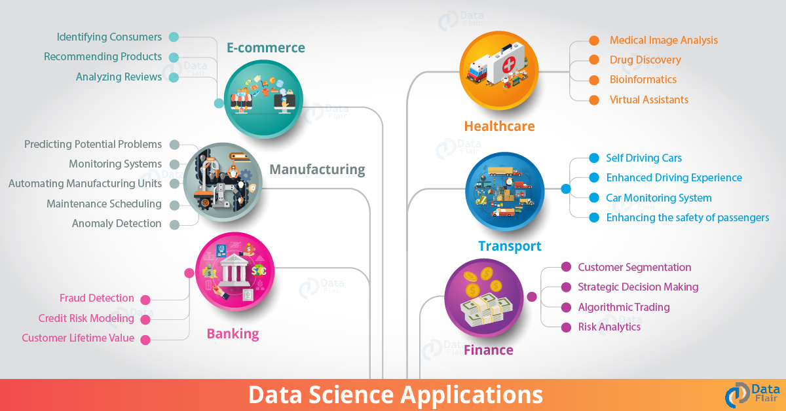

# 실제 환경에서의 데이터 과학

|  ](../../sketchnotes/20-DataScience-RealWorld.png) |
|:----------------------------------------------------------------------------------------------------------------:|
| Data Science In The Real World - _Sketchnote by [@nitya](https://twitter.com/nitya)_                             |

우리는 이 학습 여정의 끝에 거의 다다랐습니다!

우리는 데이터 과학과 윤리의 정의로 시작해서, 데이터 분석과 시각화를 위한 여러가지 툴 & 테크닉을 살펴보았고, 데이터 과학의 라이프 사이클을 검토하였고, 클라우드 컴퓨팅 서비스를 통한 데이터 과학 워크플로우 확장 및 자동화에 대해 알아보았습니다. 그래서 이제 당신은 아마도 _"내가 배운 것들을 현실에서는 어떻게 엮어서 사용하지?"_ 라는 의문점이 생길 것입니다.

이 레슨에서, 우리는 산업 전반에 걸친 데이터 과학의 실제 적용 사례를 살펴보고 연구, 디지털 인문학, 지속 가능성, 맥락에 대한 구체적인 예를 살펴보겠습니다. 학생 프로젝트 기회를 살펴보고 유용한 리소스로 마무리하여 학습 여정을 계속 이어나갈 수 있도록 도와드리겠습니다! 

## 강의 전 퀴즈

[Pre-lecture quiz](https://purple-hill-04aebfb03.1.azurestaticapps.net/quiz/38)

## 데이터 과학 + 산업

AI의 민주화 덕분에, 개발자들은 이제 사용자 경험과 개발 워크플로우에 대한 AI 중심의 의사 결정 및 데이터 기반 통찰력을 설계하고 통합하는 것이 더 쉬워지고 있습니다. 이것은 현실의 산업에서 데이터 과학이 어떻게 "적용" 되는지에 대한 몇 가지의 예입니다:

* [구글 독감 트렌드 (Google Flu Trends)](https://www.wired.com/2015/10/can-learn-epic-failure-google-flu-trends/) 데이터 과학을 사용하여 검색어와 독감 트렌드를 연관시켰습니다. used data science to correlate search terms with flu trends. 이 접근 방식에는 결함이 있지만 데이터 기반 의료 예측의 가능성(및 과제)에 대한 인식을 높였습니다.
  
  [UPS 라우팅 예측 (UPS Routing Predictions)](https://www.technologyreview.com/2018/11/21/139000/how-ups-uses-ai-to-outsmart-bad-weather/) - UPS가 데이터 과학과 머신러닝을 이용하여 배송을 위한 최적의 루트를 날씨 조건, 교통 패턴, 배달 마감일 등을 고려하여 어떻게 예측하는지에 대해 설명합니다. 

* [NYC 택시 루트 시각화 (NYC Taxicab Route Visualization)](http://chriswhong.github.io/nyctaxi/) - [정보 자유법 (Freedom Of Information Laws)](https://chriswhong.com/open-data/foil_nyc_taxi/) 을 사용하여 수집된 데이터는 뉴욕 택시 생활의 하루를 시각화하는 데 도움이 되었고, 뉴욕 택시들이 바쁜 도시를 어떻게 돌아다니는지, 그들이 버는 돈, 그리고 매 24시간 동안의 여행 기간을 이해하는 데 도움이 되었습니다. 

* [우버 데이터 과학 워크벤치 (Uber Data Science Workbench)](https://eng.uber.com/dsw/) - 요금, 안전, 사기 탐지 및 탐색 결정에 도움이 되는 데이터 분석 도구를 구축하기 위해 *매일* 수백만 개의 uber 여행에서 수집된 데이터(픽업 & 하차 위치, 이동 시간, 선호 경로 등)를 사용합니다. 

* [스포츠 분석 (Sports Analytics)](https://towardsdatascience.com/scope-of-analytics-in-sports-world-37ed09c39860) - 인재 스카우트, 스포츠 도박, 재고/장소 관리를 적용한 *예측 분석* (팀 및 선수 분석 - Moneyball 을 생각해보세요 - 그리고 팬 관리) 및 *데이터 시각화*  (팀 & 팬 대시보드, 게임 등) 에 중점을 둡니다. 

* [금융 산업에서의 데이터 과학 (Data Science in Banking)](https://data-flair.training/blogs/data-science-in-banking/) - 리스크 모델링 및 부정 행위 방지, 고객 세분화, 실시간 예측 및 추천 시스템에 이르기까지 다양한 적용을 통해 금융 산업에서 데이터 과학의 가치를 강조합니다. 예측 분석은 또한 [신용 점수 (credit scores)](https://dzone.com/articles/using-big-data-and-predictive-analytics-for-credit) 와 같은 중요한 척도를 도출합니다.

* [헬스케어에서의 데이터 과학 (Data Science in Healthcare)](https://data-flair.training/blogs/data-science-in-healthcare/) - 의료 영상(예: MRI, X-Ray, CT-Scan), 유전체학(DNA 시퀀싱), 약물 개발(위험 평가, 성공 예측), 예측 분석(환자 치료 & 공급 물류), 질병 추적 & 예방 등의 적용을 강조합니다.

 이미지 출처: [Data Flair: 6 Amazing Data Science Applications ](https://data-flair.training/blogs/data-science-applications/)

위 그림은 데이터 과학 기술을 적용하기 위한 다른 도메인과 예를 보여줍니다. 더 많은 적용 사례를 보고싶나요? 아래의 [Review & Self Study](?id=review-amp-self-study)를 살펴보세요.

## 데이터 과학 + 연구

|  ](../../sketchnotes/20-DataScience-Research.png) |
|:---------------------------------------------------------------------------------------------------------------:|
| Data Science & Research - _Sketchnote by [@nitya](https://twitter.com/nitya)_                                   |

현실 속에서 종종 규모에 맞는 산업 활용 사례에 초점을 맞추지만, _연구_ 에 적용된 것과 프로젝트는 다음 두 가지 관점에서 유용할 수 있습니다:

* _혁신 기회_ - 차세대 애플리케이션을 위한 선진 개념의 신속한 프로토타이핑 및 사용자 경험의 테스트를 살펴봅니다. 
* _배포 과제_ - 현실 세계에서 데이터 과학 기술의 잠재적인 피해 또는 의도하지 않은 결과에 대하여 조사합니다.

학생들에게 이러한 연구 프로젝트는 주제에 대한 이해를 향상시킬 수 있는 학습 기회와 협업 기회를 제공할 수 있으며, 관심 분야에서 일하는 직원 또는 팀의 인식과 참여를 넓힐 수 있습니다. 그렇다면 연구 프로젝트는 어떻게 생겼고 어떻게 영향을 미칠 수 있을까요?

이 예제를 한 번 봅시다 - Joy Buolamwini (MIT Media Labs)의 [MIT 젠더 쉐이즈 연구 (MIT Gender Shades Study)](http://gendershades.org/overview.html)와 Timnit Gebru (당시에 Microsoft Research)가 공동 저술한 [연구 (signature research paper)](http://proceedings.mlr.press/v81/buolamwini18a/buolamwini18a.pdf)

* **무엇:** 이 연구 프로젝트의 목적은 _성별과 피부 타입에 기초하여 자동화된 얼굴 분석 알고리즘과 데이터 셋에 존재하는 편향을 평가하는 것_ 입니다. 
* **왜:** 얼굴 분석은 법 집행, 공항 보안, 고용 시스템 등에서 사용됩니다 - 부정확한 분류(예: 편향으로 인한)로 인해 영향을 받는 개인이나 집단에 잠재적인 경제적 피해와 사회적 피해를 일으킬 수 있는 상황이 생길 수 있습니다. 편향을 이해하는 (그리고 제거 또는 완화하는) 것이 사용 공정성의 핵심입니다.
* **어떻게:** 연구원들은 기존 벤치마크에서 주로 밝은 피부의 피사체를 사용했으며, 성별과 피부 유형에 따라 보다 균형 잡힌 새로운 데이터 셋 (1000개 이상의 이미지)을 큐레이션했다고 밝혔습니다. 데이터 셋은 세 가지 성별 분류 제품 (Microsoft, IBM & Face++)의 정확성을 평가하는 데 사용되었습니다.

그 결과 전체적인 분류 정확도는 괜찮았지만, 다양한 하위 그룹 간 오류율에서 현저한 차이가 있었습니다. **misgendering**은 여성 또는 피부색이 어두운 사람의 경우에 더 높은 편향을 나타냈습니다.

**주요 결과:** 데이터 과학의 초기 AI 솔루션에서 이러한 편견을 인식하고 완화하기 위해 더 많은 _대표적인 데이터 셋_ (균형 있는 하위 그룹)과 더 많은 _포괄적인 팀_ (다양한 배경)을 필요로 한다는 인식을 높였습니다. 이러한 연구 노력은 AI 제품 및 프로세스 전반의 공정성을 개선하기 위해 *책임 있는 AI* 에 대한 원칙과 관행을 정의하는 많은 조직에서도 중요한 역할을 합니다.

**Microsoft의 관련 연구에 대한 노력을 더 알고싶나요?** 

* 인공지능에 대한 [Microsoft Research Projects](https://www.microsoft.com/research/research-area/artificial-intelligence/?facet%5Btax%5D%5Bmsr-research-area%5D%5B%5D=13556&facet%5Btax%5D%5Bmsr-content-type%5D%5B%5D=msr-project) 확인해보세요
* 학생들의 프로젝트를 [Microsoft Research Data Science Summer School](https://www.microsoft.com/en-us/research/academic-program/data-science-summer-school/) 에서 살펴보세요
* [Fairlearn](https://fairlearn.org/) 프로젝트와 [Responsible AI](https://www.microsoft.com/en-us/ai/responsible-ai?activetab=pivot1%3aprimaryr6) 를 확인해보세요

## 데이터 과학 + 인문학

|  ](../../../sketchnotes/20-DataScience-Humanities.png) |
|:--------------------------------------------------------------------------------------------------------------------:|
| Data Science & Digital Humanities - _Sketchnote by [@nitya](https://twitter.com/nitya)_                              |

디지털 인문학은 "계산 방법과 인문학적 연구를 결합한 관행과 접근법의 집합"으로 [정의](https://digitalhumanities.stanford.edu/about-dh-stanford)되어 왔습니다. _"역사의 재발견"_ 과 _"시적 사고"_ 와 같은 [Stanford projects](https://digitalhumanities.stanford.edu/projects)는 [디지털 인문학과 데이터 과학 (Digital Humanities and Data Science)](https://digitalhumanities.stanford.edu/digital-humanities-and-data-science) 사이의 연관성을 보여줍니다. - 새로운 통찰력과 관점을 도출하기 위해 역사 및 문학 데이터 셋을 다시 검토하는 데 도움이 될 수 있는 네트워크 분석, 정보 시각화, 공간 및 텍스트 분석과 같은 기술을 강조

*여기에서 프로젝트를 탐색하고 확장하기를 원하나요?*

["Emily Dickinson and the Meter of Mood"](https://gist.github.com/jlooper/ce4d102efd057137bc000db796bfd671) 를 살펴보세요 - [Jen Looper](https://twitter.com/jenlooper)의 아주 좋은 예제는 우리가 익숙한 시를 다시 읽고, 시의 의미와 새로운 맥락에서 작가의 공헌을 재평가하기 위해 어떻게 데이터 과학을 사용할 수 있는지 묻습니다. 예를 들어, *우리는 시의 어조나 감정을 분석함으로써 시가 쓰여진 계절을 예측할 수 있는지* - 그리고 이것은 우리에게 그 시기 동안의 작가의 심리 상태에 대해 무엇을 말해주는지?

이 질문들에 대답하기 위해, 우리는 몇 가지 데이터 과학 라이프 사이클의 스텝을 따라가 볼 것 입니다: 

* [`데이터 획득 (Data Acquisition)`](https://gist.github.com/jlooper/ce4d102efd057137bc000db796bfd671#acquiring-the-dataset) - 분석을 위해 관련 데이터 셋을 수집합니다. API(예: [Poetry DB API](https://poetrydb.org/index.html)) 사용 또는 Scrapy와 같은 도구를 사용하여 웹 페이지(예: [Project Gutenberg](https://www.gutenberg.org/files/12242/12242-h/12242-h.htm))를 스크랩핑하는 옵션이 있습니다.
* [`데이터 정리 (Data Cleaning)`](https://gist.github.com/jlooper/ce4d102efd057137bc000db796bfd671#clean-the-data) - Visual Studio Code 및 Microsoft Excel과 같은 기본 도구를 사용하여 텍스트를 포맷팅, 검사 및 단순화하는 방법을 설명합니다.
* [`데이터 분석 (Data Analysis)`](https://gist.github.com/jlooper/ce4d102efd057137bc000db796bfd671#working-with-the-data-in-a-notebook) - 데이터를 구성하고 시각화하기 위해 파이썬 패키지(pandas, numpy, matplotlib 등)를 사용하여 분석을 위해 데이터 세트를 "노트북 (Notebooks)"으로 가져올 수 있는 방법을 설명합니다.
* [`감정 분석 (Sentiment Analysis)`](https://gist.github.com/jlooper/ce4d102efd057137bc000db796bfd671#sentiment-analysis-using-cognitive-services) - 자동화된 데이터 처리 워크플로우를 위해 [Power Automate](https://flow.microsoft.com/en-us/)와 같은 로우 코드 툴을 사용하여 Text Analytics와 같은 클라우드 서비스를 통합하는 방법을 설명합니다.
* explains how we can integrate cloud services like Text Analytics, using low-code tools like  for automated data processing workflows.

이 워크 워크플로우를 이용해서, 우리는 계절이 시에 실린 감정이 어덯게 영향을 미치는지 알아볼 수 있고, 저자에 대한 우리의 관점을 형성하도록 도울 수 있습니다. 스스로 한 번 해보세요 - 그런 다음 노트북을 확장하여 다른 질문을 하거나 새로운 방법으로 데이터를 시각화해보세요!

> [Digital Humanities toolkit](https://github.com/Digital-Humanities-Toolkit) 툴킷의 도구를 사용하여 이러한 검색 방법을 시도해 볼 수 있습니다

## 데이터 과학 + 지속 가능성

|  ](../../../sketchnotes/20-DataScience-Sustainability.png) |
|:------------------------------------------------------------------------------------------------------------------------:|
| Data Science & Sustainability - _Sketchnote by [@nitya](https://twitter.com/nitya)_                                      |

[2030 지속 가능한 개발 의제 (2030 Agenda For Sustainable Development)](https://sdgs.un.org/2030agenda) - 2015년 모든 유엔 회원국들이 채택하였음 - 쇠퇴와 기후 변화의 영향으로 부터 **지구를 보호**하는 것에 초점을 맞춘 목표를 포함하여 17개 목표를 명시하고 있습니다. [Microsoft Sustainability](https://www.microsoft.com/en-us/sustainability) 이니셔티브는 2030년까지 탄소 네거티브, 물 포지티브, 제로 웨이스트, 바이오 다이버스의 [네 가지 목표](https://dev.to/azure/a-visual-guide-to-sustainable-software-engineering-53hh)에 초점을 맞춰 기술 솔루션이 보다 지속 가능한 미래를 지원하고 구축할 수 있는 방법을 모색함으로써 이러한 목표를 지원합니다.

이러한 과제를 확장 가능하게하고 시기 적절하게 해결하려면 클라우드 규모의 사고와 대규모 데이터가 필요합니다. [Planetary Computer](https://planetarycomputer.microsoft.com/) 이니셔티브는 데이터 과학자와 개발자가 이러한 노력을 하는 데 도움이 되는 4가지 구성 요소를 제공합니다.

* [Data Catalog](https://planetarycomputer.microsoft.com/catalog) - 페타바이트 단위의 지구 시스템 데이터(무료 및 Azure 호스팅됨)를 제공합니다.
* [Planetary API](https://planetarycomputer.microsoft.com/docs/reference/stac/) - 사용자가 시공간에 걸쳐 관련 데이터를 검색할 수 있도록 지원합니다.
* [Hub](https://planetarycomputer.microsoft.com/docs/overview/environment/) - 과학자들이 대규모 지리공간 데이터셋을 처리할 수 있는 관리 환경입니다.
* [Applications](https://planetarycomputer.microsoft.com/applications) - 지속 가능성 통찰력을 위한 활용 사례 및 도구를 제시합니다.

**PlaPlanetary Computer Project는 현재 프리뷰 중입니다(2021년 9월 기준)** - 데이터 과학을 사용하여 지속 가능성 솔루션에 기여하는 방법을 소개합니다.

* [엑세스를 요청](https://planetarycomputer.microsoft.com/account/request) 하여 탐색을 시작하고 피어와 연결합니다.
* 지원되는 데이터 셋과 API를 이해하기 위한 [문서](https://planetarycomputer.microsoft.com/docs/overview/about)를 살펴보세요.
* 적용 방법에 대한 아이디어에 대한 영감을 얻기 위해 [Ecosystem Monitoring](https://analytics-lab.org/ecosystemmonitoring/)과 같은 애플리케이션을 탐색합니다.

데이터 시각화를 사용하여 기후 변화나 삼림 벌채와 같은 분야에 대한 관련 통찰력을 노출하거나 확대할 수 있는 방법을 생각해보세요. 또는 보다 지속 가능한 생활을 위해, 행동 변화에 동기를 부여하는 새로운 사용자 경험을 만들어 주려면 통찰력을 어떻게 사용할 수 있는지 생각해 보십시오.

## 데이터 과학 + 학생

우리는 산업 및 연구 분야의 실제 적용 사례에 대해 이야기했으며 디지털 인문학과 지속 가능성의 데이터 과학 적용 사례를 알아보았습니다. 그렇다면 어떻게 하면 데이터 과학 초보자로서 기술을 개발하고 전문 지식을 공유할 수 있을까요?

여기에 영감을 불어넣어 줄 만한 데이터 과학에 대한 학생들의 프로젝트 예시가 있습니다.

* 깃허브에서 [projects](https://github.com/msr-ds3) [MSR Data Science Summer School](https://www.microsoft.com/en-us/research/academic-program/data-science-summer-school/#!projects)의 다음과 같은 토픽이 포함된 [프로젝트](https://github.com/msr-ds3)가 있습니다 : 
  - [경찰의 무력에 대한 인종 편향 (Racial Bias in Police Use of Force)](https://www.microsoft.com/en-us/research/video/data-science-summer-school-2019-replicating-an-empirical-analysis-of-racial-differences-in-police-use-of-force/) | [Github](https://github.com/msr-ds3/stop-question-frisk)
  - [뉴욕시 지하철 시스템의 신뢰성 (Reliability of NYC Subway System)](https://www.microsoft.com/en-us/research/video/data-science-summer-school-2018-exploring-the-reliability-of-the-nyc-subway-system/) | [Github](https://github.com/msr-ds3/nyctransit)
* [자료 문화 디지털화: Sirkap의 사회 경제적 분포 탐색](https://claremont.maps.arcgis.com/apps/Cascade/index.html?appid=bdf2aef0f45a4674ba41cd373fa23afc)- [Ornella Altunyan](https://twitter.com/ornelladotcom)과 Claremont의 팀이 [ArcGIS StoryMaps](https://storymaps.arcgis.com/)을 사용하였습니다.

## 🚀 도전 과제

초보자 친화적인 데이터 과학 프로젝트를 추천하는 기사 검색 -  [이 50개 토픽 영역](https://www.upgrad.com/blog/data-science-project-ideas-topics-beginners/)이나 [21개 프로젝트 아이디어](https://www.intellspot.com/data-science-project-ideas) 또는 [16개의 프로젝트와 소스코드](https://data-flair.training/blogs/data-science-project-ideas/)가 있는 프로젝트처럼 해체하고 합칠 수 있습니다. 또한 학습 여정에 대해 블로그에 올리고 여러분의 통찰력을 우리 모두와 공유하는 것을 잊지마세요.

## 강의 후 퀴즈

[Post-lecture quiz](https://purple-hill-04aebfb03.1.azurestaticapps.net/quiz/39)

## 리뷰 & 혼자 공부해보기

더 많은 케이스에 대해 알고싶나요? 여기에 관련된 기사들이 있습니다:

* [17개의 데이터 과학 적용 사례들 (Data Science Applications and Examples)](https://builtin.com/data-science/data-science-applications-examples) - 2021년 7월

* [11개의 놀라운 데이터 과학 애플리케이션 (11 Breathtaking Data Science Applications in Real World)](https://myblindbird.com/data-science-applications-real-world/) - 2021년 5월

* [실제 환경에서의 데이터 과학 (Data Science In The Real World)](https://towardsdatascience.com/data-science-in-the-real-world/home) - Article Collection

* 다음과 같은 분야의 데이터 과학: [Education](https://data-flair.training/blogs/data-science-in-education/), [Agriculture](https://data-flair.training/blogs/data-science-in-agriculture/), [Finance](https://data-flair.training/blogs/data-science-in-finance/), [Movies](https://data-flair.training/blogs/data-science-at-movies/) & 등등.
  
  ## 과제

[Planetary Computer 데이터 셋 살펴보기](08_assignment.md)
