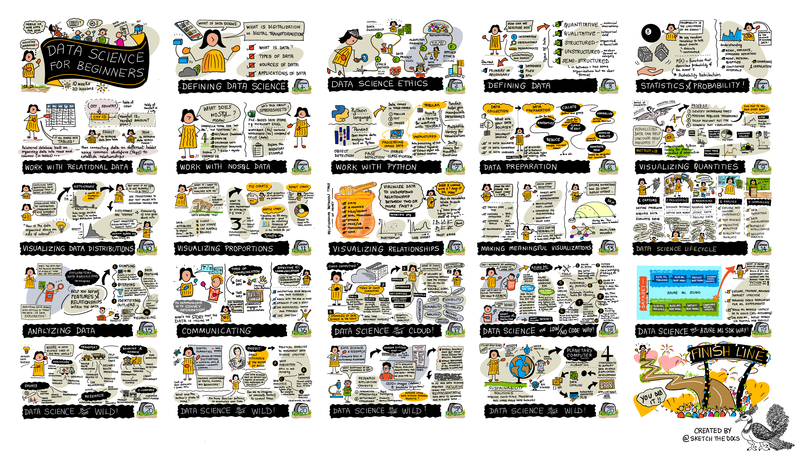

Find all sketchnotes here!

## What Comes Next

Use this folder as a visual companion, not a standalone entry point:

- Return to the [Microsoft course overview](../README.md) to pick the lesson or section you are actively studying.
- If you are reviewing concepts, open the matching lesson README next to the relevant sketchnote so the visual summary stays grounded in the actual material.

## Credits

Nitya Narasimhan, artist

