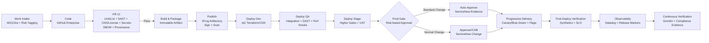

```mermaid
flowchart LR
  A[Work Intake\nADO/Jira + Risk Tagging] --> B[Code\nGitHub Enterprise]
  B --> C[PR CI\nUnit/Lint + SAST + OSS/License + Secrets\nSBOM + Provenance]
  C -->|Pass| D[Build & Package\nImmutable Artifact]
  D --> E[Publish\nJFrog Artifactory\nSign + Scan]
  E --> F[Deploy Dev\nIaC Terraform/CDK]
  F --> G[Deploy QA\nIntegration + DAST + Perf Smoke]
  G --> H[Deploy Stage\nHigher Gates + UAT]
  H --> I{Prod Gate\nRisk-based Approval}
  I -->|Standard Change| J[Auto-Approve\nServiceNow Evidence]
  I -->|Normal Change| K[Approver/CAB\nServiceNow Change]
  J --> L[Progressive Delivery\nCanary/Blue-Green + Flags]
  K --> L
  L --> M[Post-Deploy Verification\nSynthetics + SLO]
  M --> N[Observability\nDatadog + Release Markers]
  N --> O[Continuous Verification\nGremlin + Compliance Evidence]
```