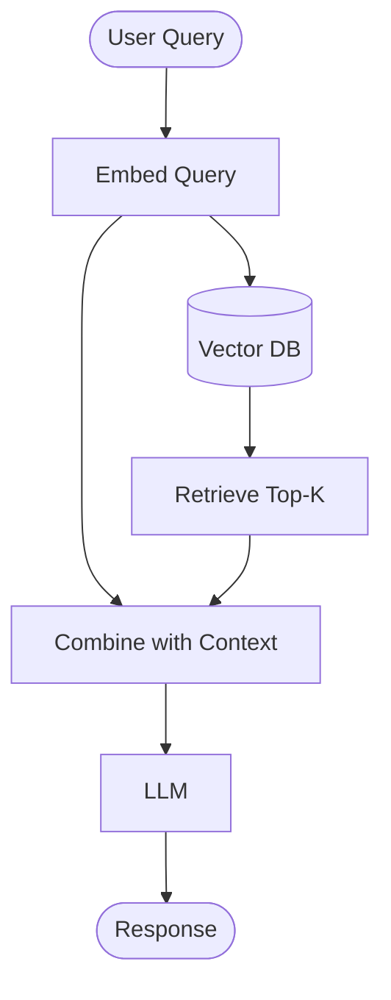

# RAG - Start Here

---

Retrieval-augmented generation is one of the most practical patterns in modern AI engineering. It gives language models access to external knowledge without retraining the base model.

---

## Why This Phase Matters

RAG sits at the intersection of embeddings, retrieval, prompt construction, and application design. It is often the right answer when you need grounded responses over your own documents, changing knowledge, or private data.

## The Core Problem

LLMs have important limitations:

- Knowledge cutoffs
- No direct access to private or proprietary documents
- Hallucinations when facts are missing
- Expensive or unnecessary fine-tuning for every new knowledge source

## The Core Idea

A RAG system usually does four things:

1. Store and index documents
2. Retrieve the most relevant chunks for a user query
3. Add that context to the prompt
4. Generate an answer grounded in the retrieved material

## How To Use This Phase Well

- Treat RAG as a systems problem, not just a prompt trick.
- Pay attention to chunking, retrieval quality, and evaluation.
- Compare when RAG is better than fine-tuning and when it is not.
- Reuse what you learned in embeddings and vector databases while working through this phase.

```python
import numpy as np
import pandas as pd
from typing import List, Dict, Tuple
import json
import os
from pathlib import Path
```

## RAG Architecture



**Key Components:**
1. Document Store (Vector DB)
2. Embedding Model
3. Retriever
4. LLM (Generator)

## Quick Demo: Minimal RAG

### Seeing the Core Idea in Action

Before diving into production-grade implementations, it helps to see RAG reduced to its essentials. The demo below creates a tiny knowledge base of five sentences, assigns each one a (simulated) embedding vector, and wires up a retrieval function that finds the most relevant documents for a query. In a real system, embeddings would come from a model like `all-MiniLM-L6-v2` and the generator would be a large language model like GPT-4 or Claude -- but the three-step pattern (embed, retrieve, generate) remains identical at any scale.

```python
# Simple document store
documents = [
    "Python is a high-level programming language created by Guido van Rossum.",
    "Machine learning is a subset of AI that learns from data.",
    "RAG combines retrieval and generation for better LLM responses.",
    "Vector databases store embeddings for similarity search.",
    "LangChain is a framework for building LLM applications."
]

# Simulate embeddings (normally use OpenAI/sentence-transformers)
import numpy as np
np.random.seed(42)
doc_embeddings = np.random.randn(len(documents), 384)

print(f"Loaded {len(documents)} documents")
print(f"Embedding dimension: {doc_embeddings.shape[1]}")
```

## Retrieval Function

### Finding the Most Relevant Documents

The retriever is the heart of any RAG system. Given a query embedding, it scores every document in the store by **cosine similarity** -- the cosine of the angle between the query vector and each document vector -- and returns the top-$k$ highest-scoring documents. Cosine similarity ranges from $-1$ to $1$, where values near $1$ indicate strong semantic overlap. In production, approximate nearest-neighbor indexes (HNSW, IVF) make this step sub-millisecond even over millions of documents.

```python
def cosine_similarity(a, b):
    """Compute cosine similarity between vectors."""
    return np.dot(a, b) / (np.linalg.norm(a) * np.linalg.norm(b))

def retrieve(query_embedding, top_k=2):
    """Retrieve top-k most similar documents."""
    similarities = []
    for i, doc_emb in enumerate(doc_embeddings):
        sim = cosine_similarity(query_embedding, doc_emb)
        similarities.append((i, sim))
    
    # Sort by similarity
    similarities.sort(key=lambda x: x[1], reverse=True)
    
    # Return top-k
    results = []
    for i, sim in similarities[:top_k]:
        results.append({
            'document': documents[i],
            'similarity': sim
        })
    return results

# Test retrieval
query_emb = np.random.randn(384)
results = retrieve(query_emb, top_k=2)

print("Retrieved Documents:")
for i, result in enumerate(results, 1):
    print(f"\n{i}. Similarity: {result['similarity']:.4f}")
    print(f"   {result['document']}")
```

## Generation with Context

### Constructing the LLM Prompt

The final RAG step stitches the retrieved documents into a structured prompt and sends it to a large language model. The prompt template explicitly instructs the model to answer **based on the provided context**, which grounds the response in factual source material and reduces hallucination. The LLM's job is now much simpler: synthesize and summarize the retrieved passages rather than recall facts from its training data. Source attribution comes naturally because each context passage can be labeled with its origin.

```python
def create_prompt(query: str, context_docs: List[str]) -> str:
    """Create prompt with retrieved context."""
    context = "\n\n".join([f"Document {i+1}: {doc}" 
                           for i, doc in enumerate(context_docs)])
    
    prompt = f"""Answer the question based on the context below.

Context:
{context}

Question: {query}

Answer:"""
    return prompt

# Example
query = "What is RAG?"
retrieved_docs = [r['document'] for r in results]
prompt = create_prompt(query, retrieved_docs)

print(prompt)
print("\n" + "="*70)
print("This prompt would be sent to an LLM (GPT-4, Claude, etc.)")
```

## Why RAG Works

### Benefits

✅ **Up-to-date information** - Add new docs anytime
✅ **Domain-specific knowledge** - Use your own data
✅ **Reduced hallucinations** - LLM has facts to reference
✅ **Source attribution** - Know where answers come from
✅ **Cost effective** - No need to fine-tune LLM

### Use Cases

- Customer support chatbots
- Document Q&A systems
- Research assistants
- Code documentation search
- Legal/medical information retrieval

## What You'll Cover

This series moves from simple concepts to more realistic systems:

1. **Basic RAG** - Build the retrieval-plus-generation loop from scratch
2. **Document Processing** - Chunking and indexing strategy
3. **Framework-Based RAG** - LangChain and LlamaIndex style workflows
4. **Advanced Retrieval** - Hybrid search, re-ranking, and retrieval tuning
5. **Conversational RAG** - Memory and multi-turn context
6. **Evaluation** - Measuring whether the system actually improves answers

## What Comes Next

After this phase, move into prompt engineering, fine-tuning, model evaluation, and AI agents. RAG is not an isolated topic; it becomes much more useful when you can evaluate it, debug it, and combine it with broader application patterns.

Use this phase to build judgment, not just demos: when retrieval helps, where it fails, and what must be measured before a RAG system is production-ready.
