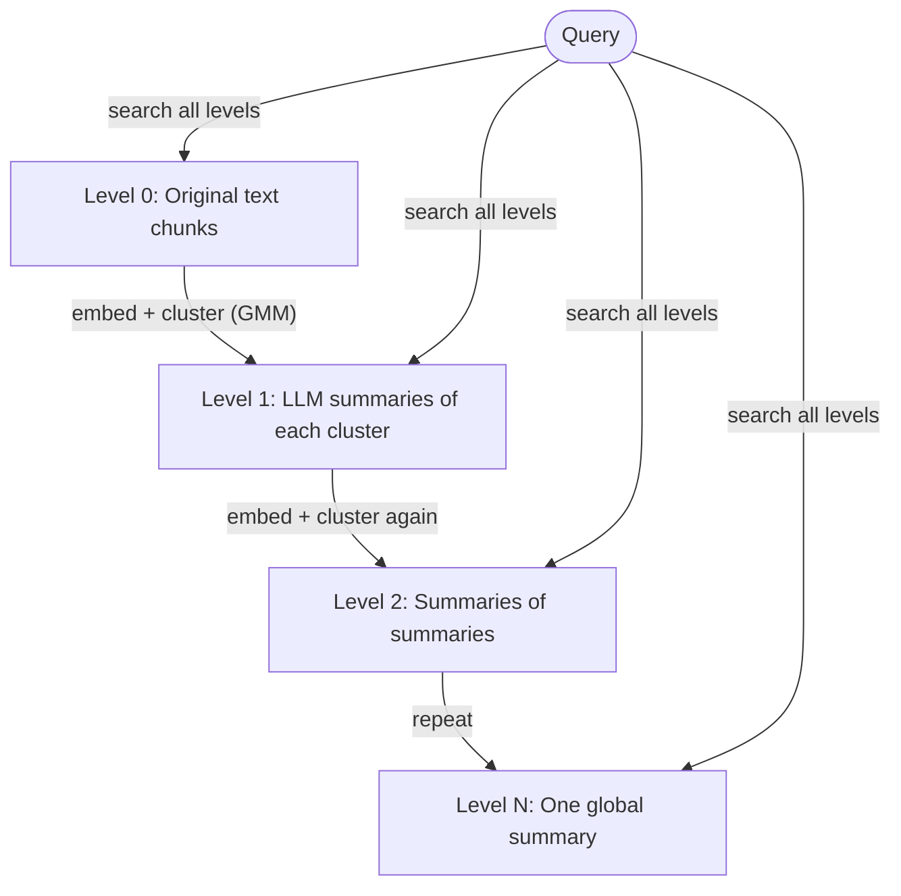
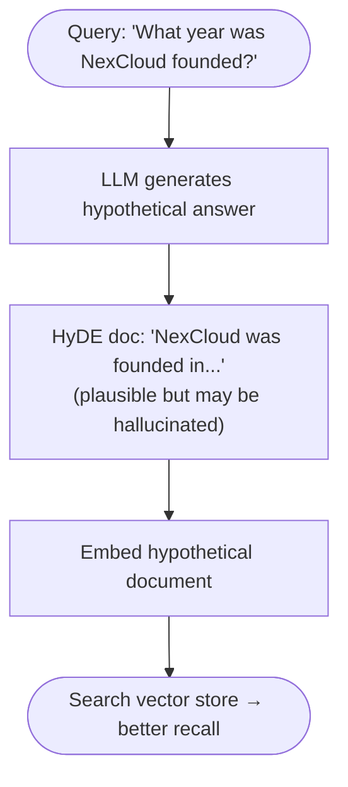
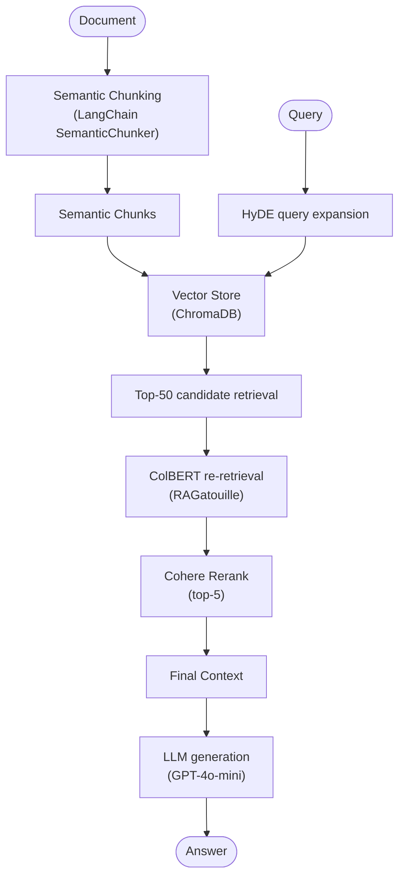

# Advanced RAG Techniques (2025-2026 State of the Art)

This notebook covers cutting-edge Retrieval-Augmented Generation techniques that go far beyond the basic "chunk-embed-retrieve-generate" pipeline. By the end, you will understand:

1. **Why naive RAG fails** on certain query types
2. **Semantic Chunking** - break on meaning, not token counts
3. **ColBERT Late Interaction Retrieval** - multi-vector token-level matching
4. **RAPTOR Hierarchical RAG** - tree-structured indexing for holistic queries
5. **Reranking with Cohere** - two-stage retrieval for precision
6. **HyDE** - Hypothetical Document Embeddings
7. **Complete Advanced RAG Pipeline** with benchmarks

---

> **Prerequisites**: OpenAI API key, Cohere API key, Python 3.10+

> **Navigation note:** This notebook uses **production libraries** (LangChain, ChromaDB, Cohere) and **requires API keys** (OpenAI, Cohere).
>
> If you want to explore the same concepts **without API keys**, start with the self-contained notebooks first:
>
> | Concept covered here | Self-contained alternative |
> |---------------------|---------------------------|
> | HyDE & reranking | `08_hyde_reranking.ipynb` |
> | CRAG / retrieval grading | `11_corrective_rag.ipynb` |
> | Parent-child retrieval | `12_parent_child_retrieval.ipynb` |
> | RAPTOR hierarchical retrieval | `13_raptor_retrieval.ipynb` |
> | Evaluation metrics | `07_evaluation.ipynb` |
>
> Work through those first, then return here to see how the same ideas look with real embedding models and vector stores.

## Setup: Install Dependencies

The advanced retrieval techniques in this notebook rely on several specialized libraries: **LangChain** for chain orchestration, **Cohere** for re-ranking, **ChromaDB** as the vector store, and **sentence-transformers** for local embeddings. The cell below installs everything in one batch. You will also need API keys for OpenAI and optionally Cohere, which should be set as environment variables or placed in a `.env` file.

```python
# Install all required packages
# Run once, then restart kernel
!pip install -q langchain langchain-openai langchain-community langchain-experimental
!pip install -q chromadb openai cohere
!pip install -q sentence-transformers ragatouille
!pip install -q tiktoken rank_bm25 scikit-learn numpy pandas
!pip install -q python-dotenv
```

```python
import os
import warnings
warnings.filterwarnings('ignore')

# Load API keys from environment or .env file
from dotenv import load_dotenv
load_dotenv()

# Set your keys here OR via environment variables
# os.environ["OPENAI_API_KEY"] = "sk-..."
# os.environ["COHERE_API_KEY"] = "..."

OPENAI_API_KEY = os.getenv("OPENAI_API_KEY", "YOUR_OPENAI_KEY")
COHERE_API_KEY = os.getenv("COHERE_API_KEY", "YOUR_COHERE_KEY")

print("OpenAI key set:", bool(OPENAI_API_KEY and OPENAI_API_KEY != "YOUR_OPENAI_KEY"))
print("Cohere key set:", bool(COHERE_API_KEY and COHERE_API_KEY != "YOUR_COHERE_KEY"))
```

---

## Part 1: Why Naive RAG Fails

Naive RAG has a simple pipeline:
```
Document → Fixed-size chunks → Embed chunks → Vector store → Top-k retrieval → LLM
```

This works well for **specific, localized queries** ("What is the capital of France?") but breaks down on:

| Query Type | Why Naive RAG Fails |
|------------|--------------------|
| **Aggregate queries** | "What are the main themes across all documents?" - no single chunk contains the answer |
| **Multi-hop queries** | "Who founded the company that acquired Slack?" - answer spans multiple chunks |
| **Abstract/holistic** | "Summarize the evolution of this technology" - requires global document understanding |
| **Comparison queries** | "How does approach A differ from approach B?" - relevant chunks may be far apart |
| **PDF with tables/charts** | Text extraction destroys visual structure - OCR-based chunking loses semantic meaning |

### The Core Problems

1. **Fixed-size chunking** splits text at arbitrary token boundaries, breaking semantic units
2. **Single-vector representation** compresses entire chunks to one embedding, losing fine-grained token signals
3. **No global document understanding** - top-k retrieval only finds locally similar chunks
4. **No reranking** - cosine similarity scores are noisy proxies for relevance

```python
# Demonstrate the failure of naive fixed-size chunking
from langchain.text_splitter import RecursiveCharacterTextSplitter

# Sample document about a fictional company
SAMPLE_DOCUMENT = """
Acme Corporation was founded in 1985 by Sarah Chen and Marcus Webb in San Francisco.
The company started as a small software consultancy focused on enterprise database solutions.

In 1992, Acme pivoted to internet infrastructure as the web began to emerge. This decision
proved transformative. By 1998, they had grown to 500 employees and were processing
10% of all US internet traffic through their routing systems.

The 2001 dot-com crash hit Acme hard. They lost 60% of their revenue in 18 months.
Sarah Chen, serving as CEO, made the controversial decision to lay off 300 employees
and refocus on cloud storage - a term barely known at the time.

This gamble paid off spectacularly. By 2008, Acme's CloudVault product had 2 million users.
The following year, they acquired TechStartup Inc., a machine learning company founded
by Dr. James Park, for $450 million.

Between 2010 and 2015, Acme expanded internationally, opening offices in London, Tokyo,
and Singapore. Revenue grew from $200M to $1.2B. The company went public in 2013 at
a $4B valuation.

In 2018, the company rebranded from Acme Corporation to NexCloud Inc. to better reflect
its cloud-first strategy. Sarah Chen retired and was replaced by Dr. James Park as CEO.

NexCloud's 2023 annual report showed $8.2B in revenue, 45,000 employees across 30 countries,
and a market cap exceeding $120B. The company's AI division, built on the TechStartup
acquisition, now accounts for 35% of total revenue.
"""

# Naive fixed-size chunking
naive_splitter = RecursiveCharacterTextSplitter(chunk_size=200, chunk_overlap=20)
naive_chunks = naive_splitter.split_text(SAMPLE_DOCUMENT)

print(f"Naive chunking produced {len(naive_chunks)} chunks\n")
print("=" * 60)
for i, chunk in enumerate(naive_chunks):
    print(f"\n--- Chunk {i+1} ---")
    print(chunk)
    print(f"  [Length: {len(chunk)} chars]")
```

```python
# Show how a multi-hop query fails with naive retrieval
# Query: "Who is the current CEO and what company did they originally lead?"
# Answer requires: (1) NexCloud CEO = Dr. James Park, (2) James Park founded TechStartup Inc.
# These facts are in DIFFERENT chunks!

print("MULTI-HOP QUERY FAILURE DEMONSTRATION")
print("=" * 50)
print("Query: 'Who is the current CEO and what company did they originally found?'")
print()
print("Relevant facts:")
print("  Fact 1 (chunk ~7): Dr. James Park became CEO when Sarah Chen retired")
print("  Fact 2 (chunk ~4): Dr. James Park founded TechStartup Inc.")
print()
print("Problem: These facts are in separate chunks.")
print("A top-1 retrieval will only return ONE chunk.")
print("Even top-5 may miss the connection between them.")
print()
print("Solution: RAPTOR hierarchical indexing (Part 4) or GraphRAG (Notebook 10)")
```

---

## Part 2: Semantic Chunking

Instead of splitting every N tokens, **semantic chunking** identifies natural breakpoints where the topic shifts. LangChain's `SemanticChunker` does this by:

1. Split text into sentences
2. Embed each sentence (or small window)
3. Compute cosine distance between adjacent embeddings
4. Place chunk boundaries where distance exceeds a threshold

### Breakpoint Types

| Method | Description | Best For |
|--------|-------------|----------|
| `percentile` | Split at the Nth percentile of distances | General use (default) |
| `standard_deviation` | Split when distance > mean + N*std | Consistent documents |
| `interquartile` | Split at IQR-based outliers | Documents with topic drift |

```python
# Semantic Chunking with LangChain SemanticChunker
# Requires OpenAI embeddings (or any embedding model)

from langchain_openai import OpenAIEmbeddings
from langchain_experimental.text_splitter import SemanticChunker

embeddings = OpenAIEmbeddings(openai_api_key=OPENAI_API_KEY)

# --- Percentile method ---
print("SEMANTIC CHUNKING: Percentile Method")
print("=" * 50)

semantic_chunker_percentile = SemanticChunker(
    embeddings,
    breakpoint_threshold_type="percentile",   # split at 95th percentile of distances
    breakpoint_threshold_amount=95
)

semantic_chunks_percentile = semantic_chunker_percentile.split_text(SAMPLE_DOCUMENT)
print(f"Produced {len(semantic_chunks_percentile)} chunks\n")
for i, chunk in enumerate(semantic_chunks_percentile):
    print(f"--- Semantic Chunk {i+1} [{len(chunk)} chars] ---")
    print(chunk[:300] + ("..." if len(chunk) > 300 else ""))
    print()
```

```python
# --- Standard Deviation method ---
print("SEMANTIC CHUNKING: Standard Deviation Method")
print("=" * 50)

semantic_chunker_std = SemanticChunker(
    embeddings,
    breakpoint_threshold_type="standard_deviation",
    breakpoint_threshold_amount=1.25  # split when distance > mean + 1.25 * std
)

semantic_chunks_std = semantic_chunker_std.split_text(SAMPLE_DOCUMENT)
print(f"Produced {len(semantic_chunks_std)} chunks\n")

# --- Interquartile method ---
print("\nSEMANTIC CHUNKING: Interquartile Method")
print("=" * 50)

semantic_chunker_iqr = SemanticChunker(
    embeddings,
    breakpoint_threshold_type="interquartile",
    breakpoint_threshold_amount=1.5
)

semantic_chunks_iqr = semantic_chunker_iqr.split_text(SAMPLE_DOCUMENT)
print(f"Produced {len(semantic_chunks_iqr)} chunks")

print("\n" + "=" * 50)
print("COMPARISON SUMMARY")
print(f"  Naive (200-char chunks):     {len(naive_chunks)} chunks")
print(f"  Semantic (percentile):       {len(semantic_chunks_percentile)} chunks")
print(f"  Semantic (std deviation):    {len(semantic_chunks_std)} chunks")
print(f"  Semantic (interquartile):    {len(semantic_chunks_iqr)} chunks")
```

### Proposition Chunking (Atomic Facts)

Proposition chunking goes even further: it uses an LLM to decompose text into **atomic, self-contained facts**. Each proposition is a single claim that can stand alone.

Example:
- Input: *"Sarah Chen, serving as CEO, made the controversial decision to lay off 300 employees..."*
- Propositions:
  - *"Sarah Chen was the CEO of Acme Corporation during the 2001 restructuring."*
  - *"Acme Corporation laid off 300 employees during the 2001 restructuring."*
  - *"Sarah Chen's decision to lay off employees was considered controversial."*

```python
# Proposition Chunking via LLM
from langchain_openai import ChatOpenAI
from langchain.schema import HumanMessage, SystemMessage

llm = ChatOpenAI(model="gpt-4o-mini", temperature=0, openai_api_key=OPENAI_API_KEY)

PROPOSITION_SYSTEM_PROMPT = """You are an expert at decomposing text into atomic propositions.
Given a paragraph, extract each distinct, self-contained factual claim as a separate proposition.
Each proposition should:
- Be a complete sentence that makes sense on its own
- Contain exactly ONE atomic fact
- Include the subject explicitly (no pronouns like 'they', 'it', 'he')
Return ONLY a JSON array of strings, no other text."""

def extract_propositions(text: str) -> list[str]:
    """Extract atomic propositions from a text chunk."""
    import json
    response = llm.invoke([
        SystemMessage(content=PROPOSITION_SYSTEM_PROMPT),
        HumanMessage(content=f"Extract propositions from:\n\n{text}")
    ])
    try:
        # Clean markdown code blocks if present
        content = response.content.strip()
        if content.startswith("```"):
            content = content.split("\n", 1)[1].rsplit("```", 1)[0].strip()
        return json.loads(content)
    except Exception as e:
        print(f"Parse error: {e}")
        return [text]  # fallback: return original

# Apply to a sample paragraph
sample_para = """
In 2018, the company rebranded from Acme Corporation to NexCloud Inc. to better reflect
its cloud-first strategy. Sarah Chen retired and was replaced by Dr. James Park as CEO.
""".strip()

propositions = extract_propositions(sample_para)
print("INPUT PARAGRAPH:")
print(sample_para)
print("\nEXTRACTED PROPOSITIONS:")
for i, prop in enumerate(propositions, 1):
    print(f"  {i}. {prop}")
```

```python
# Apply proposition chunking across the full document
# Use naive chunks as input paragraphs, then decompose each

paragraph_splitter = RecursiveCharacterTextSplitter(
    chunk_size=500, chunk_overlap=0, separators=["\n\n", "\n"]
)
paragraphs = paragraph_splitter.split_text(SAMPLE_DOCUMENT)

all_propositions = []
for para in paragraphs:
    if len(para.strip()) > 50:  # skip very short fragments
        props = extract_propositions(para)
        all_propositions.extend(props)

print(f"Original paragraphs: {len(paragraphs)}")
print(f"Total propositions extracted: {len(all_propositions)}")
print("\nAll propositions:")
for i, prop in enumerate(all_propositions, 1):
    print(f"  {i:2d}. {prop}")
```

---

## Part 3: ColBERT Late Interaction Retrieval

### Single-Vector vs Multi-Vector Retrieval

**Traditional dense retrieval** (bi-encoder):
- Compress entire query into one vector `q`
- Compress entire document into one vector `d`
- Score = `dot(q, d)` - **loses all token-level information**

**ColBERT late interaction**:
- Encode query into `m` token vectors `Q = [q1, q2, ..., qm]`
- Encode document into `n` token vectors `D = [d1, d2, ..., dn]`
- **MaxSim scoring**: for each query token, find its best-matching document token

```
Score(Q, D) = Σᵢ max_j (qᵢ · dⱼ)
```

This means a query token like "CEO" will precisely match the document token "CEO" rather than hoping a single compressed vector captures this nuance.

| Aspect | Single-Vector | ColBERT |
|--------|--------------|--------|
| Representation | 1 vector per chunk | 1 vector per TOKEN |
| Storage | Low | High (128-dim per token) |
| Precision | Moderate | High |
| Speed | Very fast (ANN) | Slower (MaxSim) |
| Best for | First-stage retrieval | Reranking or small corpora |

```python
# ColBERT with RAGatouille
# RAGatouille wraps the ColBERT library with a simple API

from ragatouille import RAGPretrainedModel

# Load a pretrained ColBERT model
# 'colbert-ir/colbertv2.0' is the standard checkpoint
RAG_colbert = RAGPretrainedModel.from_pretrained("colbert-ir/colbertv2.0")

print("ColBERT model loaded successfully")
print(f"Model type: {type(RAG_colbert)}")
```

```python
# Index a corpus with ColBERT
# ColBERT builds a token-level inverted index

# Prepare a small corpus from our document + extra passages
corpus = [
    "Acme Corporation was founded in 1985 by Sarah Chen and Marcus Webb in San Francisco.",
    "In 1992, Acme pivoted to internet infrastructure as the web began to emerge.",
    "By 1998, they had grown to 500 employees and were processing 10% of all US internet traffic.",
    "The 2001 dot-com crash hit Acme hard. They lost 60% of their revenue in 18 months.",
    "Sarah Chen made the controversial decision to lay off 300 employees and refocus on cloud storage.",
    "By 2008, Acme's CloudVault product had 2 million users.",
    "In 2009, Acme acquired TechStartup Inc., founded by Dr. James Park, for $450 million.",
    "Between 2010 and 2015, Acme expanded internationally, opening offices in London, Tokyo, and Singapore.",
    "Revenue grew from $200M to $1.2B between 2010 and 2015. The company went public in 2013.",
    "In 2018, Acme rebranded to NexCloud Inc. Sarah Chen retired and Dr. James Park became CEO.",
    "NexCloud's 2023 revenue was $8.2B with 45,000 employees across 30 countries.",
    "NexCloud's AI division now accounts for 35% of total revenue.",
]

# Index with ColBERT - this creates token-level embeddings for every document
index_path = RAG_colbert.index(
    index_name="acme_corp_index",
    collection=corpus,
    split_documents=False  # our docs are already sentence-level
)

print(f"Index created at: {index_path}")
```

```python
# Query the ColBERT index
# ColBERT's MaxSim scoring handles token-level matching

queries = [
    "Who founded the company and when?",
    "What happened during the 2001 downturn?",
    "Who is the current CEO and what company did they originally found?",
]

for query in queries:
    print(f"\nQUERY: '{query}'")
    print("-" * 60)
    results = RAG_colbert.search(query=query, k=3)
    for i, result in enumerate(results, 1):
        score = result.get('score', result.get('relevance_score', 'N/A'))
        content = result.get('content', result.get('passage', str(result)))
        print(f"  [{i}] Score: {score:.4f}" if isinstance(score, float) else f"  [{i}] Score: {score}")
        print(f"      {content}")
```

```python
# Demonstrate MaxSim scoring concept manually
import numpy as np

def maxsim_score(query_vectors: np.ndarray, doc_vectors: np.ndarray) -> float:
    """
    Compute ColBERT MaxSim score.
    
    For each query token, find its maximum cosine similarity with any document token.
    Sum these per-token maximums to get the final score.
    
    Args:
        query_vectors: (m, d) array of m query token embeddings
        doc_vectors:   (n, d) array of n document token embeddings
    Returns:
        scalar MaxSim score
    """
    # Normalize vectors
    q_norm = query_vectors / np.linalg.norm(query_vectors, axis=1, keepdims=True)
    d_norm = doc_vectors / np.linalg.norm(doc_vectors, axis=1, keepdims=True)
    
    # Compute all pairwise similarities: (m, n)
    similarities = q_norm @ d_norm.T
    
    # MaxSim: for each query token, take max over document tokens
    per_token_max = similarities.max(axis=1)  # shape: (m,)
    
    # Sum over all query tokens
    return per_token_max.sum()

# Simulate with random vectors to show the concept
np.random.seed(42)
dim = 128  # ColBERT uses 128-dim representations

query_tokens = np.random.randn(5, dim)   # 5 query tokens
doc_a_tokens = np.random.randn(12, dim)  # Document A: 12 tokens
doc_b_tokens = np.random.randn(20, dim)  # Document B: 20 tokens

score_a = maxsim_score(query_tokens, doc_a_tokens)
score_b = maxsim_score(query_tokens, doc_b_tokens)

print("MaxSim Score Demonstration (random vectors):")
print(f"  Document A (12 tokens): {score_a:.4f}")
print(f"  Document B (20 tokens): {score_b:.4f}")
print()
print("Key insight: MaxSim is computed over token-level vectors, not a single vector.")
print("This means every query token gets to 'vote' on the most relevant doc token.")
print("Longer documents are naturally advantaged (more tokens to match against).")
```

---

## Part 4: RAPTOR Hierarchical RAG

RAPTOR (Recursive Abstractive Processing for Tree-Organized Retrieval) builds a **tree of summaries** from the bottom up:



**At query time**, retrieval searches ACROSS ALL LEVELS simultaneously. Specific queries match leaf nodes; abstract queries match high-level summaries.

### When to Use RAPTOR
- Long documents (books, research papers, legal contracts)
- Abstract/holistic questions: "What is the main argument?", "What are the key themes?"
- Multi-hop questions that require connecting information from multiple sections

```python
# RAPTOR Implementation
import numpy as np
from sklearn.cluster import KMeans
from sklearn.mixture import GaussianMixture
from langchain_openai import OpenAIEmbeddings, ChatOpenAI
from langchain.schema import HumanMessage
from dataclasses import dataclass, field
from typing import Optional

@dataclass
class RaptorNode:
    """A single node in the RAPTOR tree."""
    text: str
    level: int  # 0 = leaf (original chunk), higher = more abstract summary
    embedding: Optional[np.ndarray] = None
    children: list = field(default_factory=list)  # child node indices
    cluster_id: int = -1

class RaptorIndex:
    """
    RAPTOR hierarchical RAG index.
    
    Builds a tree of LLM-generated summaries from leaf chunks upward.
    Retrieval searches all levels simultaneously.
    """
    
    def __init__(
        self,
        embeddings_model,
        llm,
        max_levels: int = 3,
        cluster_method: str = "kmeans",  # 'kmeans' or 'gmm'
        n_clusters_per_level: int = 3
    ):
        self.embeddings_model = embeddings_model
        self.llm = llm
        self.max_levels = max_levels
        self.cluster_method = cluster_method
        self.n_clusters = n_clusters_per_level
        self.all_nodes: list[RaptorNode] = []  # all nodes across all levels
    
    def _embed_texts(self, texts: list[str]) -> np.ndarray:
        """Embed a list of texts, returning (N, D) array."""
        vectors = self.embeddings_model.embed_documents(texts)
        return np.array(vectors)
    
    def _cluster(self, embeddings: np.ndarray) -> np.ndarray:
        """Cluster embeddings, return cluster assignment array."""
        n = min(self.n_clusters, len(embeddings))
        if n < 2:
            return np.zeros(len(embeddings), dtype=int)
        
        if self.cluster_method == "gmm":
            gm = GaussianMixture(n_components=n, random_state=42)
            labels = gm.fit_predict(embeddings)
        else:
            km = KMeans(n_clusters=n, random_state=42, n_init=10)
            labels = km.fit_predict(embeddings)
        return labels
    
    def _summarize_cluster(self, texts: list[str]) -> str:
        """Use LLM to generate a coherent summary of a cluster of texts."""
        combined = "\n\n".join(f"- {t}" for t in texts)
        response = self.llm.invoke([
            HumanMessage(content=f"""Provide a concise, informative summary of the following 
related text passages. Preserve all key facts, names, dates, and numbers.

{combined}

Summary:""")
        ])
        return response.content.strip()
    
    def build(self, leaf_texts: list[str]):
        """Build the full RAPTOR tree from leaf chunks."""
        print(f"Building RAPTOR tree with {len(leaf_texts)} leaf chunks...")
        
        # Level 0: Create leaf nodes
        embeddings = self._embed_texts(leaf_texts)
        for i, (text, emb) in enumerate(zip(leaf_texts, embeddings)):
            node = RaptorNode(text=text, level=0, embedding=emb)
            self.all_nodes.append(node)
        
        current_level_nodes = list(range(len(leaf_texts)))
        current_texts = leaf_texts
        current_embeddings = embeddings
        
        # Build higher levels
        for level in range(1, self.max_levels + 1):
            if len(current_level_nodes) <= 1:
                print(f"  Level {level}: Only 1 node remaining. Tree complete.")
                break
            
            print(f"  Level {level}: Clustering {len(current_level_nodes)} nodes...")
            labels = self._cluster(current_embeddings)
            unique_clusters = np.unique(labels)
            
            new_level_nodes = []
            new_texts = []
            
            for cluster_id in unique_clusters:
                cluster_mask = labels == cluster_id
                cluster_texts = [current_texts[i] for i in range(len(current_texts)) if cluster_mask[i]]
                cluster_node_indices = [current_level_nodes[i] for i in range(len(current_level_nodes)) if cluster_mask[i]]
                
                print(f"    Cluster {cluster_id}: {len(cluster_texts)} nodes → summarizing...")
                summary = self._summarize_cluster(cluster_texts)
                
                # Create summary node
                summary_node = RaptorNode(
                    text=summary,
                    level=level,
                    cluster_id=int(cluster_id),
                    children=cluster_node_indices
                )
                self.all_nodes.append(summary_node)
                new_level_nodes.append(len(self.all_nodes) - 1)
                new_texts.append(summary)
            
            # Embed the new summary nodes
            new_embeddings = self._embed_texts(new_texts)
            for idx, node_idx in enumerate(new_level_nodes):
                self.all_nodes[node_idx].embedding = new_embeddings[idx]
            
            current_level_nodes = new_level_nodes
            current_texts = new_texts
            current_embeddings = new_embeddings
            print(f"  Level {level}: Created {len(new_level_nodes)} summary nodes")
        
        print(f"\nRAPTOR tree complete: {len(self.all_nodes)} total nodes across {self.max_levels+1} levels")
    
    def retrieve(self, query: str, k: int = 5) -> list[RaptorNode]:
        """Retrieve top-k nodes from ALL levels of the tree."""
        query_emb = np.array(self.embeddings_model.embed_query(query))
        
        scores = []
        for node in self.all_nodes:
            if node.embedding is not None:
                # Cosine similarity
                sim = np.dot(query_emb, node.embedding) / (
                    np.linalg.norm(query_emb) * np.linalg.norm(node.embedding) + 1e-9
                )
                scores.append((sim, node))
        
        scores.sort(key=lambda x: x[0], reverse=True)
        return [node for _, node in scores[:k]]

print("RAPTOR classes defined successfully")
```

```python
# Build a RAPTOR index on our sample document

embeddings = OpenAIEmbeddings(openai_api_key=OPENAI_API_KEY)
llm = ChatOpenAI(model="gpt-4o-mini", temperature=0, openai_api_key=OPENAI_API_KEY)

# Use sentence-level splits as leaf nodes
import re
sentences = [s.strip() for s in re.split(r'(?<=[.!?])\s+', SAMPLE_DOCUMENT.strip()) if len(s.strip()) > 30]

raptor = RaptorIndex(
    embeddings_model=embeddings,
    llm=llm,
    max_levels=2,
    cluster_method="kmeans",
    n_clusters_per_level=3
)

raptor.build(sentences)
```

```python
# Test RAPTOR retrieval on different query types

test_queries = [
    # Specific query (should hit leaf nodes)
    ("What year did Acme acquire TechStartup Inc. and for how much?",
     "Specific - should match leaf-level chunk"),
    
    # Abstract query (should hit summary nodes)
    ("Describe the company's overall strategic evolution from founding to present.",
     "Abstract - should match high-level summary nodes"),
    
    # Multi-hop query
    ("Who became CEO after Sarah Chen and what was their background?",
     "Multi-hop - requires connecting acquisition and leadership facts"),
]

for query, query_type in test_queries:
    print(f"\nQUERY: {query}")
    print(f"Type: {query_type}")
    print("-" * 70)
    
    results = raptor.retrieve(query, k=3)
    for node in results:
        print(f"  [Level {node.level}] {node.text[:150]}{'...' if len(node.text) > 150 else ''}")
    print()
```

---

## Part 5: Reranking with Cohere

### The Two-Stage Retrieval Pattern

```
Stage 1 (Recall):  BM25 or vector search → top-50 candidates (fast, approximate)
Stage 2 (Precision): Cross-encoder reranker → top-5 results (slow, accurate)
Stage 3 (Generation): LLM uses reranked context → answer
```

**Why rerank?** Vector search uses bi-encoders: query and document are embedded independently. Cross-encoders (like Cohere Rerank) see **both query and document together**, giving dramatically better relevance scores at the cost of more compute.

### Cohere Rerank 3.5
- State-of-the-art multilingual reranker
- Supports documents up to 4096 tokens
- Returns relevance scores in [0, 1]
- API: `co.rerank(query, documents, model="rerank-v3.5", top_n=5)`

```python
# Cohere Reranking
import cohere

co = cohere.Client(api_key=COHERE_API_KEY)

# Simulate Stage 1: retrieve a broad set of candidates
# In practice this would come from vector search or BM25
candidate_documents = [
    "Acme Corporation was founded in 1985 by Sarah Chen and Marcus Webb in San Francisco.",
    "In 1992, Acme pivoted to internet infrastructure as the web began to emerge.",
    "The 2001 dot-com crash hit Acme hard. They lost 60% of their revenue in 18 months.",
    "Sarah Chen made the controversial decision to lay off 300 employees and refocus on cloud storage.",
    "By 2008, Acme's CloudVault product had 2 million users.",
    "In 2009, Acme acquired TechStartup Inc., founded by Dr. James Park, for $450 million.",
    "Between 2010 and 2015, Acme expanded internationally to London, Tokyo, and Singapore.",
    "In 2018, the company rebranded to NexCloud Inc. Sarah Chen retired.",
    "Dr. James Park became CEO of NexCloud in 2018 after Sarah Chen's retirement.",
    "NexCloud's 2023 revenue was $8.2B with 45,000 employees across 30 countries.",
    "NexCloud's AI division accounts for 35% of total revenue as of 2023.",
    "The company's market capitalization exceeded $120 billion in 2023.",
]

query = "Who became CEO after Sarah Chen left and what was their background?"

# Stage 2: Rerank with Cohere
results = co.rerank(
    query=query,
    documents=candidate_documents,
    model="rerank-v3.5",
    top_n=5
)

print(f"QUERY: {query}")
print(f"\nTop 5 results after Cohere reranking (from {len(candidate_documents)} candidates):")
print("=" * 70)
for i, result in enumerate(results.results, 1):
    print(f"\n[{i}] Relevance Score: {result.relevance_score:.4f}")
    print(f"    Original Index: {result.index}")
    print(f"    Text: {candidate_documents[result.index]}")
```

```python
# Local Cross-Encoder Reranking with sentence-transformers
# Use this when you don't want to use an external API

from sentence_transformers import CrossEncoder

# Load a local cross-encoder model
# ms-marco-MiniLM-L-6-v2 is a fast, small model good for reranking
local_reranker = CrossEncoder("cross-encoder/ms-marco-MiniLM-L-6-v2")

# Prepare query-document pairs
pairs = [(query, doc) for doc in candidate_documents]

# Get scores - cross-encoder sees query+document together
scores = local_reranker.predict(pairs)

# Sort by score
ranked = sorted(zip(scores, candidate_documents), key=lambda x: x[0], reverse=True)

print(f"QUERY: {query}")
print(f"\nTop 5 results - Local Cross-Encoder Reranking:")
print("=" * 70)
for i, (score, doc) in enumerate(ranked[:5], 1):
    print(f"\n[{i}] Score: {score:.4f}")
    print(f"    {doc}")
```

```python
# Compare ordering: before vs after reranking
import pandas as pd

# Show the dramatic reordering that happens
local_scores = local_reranker.predict(pairs)

df = pd.DataFrame({
    "Original Rank": range(1, len(candidate_documents) + 1),
    "Document": [d[:60] + "..." if len(d) > 60 else d for d in candidate_documents],
    "Rerank Score": local_scores
})
df["Reranked Position"] = df["Rerank Score"].rank(ascending=False).astype(int)
df["Rank Change"] = df["Original Rank"] - df["Reranked Position"]

df_sorted = df.sort_values("Reranked Position")
print("RERANKING RESULTS:")
print(df_sorted[["Reranked Position", "Original Rank", "Rerank Score", "Document"]].to_string(index=False))
```

---

## Part 6: HyDE - Hypothetical Document Embeddings

HyDE (Gao et al., 2022) addresses a fundamental mismatch: **queries and documents live in different embedding spaces**. A question like "What year was the company founded?" looks very different from the answer "The company was founded in 1985."

**HyDE approach**:
1. Use an LLM to generate a **hypothetical answer** to the query (even if hallucinated)
2. **Embed the hypothetical answer** (not the original query)
3. Use that embedding to search the vector store

The hypothetical answer is in the same linguistic style and topic space as real documents, making the embedding a much better search vector.



```python
# HyDE Implementation
import chromadb
from langchain_openai import OpenAIEmbeddings, ChatOpenAI
from langchain.schema import HumanMessage, SystemMessage
from langchain.vectorstores import Chroma
from langchain.docstore.document import Document

# Build a vector store with our corpus
embeddings_model = OpenAIEmbeddings(openai_api_key=OPENAI_API_KEY)

docs = [Document(page_content=text, metadata={"index": i}) 
        for i, text in enumerate(candidate_documents)]

vectorstore = Chroma.from_documents(
    documents=docs,
    embedding=embeddings_model,
    collection_name="acme_hyde_demo"
)

print(f"Vector store built with {len(docs)} documents")
```

```python
# HyDE retrieval function

llm = ChatOpenAI(model="gpt-4o-mini", temperature=0.3, openai_api_key=OPENAI_API_KEY)

HYDE_SYSTEM_PROMPT = """You are a knowledgeable assistant. Given a question, write a short, 
factual-sounding passage that would directly answer the question. Write as if from a corporate 
history document. Be concise (2-3 sentences). Do not say you don't know - generate a 
plausible hypothetical answer based on common patterns."""

def hyde_retrieve(query: str, vectorstore, k: int = 3, verbose: bool = True) -> list:
    """
    HyDE (Hypothetical Document Embedding) retrieval.
    
    1. Generate hypothetical answer with LLM
    2. Embed the hypothetical answer
    3. Use that embedding as the search vector
    """
    # Step 1: Generate hypothetical document
    response = llm.invoke([
        SystemMessage(content=HYDE_SYSTEM_PROMPT),
        HumanMessage(content=f"Question: {query}")
    ])
    hypothetical_doc = response.content.strip()
    
    if verbose:
        print(f"HYPOTHETICAL DOCUMENT:")
        print(f"  '{hypothetical_doc}'")
        print()
    
    # Step 2: Use the hypothetical document for retrieval
    # The vectorstore will embed it and find similar real documents
    results = vectorstore.similarity_search(hypothetical_doc, k=k)
    return results

def standard_retrieve(query: str, vectorstore, k: int = 3) -> list:
    """Standard retrieval: embed the query directly."""
    return vectorstore.similarity_search(query, k=k)

# Compare standard vs HyDE retrieval
test_query = "When was the company originally established and by whom?"

print("=" * 70)
print(f"QUERY: {test_query}")
print("=" * 70)

print("\n--- STANDARD RETRIEVAL ---")
std_results = standard_retrieve(test_query, vectorstore)
for i, doc in enumerate(std_results, 1):
    print(f"[{i}] {doc.page_content}")

print("\n--- HyDE RETRIEVAL ---")
hyde_results = hyde_retrieve(test_query, vectorstore)
print("Retrieved documents:")
for i, doc in enumerate(hyde_results, 1):
    print(f"[{i}] {doc.page_content}")
```

```python
# Test HyDE on a more challenging abstract query
abstract_query = "How did the leadership transition unfold at the company?"

print("=" * 70)
print(f"QUERY: {abstract_query}")
print("=" * 70)

print("\n--- STANDARD RETRIEVAL ---")
for i, doc in enumerate(standard_retrieve(abstract_query, vectorstore), 1):
    print(f"[{i}] {doc.page_content}")

print("\n--- HyDE RETRIEVAL ---")
for i, doc in enumerate(hyde_retrieve(abstract_query, vectorstore), 1):
    print(f"[{i}] {doc.page_content}")
```

---

## Part 7: Complete Advanced RAG Pipeline

Now we combine everything into a production-grade pipeline:



```python
# Complete Advanced RAG Pipeline

class AdvancedRAGPipeline:
    """
    Production-grade RAG pipeline combining:
    - Semantic chunking
    - HyDE query expansion
    - Vector store retrieval
    - Cohere reranking
    - LLM answer generation
    """
    
    def __init__(
        self,
        openai_api_key: str,
        cohere_api_key: str,
        use_hyde: bool = True,
        use_reranking: bool = True,
        retrieval_k: int = 20,
        final_k: int = 5
    ):
        self.use_hyde = use_hyde
        self.use_reranking = use_reranking
        self.retrieval_k = retrieval_k
        self.final_k = final_k
        
        self.embeddings = OpenAIEmbeddings(openai_api_key=openai_api_key)
        self.llm = ChatOpenAI(model="gpt-4o-mini", temperature=0, openai_api_key=openai_api_key)
        self.co = cohere.Client(api_key=cohere_api_key)
        self.vectorstore = None
    
    def ingest(self, document: str, collection_name: str = "advanced_rag"):
        """Chunk document semantically and index into vector store."""
        print("[1/2] Semantic chunking...")
        chunker = SemanticChunker(
            self.embeddings,
            breakpoint_threshold_type="percentile",
            breakpoint_threshold_amount=90
        )
        chunks = chunker.split_text(document)
        print(f"      Created {len(chunks)} semantic chunks")
        
        print("[2/2] Indexing into vector store...")
        docs = [Document(page_content=c, metadata={"chunk_id": i}) for i, c in enumerate(chunks)]
        self.vectorstore = Chroma.from_documents(
            documents=docs,
            embedding=self.embeddings,
            collection_name=collection_name
        )
        print(f"      Indexed {len(docs)} documents")
        return self
    
    def _expand_query_hyde(self, query: str) -> str:
        """Generate a hypothetical document for HyDE retrieval."""
        response = self.llm.invoke([
            SystemMessage(content=HYDE_SYSTEM_PROMPT),
            HumanMessage(content=f"Question: {query}")
        ])
        return response.content.strip()
    
    def retrieve_and_rerank(self, query: str, verbose: bool = False) -> list[str]:
        """Full retrieval pipeline with optional HyDE + reranking."""
        # Stage 1: Query expansion (optional)
        search_query = query
        if self.use_hyde:
            search_query = self._expand_query_hyde(query)
            if verbose:
                print(f"  HyDE expansion: '{search_query[:100]}...'")
        
        # Stage 2: Vector retrieval
        raw_results = self.vectorstore.similarity_search(search_query, k=self.retrieval_k)
        candidate_texts = [doc.page_content for doc in raw_results]
        
        if verbose:
            print(f"  Retrieved {len(candidate_texts)} candidates from vector store")
        
        if not candidate_texts:
            return []
        
        # Stage 3: Reranking (optional)
        if self.use_reranking and len(candidate_texts) > self.final_k:
            rerank_results = self.co.rerank(
                query=query,  # use original query for reranking, not HyDE
                documents=candidate_texts,
                model="rerank-v3.5",
                top_n=self.final_k
            )
            final_docs = [candidate_texts[r.index] for r in rerank_results.results]
            if verbose:
                print(f"  Reranked to {len(final_docs)} documents")
        else:
            final_docs = candidate_texts[:self.final_k]
        
        return final_docs
    
    def answer(self, query: str, verbose: bool = False) -> dict:
        """Full RAG pipeline: retrieve → rerank → generate."""
        context_docs = self.retrieve_and_rerank(query, verbose=verbose)
        
        if not context_docs:
            return {"query": query, "answer": "No relevant context found.", "context": []}
        
        context_str = "\n\n".join(f"[{i+1}] {doc}" for i, doc in enumerate(context_docs))
        
        response = self.llm.invoke([
            SystemMessage(content="You are a precise question-answering assistant. Answer based ONLY on the provided context. Be concise and cite specific facts."),
            HumanMessage(content=f"Context:\n{context_str}\n\nQuestion: {query}")
        ])
        
        return {
            "query": query,
            "answer": response.content.strip(),
            "context": context_docs
        }

print("AdvancedRAGPipeline class defined")
```

```python
# Build the advanced pipeline
pipeline = AdvancedRAGPipeline(
    openai_api_key=OPENAI_API_KEY,
    cohere_api_key=COHERE_API_KEY,
    use_hyde=True,
    use_reranking=True,
    retrieval_k=10,
    final_k=4
)

pipeline.ingest(SAMPLE_DOCUMENT, collection_name="advanced_rag_demo")
```

```python
# Benchmark: Naive RAG vs Advanced RAG

# Build a naive RAG for comparison
naive_chunks_for_rag = RecursiveCharacterTextSplitter(
    chunk_size=200, chunk_overlap=20
).split_text(SAMPLE_DOCUMENT)

naive_docs = [Document(page_content=c) for c in naive_chunks_for_rag]
naive_vectorstore = Chroma.from_documents(
    documents=naive_docs,
    embedding=OpenAIEmbeddings(openai_api_key=OPENAI_API_KEY),
    collection_name="naive_rag_demo"
)

llm_for_naive = ChatOpenAI(model="gpt-4o-mini", temperature=0, openai_api_key=OPENAI_API_KEY)

def naive_rag_answer(query: str) -> str:
    docs = naive_vectorstore.similarity_search(query, k=3)
    context = "\n\n".join(d.page_content for d in docs)
    resp = llm_for_naive.invoke([
        SystemMessage(content="Answer based ONLY on context. Be concise."),
        HumanMessage(content=f"Context:\n{context}\n\nQuestion: {query}")
    ])
    return resp.content.strip()

# Test questions
benchmark_questions = [
    "What were the major strategic pivots Acme made over its history?",
    "Who founded the AI division and through what mechanism did it come to be part of the company?",
    "Describe the CEO succession history of the company.",
]

print("BENCHMARK: NAIVE RAG vs ADVANCED RAG")
print("=" * 70)

for q in benchmark_questions:
    print(f"\nQ: {q}")
    print("-" * 70)
    
    naive_ans = naive_rag_answer(q)
    print(f"NAIVE RAG:\n  {naive_ans}")
    
    adv_result = pipeline.answer(q, verbose=False)
    print(f"\nADVANCED RAG:\n  {adv_result['answer']}")
    print()
```

---

## Summary: Choosing the Right Technique

| Technique | When to Use | Key Benefit | Tradeoff |
|-----------|-------------|-------------|----------|
| **Semantic Chunking** | Always (replace fixed-size) | Better chunk coherence | Slightly higher indexing cost |
| **Proposition Chunking** | High-precision Q&A, fact retrieval | Maximum granularity | Many LLM calls during indexing |
| **ColBERT** | When precision matters on small corpora | Token-level matching | High storage (N tokens × 128 dims) |
| **RAPTOR** | Long docs, abstract/holistic queries | Multi-level understanding | Expensive to build (many LLM calls) |
| **Cohere Rerank** | Almost always (cheap, high ROI) | Dramatic precision improvement | Extra API call, ~50ms latency |
| **HyDE** | When queries are very different from document style | Bridges query-doc gap | Extra LLM call, may introduce noise |
| **Full Advanced Pipeline** | Production systems, high-quality requirements | Best overall performance | Higher latency + cost |

### Key Takeaways

1. **Reranking has the best ROI**: It's cheap (a few milliseconds + API cost) and dramatically improves precision. Use it by default.

2. **Semantic chunking over fixed-size chunking**: Almost always better with minimal added cost.

3. **RAPTOR is expensive but powerful**: Reserve it for truly long documents or questions requiring global understanding.

4. **ColBERT is best as a reranker**: Its token-level precision is overkill for first-stage retrieval but excellent for reranking a small candidate set.

5. **HyDE helps with abstract queries**: When users ask "explain X" or "how does Y work" rather than keyword-style queries.
