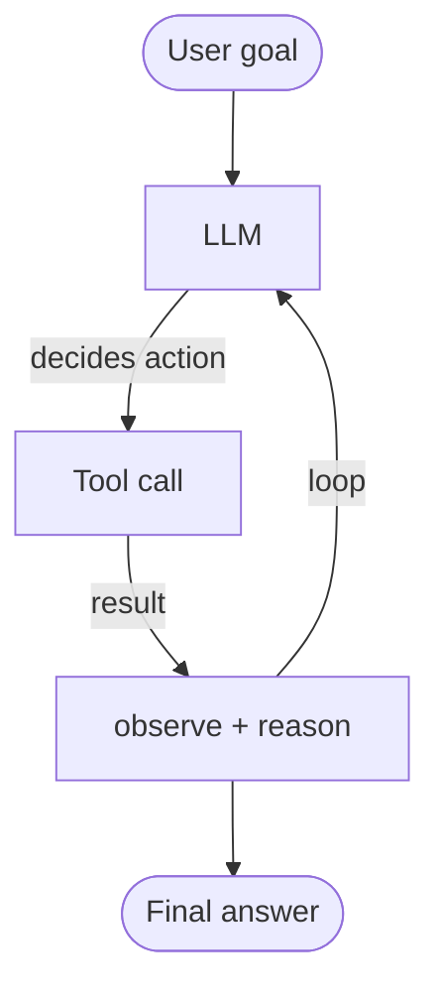

# AI Agents - Start Here

---

Build LLMs that can take actions: calling tools, browsing the web, writing code, and completing multi-step tasks autonomously.

This is one of the core production phases in the repo, not just a trend topic. Treat it as systems design plus evaluation, not just prompt experiments with tools.

---

## What Is an AI Agent?

An agent is an LLM equipped with **tools** and a **loop**:



## Notebooks in This Phase

| Notebook | Topic |
|----------|-------|
| `01_intro_to_agents.ipynb` | Agent concepts, tools, and the action loop |
| `02_function_calling.ipynb` | OpenAI and Anthropic tool/function use |
| `03_react_pattern.ipynb` | ReAct: Reason + Act + Observe |
| `04_agent_frameworks.ipynb` | LangChain, LlamaIndex, Microsoft Agent Framework, runtimes (Temporal, Step Functions) |
| `05_multi_agent_systems.ipynb` | Multi-agent coordination and orchestration |
| `06_mcp_model_context_protocol.ipynb` | MCP - universal tool protocol for agents |
| `07_openai_agents_sdk_langgraph.ipynb` | OpenAI Agents SDK + LangGraph workflows |
| `08_reasoning_models.ipynb` | o1, o3, DeepSeek-R1 - extended thinking |
| `09_autonomous_agents_2026.ipynb` | OpenHands, OpenCode, Lingxi, mini-swe-agent, computer use, and long-horizon tasks |
| `10_agent_evaluation.ipynb` | Measuring agent quality, tool use, and failure rates |

## Key Concepts

| Concept | Description |
|---------|-------------|
| **Tool use** | LLM calls functions (search, code, API) |
| **ReAct** | Interleaved reasoning + acting loop |
| **Memory** | Short-term context plus optional long-term retrieval |
| **Planning** | Task decomposition and sub-task delegation |
| **MCP** | Model Context Protocol for tool standardization |
| **Multi-agent** | Specialized agents working in parallel |
| **Agent runtime** | Durable execution engine (Temporal, Step Functions) for production workflows |

## Agent Frameworks Covered

| Framework | Type | Coverage |
|-----------|------|----------|
| **LangChain / LangGraph** | Open-source SDK | Deep - agents, tools, graphs, workflows |
| **Microsoft Agent Framework** | Open-source SDK | Conceptual + patterns - successor to AutoGen |
| **OpenAI Agents SDK** | Open-source SDK | Deep - handoffs, guardrails, MCP |
| **LlamaIndex** | Open-source SDK | Conceptual + patterns - RAG agents |
| **CrewAI** | Open-source SDK | Multi-agent teams |
| **AutoGen** | Open-source SDK | Multi-agent conversation |
| **Google ADK** | Open-source SDK | Multi-language, A2A protocol |
| **Haystack** | Open-source SDK | RAG pipelines |
| **Temporal.io** | Agent runtime | Durable workflow execution |
| **AWS Step Functions** | Agent runtime | Serverless orchestration |

## Representative Agentic Platforms

- **OpenHands** - open-source autonomous software engineer
- **OpenCode** - terminal-first coding agent
- **mini-swe-agent** - minimal coding agent for research and benchmarks
- **Lingxi** - repository-level issue resolution framework
- **Anthropic Computer Use** - GUI control agent runtime

## Prerequisites
- Prompt engineering familiarity
- RAG systems and embeddings basics
- Python fundamentals

## How To Use This Phase Well

1. Build one single-agent system end to end before exploring multi-agent orchestration.
2. Evaluate the system you build instead of judging it only by demos.
3. Use advanced agent notebooks selectively based on real failure modes or project goals.

## Learning Path

```text
02_intro_to_agents.ipynb         ← Start here
02_function_calling.ipynb
03_react_pattern.ipynb
05_agent_frameworks.ipynb        ← Now includes MS Agent Framework, LlamaIndex, runtimes
06_mcp_model_context_protocol.ipynb
07_openai_agents_sdk_langgraph.ipynb
05_multi_agent_systems.ipynb
08_reasoning_models.ipynb
10_autonomous_agents_2026.ipynb  ← Cutting edge
11_agent_evaluation.ipynb        ← Measure everything
```

## What Comes Next

- Continue to `16-model-evaluation/` to measure agent quality, tool use, and failure rates.
- Continue to `19-ai-safety-redteaming/` to harden agent systems against unsafe behavior.
- Continue to `31-ai-powered-dev-tools/` if you want stronger coding-agent and MCP workflow context.
