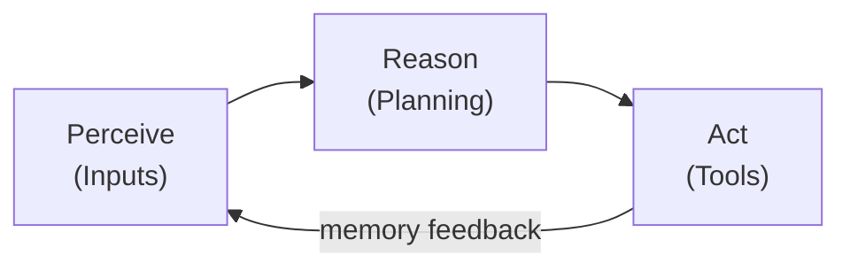

```python
# Install required packages
!pip install openai python-dotenv -q

import openai
import os
import json
from dotenv import load_dotenv

# Load environment variables
load_dotenv()
openai.api_key = os.getenv("OPENAI_API_KEY")

print("✅ Environment setup complete!")
```

## Part 1: What is an AI Agent?

### Definition

**AI Agent:** A software system that can autonomously perceive its environment, reason about actions, and take steps to achieve goals.

### Key Characteristics

1. **Autonomy:** Makes decisions without constant human input
2. **Reactivity:** Responds to environmental changes
3. **Pro-activeness:** Takes initiative to achieve goals
4. **Social Ability:** Interacts with other agents/humans

### Agent Architecture



---

## Part 2: Chatbot vs Agent

### Comparison Table

| Feature | Chatbot | AI Agent |
|---------|---------|----------|
| **Primary Function** | Converse | Take actions |
| **Tools** | None | External tools/APIs |
| **Autonomy** | Reactive only | Proactive |
| **Planning** | No | Yes (multi-step) |
| **Memory** | Conversation only | Persistent state |
| **Example** | Customer FAQ bot | Customer service agent |

### Examples

**Chatbot:**
```
User: "What's the weather in Boston?"
Bot:  "I don't have access to real-time weather data."
```

**AI Agent:**
```
User:  "What's the weather in Boston?"
Agent: [Calls weather API]
       "It's currently 72°F and sunny in Boston, MA."
```

---

### Part 3: Build Your First Simple Agent

An agent is only as useful as its tools. The simplest agent has a single tool -- in this case, a calculator -- and follows a three-step loop: (1) send the user query and tool schema to the LLM, (2) if the LLM decides to call a tool, execute it and collect the result, (3) send the result back to the LLM for a natural language response. The `tool_choice="auto"` parameter lets the model decide whether a tool is needed: for "What is 45 plus 67?" it calls the calculator, but for "What is an AI agent?" it answers directly from its training data.

```python
# Define tools (functions the agent can use)
def calculator(operation: str, a: float, b: float) -> float:
    """Perform basic math operations"""
    operations = {
        "add": lambda x, y: x + y,
        "subtract": lambda x, y: x - y,
        "multiply": lambda x, y: x * y,
        "divide": lambda x, y: x / y if y != 0 else "Error: Division by zero"
    }
    
    if operation in operations:
        return operations[operation](a, b)
    else:
        return f"Error: Unknown operation '{operation}'"

# Test the calculator
print("Calculator tests:")
print(f"  10 + 5 = {calculator('add', 10, 5)}")
print(f"  10 - 5 = {calculator('subtract', 10, 5)}")
print(f"  10 * 5 = {calculator('multiply', 10, 5)}")
print(f"  10 / 5 = {calculator('divide', 10, 5)}")
```

```python
# Define tool schema for OpenAI function calling
tools = [
    {
        "type": "function",
        "function": {
            "name": "calculator",
            "description": "Perform basic mathematical operations (add, subtract, multiply, divide)",
            "parameters": {
                "type": "object",
                "properties": {
                    "operation": {
                        "type": "string",
                        "enum": ["add", "subtract", "multiply", "divide"],
                        "description": "The mathematical operation to perform"
                    },
                    "a": {
                        "type": "number",
                        "description": "The first number"
                    },
                    "b": {
                        "type": "number",
                        "description": "The second number"
                    }
                },
                "required": ["operation", "a", "b"]
            }
        }
    }
]

print("✅ Tool schema defined")
print(json.dumps(tools[0], indent=2))
```

```python
# Simple agent implementation
def simple_agent(user_query: str):
    """A simple agent that can use the calculator tool"""
    
    print(f"\n👤 User: {user_query}")
    print("🤖 Agent: Thinking...\n")
    
    # Step 1: Send query to LLM with tools
    response = openai.chat.completions.create(
        model="gpt-3.5-turbo",
        messages=[{"role": "user", "content": user_query}],
        tools=tools,
        tool_choice="auto"  # Let model decide if it needs tools
    )
    
    message = response.choices[0].message
    
    # Step 2: Check if tool was called
    if message.tool_calls:
        # Extract tool call
        tool_call = message.tool_calls[0]
        function_name = tool_call.function.name
        function_args = json.loads(tool_call.function.arguments)
        
        print(f"🔧 Agent decided to use tool: {function_name}")
        print(f"   Arguments: {function_args}")
        
        # Step 3: Execute the function
        if function_name == "calculator":
            result = calculator(**function_args)
            print(f"   Result: {result}\n")
            
            # Step 4: Send result back to LLM for final response
            second_response = openai.chat.completions.create(
                model="gpt-3.5-turbo",
                messages=[
                    {"role": "user", "content": user_query},
                    message,
                    {
                        "role": "tool",
                        "tool_call_id": tool_call.id,
                        "name": function_name,
                        "content": str(result)
                    }
                ]
            )
            
            final_response = second_response.choices[0].message.content
            print(f"🤖 Agent: {final_response}")
            return final_response
    else:
        # No tool needed, return direct response
        print(f"🤖 Agent: {message.content}")
        return message.content
```

```python
# Test the agent
simple_agent("What is 45 plus 67?")
```

```python
# Test with a more complex query
simple_agent("If I have 100 dollars and spend 23.50, how much do I have left?")
```

```python
# Test without needing the calculator
simple_agent("What is an AI agent?")
```

### 🧠 Knowledge Check

**Question 1:** What are the three main steps in the agent loop?

<details>
<summary>Click for answer</summary>

**Answer:** 
1. **Perceive** - Receive user input
2. **Reason** - Decide what action to take (which tool to use)
3. **Act** - Execute the tool and return results

Then the cycle repeats with feedback from the action.

</details>

**Question 2:** When does the agent decide to use a tool vs. answer directly?

<details>
<summary>Click for answer</summary>

**Answer:** The LLM analyzes the user query and determines if it needs external tools to answer:
- **Use tool:** When the query requires actions or external data (e.g., "What is 45 + 67?")
- **Answer directly:** When the LLM has the knowledge in its training data (e.g., "What is an AI agent?")

This is controlled by `tool_choice="auto"`

</details>

---

## Part 4: Agent Design Patterns

### 1. **Single-Tool Agent**
- One specialized tool (like our calculator)
- Simple and focused
- Example: SQL agent, weather agent

### 2. **Multi-Tool Agent**
- Multiple tools available
- Agent selects appropriate tool
- Example: Personal assistant (calendar + email + search)

### 3. **ReAct Agent (Reasoning + Acting)**
- Alternates between thinking and acting
- Explains reasoning before each action
- Can self-correct

### 4. **Chain Agent**
- Fixed sequence of tools
- Output of one tool → input to next
- Example: Data pipeline (load → clean → analyze → visualize)

### 5. **Hierarchical Agent**
- Multiple agents coordinated by a master agent
- Task decomposition
- Example: Research agent delegates to search, summarize, write agents

---

### Part 5: Multi-Tool Agent Example

Real-world agents need access to multiple tools, and a key part of the agent's intelligence is **tool selection** -- choosing which tool to invoke based on the user's intent. The multi-tool agent below has a calculator, a clock, and a random number generator. When the user asks "What time is it?", the LLM analyzes the query against all tool descriptions and selects `get_current_time`. The `available_functions` dictionary maps tool names to their Python implementations, enabling dynamic dispatch. As you add more tools, clear and distinct tool descriptions become critical to prevent the model from selecting the wrong one.

```python
# Define additional tools
def get_current_time():
    """Get the current time"""
    from datetime import datetime
    return datetime.now().strftime("%I:%M %p")

def get_random_number(min_val: int, max_val: int):
    """Generate a random number between min and max"""
    import random
    return random.randint(min_val, max_val)

# Updated tool schemas
multi_tools = [
    {
        "type": "function",
        "function": {
            "name": "calculator",
            "description": "Perform basic mathematical operations",
            "parameters": {
                "type": "object",
                "properties": {
                    "operation": {"type": "string", "enum": ["add", "subtract", "multiply", "divide"]},
                    "a": {"type": "number"},
                    "b": {"type": "number"}
                },
                "required": ["operation", "a", "b"]
            }
        }
    },
    {
        "type": "function",
        "function": {
            "name": "get_current_time",
            "description": "Get the current time",
            "parameters": {"type": "object", "properties": {}}
        }
    },
    {
        "type": "function",
        "function": {
            "name": "get_random_number",
            "description": "Generate a random number between min and max (inclusive)",
            "parameters": {
                "type": "object",
                "properties": {
                    "min_val": {"type": "integer", "description": "Minimum value"},
                    "max_val": {"type": "integer", "description": "Maximum value"}
                },
                "required": ["min_val", "max_val"]
            }
        }
    }
]

print(f"✅ Multi-tool agent has {len(multi_tools)} tools available")
```

```python
# Multi-tool agent
def multi_tool_agent(user_query: str):
    """Agent with multiple tools"""
    
    # Map function names to actual functions
    available_functions = {
        "calculator": calculator,
        "get_current_time": get_current_time,
        "get_random_number": get_random_number
    }
    
    print(f"\n👤 User: {user_query}")
    print("🤖 Agent: Analyzing request...\n")
    
    # Call LLM with all tools
    response = openai.chat.completions.create(
        model="gpt-3.5-turbo",
        messages=[{"role": "user", "content": user_query}],
        tools=multi_tools,
        tool_choice="auto"
    )
    
    message = response.choices[0].message
    
    if message.tool_calls:
        tool_call = message.tool_calls[0]
        function_name = tool_call.function.name
        function_args = json.loads(tool_call.function.arguments)
        
        print(f"🔧 Selected tool: {function_name}")
        print(f"   Arguments: {function_args}")
        
        # Execute the selected function
        function_to_call = available_functions[function_name]
        result = function_to_call(**function_args) if function_args else function_to_call()
        print(f"   Result: {result}\n")
        
        # Get final response
        second_response = openai.chat.completions.create(
            model="gpt-3.5-turbo",
            messages=[
                {"role": "user", "content": user_query},
                message,
                {
                    "role": "tool",
                    "tool_call_id": tool_call.id,
                    "name": function_name,
                    "content": str(result)
                }
            ]
        )
        
        final_response = second_response.choices[0].message.content
        print(f"🤖 Agent: {final_response}")
        return final_response
    else:
        print(f"🤖 Agent: {message.content}")
        return message.content
```

```python
# Test with different queries
multi_tool_agent("What time is it right now?")
```

```python
multi_tool_agent("Pick a random number between 1 and 100")
```

```python
multi_tool_agent("Calculate 25 times 4")
```

### Part 6: Real-World Agent Example

Moving beyond toy tools, the **customer support agent** demonstrates how agents solve practical business problems. It has three tools: FAQ search (information retrieval), order status lookup (database query), and ticket creation (write operation). Each tool connects to a simulated backend -- in production, these would be real databases and APIs. The system prompt sets the agent's tone ("friendly and professional"), while the tool schemas guide which operations are available. This pattern scales naturally: add a refund tool, a shipping tool, or a product recommendation tool, and the agent gains new capabilities without changes to the core loop.

```python
# Simulated database/knowledge base
faq_database = {
    "return policy": "You can return items within 30 days of purchase for a full refund.",
    "shipping": "Free shipping on orders over $50. Standard shipping takes 5-7 business days.",
    "payment methods": "We accept credit cards, PayPal, and Apple Pay.",
    "warranty": "All products come with a 1-year manufacturer's warranty."
}

order_database = {
    "12345": {"status": "shipped", "tracking": "1Z999AA10123456784", "eta": "Dec 18"},
    "67890": {"status": "processing", "tracking": None, "eta": "Dec 20"}
}

# Support agent tools
def search_faq(topic: str) -> str:
    """Search the FAQ database"""
    topic_lower = topic.lower()
    for key, value in faq_database.items():
        if key in topic_lower or topic_lower in key:
            return value
    return "No FAQ found for that topic. Please contact support."

def check_order_status(order_id: str) -> str:
    """Check the status of an order"""
    if order_id in order_database:
        order = order_database[order_id]
        status_msg = f"Order {order_id}: {order['status']}"
        if order['tracking']:
            status_msg += f" | Tracking: {order['tracking']}"
        status_msg += f" | ETA: {order['eta']}"
        return status_msg
    else:
        return f"Order {order_id} not found in system."

def create_support_ticket(issue: str, customer_email: str) -> str:
    """Create a support ticket"""
    ticket_id = f"TKT-{hash(issue + customer_email) % 10000:04d}"
    return f"Support ticket {ticket_id} created. We'll respond within 24 hours."

print("✅ Customer support tools defined")
```

```python
# Tool schemas for support agent
support_tools = [
    {
        "type": "function",
        "function": {
            "name": "search_faq",
            "description": "Search the FAQ database for information on topics like return policy, shipping, payment methods, warranty",
            "parameters": {
                "type": "object",
                "properties": {
                    "topic": {"type": "string", "description": "The topic to search for"}
                },
                "required": ["topic"]
            }
        }
    },
    {
        "type": "function",
        "function": {
            "name": "check_order_status",
            "description": "Check the status and tracking information for an order",
            "parameters": {
                "type": "object",
                "properties": {
                    "order_id": {"type": "string", "description": "The order ID (5 digits)"}
                },
                "required": ["order_id"]
            }
        }
    },
    {
        "type": "function",
        "function": {
            "name": "create_support_ticket",
            "description": "Create a support ticket for complex issues that require human assistance",
            "parameters": {
                "type": "object",
                "properties": {
                    "issue": {"type": "string", "description": "Description of the issue"},
                    "customer_email": {"type": "string", "description": "Customer's email address"}
                },
                "required": ["issue", "customer_email"]
            }
        }
    }
]
```

```python
# Customer support agent
def support_agent(user_query: str, customer_email: str = "customer@example.com"):
    """Customer support agent"""
    
    available_functions = {
        "search_faq": search_faq,
        "check_order_status": check_order_status,
        "create_support_ticket": lambda issue: create_support_ticket(issue, customer_email)
    }
    
    print(f"\n👤 Customer: {user_query}")
    print("🎧 Support Agent: Let me help you with that...\n")
    
    response = openai.chat.completions.create(
        model="gpt-3.5-turbo",
        messages=[
            {"role": "system", "content": "You are a helpful customer support agent. Be friendly and professional."},
            {"role": "user", "content": user_query}
        ],
        tools=support_tools,
        tool_choice="auto"
    )
    
    message = response.choices[0].message
    
    if message.tool_calls:
        tool_call = message.tool_calls[0]
        function_name = tool_call.function.name
        function_args = json.loads(tool_call.function.arguments)
        
        print(f"🔧 Using tool: {function_name}")
        print(f"   Arguments: {function_args}")
        
        function_to_call = available_functions[function_name]
        result = function_to_call(**function_args)
        print(f"   Result: {result}\n")
        
        second_response = openai.chat.completions.create(
            model="gpt-3.5-turbo",
            messages=[
                {"role": "system", "content": "You are a helpful customer support agent. Be friendly and professional."},
                {"role": "user", "content": user_query},
                message,
                {
                    "role": "tool",
                    "tool_call_id": tool_call.id,
                    "name": function_name,
                    "content": str(result)
                }
            ]
        )
        
        final_response = second_response.choices[0].message.content
        print(f"🎧 Support Agent: {final_response}")
        return final_response
    else:
        print(f"🎧 Support Agent: {message.content}")
        return message.content
```

```python
# Test the support agent
support_agent("What's your return policy?")
```

```python
support_agent("Where is my order #12345?")
```

```python
support_agent("I received a damaged item and need help", customer_email="john@email.com")
```

## 🎯 Summary

### What We Learned

1. **AI Agents** are autonomous systems that perceive, reason, and act
2. **Key difference** from chatbots: Agents can use tools to take actions
3. **Agent architecture:** Perceive → Reason → Act → Learn (with Memory)
4. **Tool schemas** define what functions agents can use
5. **OpenAI Function Calling** enables agents to use external tools
6. **Design patterns:** Single-tool, multi-tool, ReAct, chain, hierarchical

### Key Takeaways

✅ Agents extend LLM capabilities with external tools  
✅ Tool selection is automatic based on user query  
✅ Agents can handle complex, multi-step tasks  
✅ Real-world applications: support, research, coding, data analysis  

### Next Steps

- **Notebook 2:** Deep dive into function calling and tool design
- **Notebook 3:** ReAct pattern for multi-step reasoning
- **Notebook 4:** Agent frameworks (LangChain, LangGraph)

---

**Ready to build more sophisticated agents? Let's continue! 🚀**
