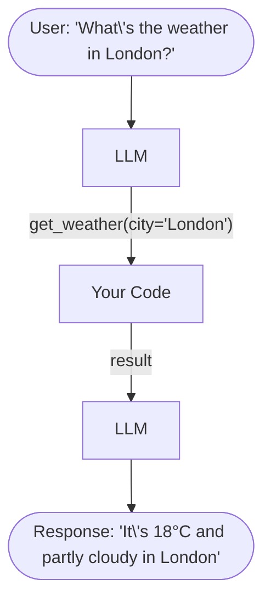

### Setup

Function calling requires the OpenAI Python client (or an equivalent for Anthropic/other providers) and a pattern for mapping tool names to Python functions. The `dotenv` library loads API credentials from a `.env` file, keeping secrets out of source control. The `json` module is essential because tool arguments arrive as JSON strings that need parsing, and tool results must be serialized back to JSON for the LLM. The `typing` module helps define clear function signatures that match the tool schemas.

```python
import os
import json
from openai import OpenAI
from dotenv import load_dotenv
from typing import Optional, List, Dict, Any
import re

load_dotenv()
client = OpenAI(api_key=os.getenv("OPENAI_API_KEY"))

print("✅ Setup complete")
```

<a id="part1"></a>
## Part 1: Function Calling Basics

### How Function Calling Works



### Key Concepts

1. **Tool Schema** - JSON description of your function
2. **Tool Call** - LLM's decision to invoke a tool
3. **Tool Result** - Output from executing the function
4. **Final Response** - LLM processes result into natural language

### Basic Example: Weather Tool

A **tool schema** is a JSON object that describes a function's name, purpose, and parameters to the LLM. The schema acts as documentation that the model reads at inference time to decide when and how to call the function. The `description` field is particularly important -- it tells the LLM under what circumstances to use this tool. Parameters include type annotations, optional enums for constrained values, and `required` arrays that distinguish mandatory from optional arguments. The actual Python function (here, `get_weather()`) is separate from the schema and runs on your server, never on the LLM side.

```python
# Define the tool schema
tools = [
    {
        "type": "function",
        "function": {
            "name": "get_weather",
            "description": "Get the current weather for a specific city",
            "parameters": {
                "type": "object",
                "properties": {
                    "city": {
                        "type": "string",
                        "description": "The city name, e.g., 'London', 'Paris'"
                    },
                    "units": {
                        "type": "string",
                        "enum": ["celsius", "fahrenheit"],
                        "description": "Temperature unit"
                    }
                },
                "required": ["city"]
            }
        }
    }
]

# Implement the actual function
def get_weather(city: str, units: str = "celsius") -> dict:
    """Simulated weather function"""
    # In production, this would call a real weather API
    mock_data = {
        "london": {"temp": 18, "condition": "Partly cloudy"},
        "paris": {"temp": 22, "condition": "Sunny"},
        "tokyo": {"temp": 25, "condition": "Clear"},
    }
    
    city_lower = city.lower()
    if city_lower not in mock_data:
        return {"error": f"Weather data not available for {city}"}
    
    data = mock_data[city_lower]
    
    if units == "fahrenheit":
        data["temp"] = round(data["temp"] * 9/5 + 32)
        data["units"] = "°F"
    else:
        data["units"] = "°C"
    
    return data

print("✅ Weather tool defined")
```

### Call the LLM with the Tool

The function calling flow requires **two LLM calls**. The first call sends the user message along with tool schemas; the LLM responds with either a direct text answer or a structured `tool_calls` object containing the function name and JSON arguments. Your code then executes the function, and the second LLM call sends the original conversation plus the tool result, allowing the model to formulate a natural language response that incorporates the real data. The `run_agent_with_tools()` function below implements this complete loop, handling both the tool-call and no-tool-call paths.

```python
def run_agent_with_tools(user_message: str, tools: list, available_functions: dict):
    """Execute agent with tool calling capability"""
    
    messages = [{"role": "user", "content": user_message}]
    
    # Step 1: Get LLM response with potential tool calls
    response = client.chat.completions.create(
        model="gpt-4",
        messages=messages,
        tools=tools,
        tool_choice="auto"  # Let the model decide when to use tools
    )
    
    response_message = response.choices[0].message
    messages.append(response_message)
    
    # Step 2: Check if the model wants to call a tool
    if response_message.tool_calls:
        for tool_call in response_message.tool_calls:
            function_name = tool_call.function.name
            function_args = json.loads(tool_call.function.arguments)
            
            print(f"🔧 Calling tool: {function_name}")
            print(f"📥 Arguments: {function_args}")
            
            # Step 3: Execute the function
            function_to_call = available_functions[function_name]
            function_response = function_to_call(**function_args)
            
            print(f"📤 Result: {function_response}")
            
            # Step 4: Add function response to messages
            messages.append({
                "tool_call_id": tool_call.id,
                "role": "tool",
                "name": function_name,
                "content": json.dumps(function_response)
            })
        
        # Step 5: Get final response from LLM
        second_response = client.chat.completions.create(
            model="gpt-4",
            messages=messages
        )
        
        return second_response.choices[0].message.content
    
    else:
        # No tool call needed
        return response_message.content

# Test it
available_functions = {
    "get_weather": get_weather
}

result = run_agent_with_tools(
    "What's the weather like in London?",
    tools,
    available_functions
)

print(f"\n🤖 Agent Response: {result}")
```

### 🎯 Knowledge Check

**Q1:** What are the 4 main steps in function calling?  
**Q2:** What does `tool_choice="auto"` mean?  
**Q3:** Why do we need to call the LLM twice?

<details>
<summary>Click for answers</summary>

**A1:** (1) Send tools to LLM, (2) LLM decides to call tool, (3) Execute function, (4) Send result back to LLM  
**A2:** The model decides whether to use tools based on the query  
**A3:** First call: determine tool usage. Second call: format result into natural language response  
</details>

<a id="part2"></a>
## Part 2: Tool Schema Design

### Anatomy of a Good Tool Schema

A tool schema has 3 critical parts:
1. **Name** - Clear, descriptive function name
2. **Description** - Tells LLM WHEN to use this tool
3. **Parameters** - Defines inputs with types and descriptions

```python
# ❌ BAD: Vague, unclear
bad_tool = {
    "type": "function",
    "function": {
        "name": "get_data",  # Too generic
        "description": "Gets data",  # Doesn't say what or when
        "parameters": {
            "type": "object",
            "properties": {
                "input": {"type": "string"}  # No description!
            }
        }
    }
}

# ✅ GOOD: Clear, specific, well-documented
good_tool = {
    "type": "function",
    "function": {
        "name": "search_products",  # Specific action
        "description": "Search the product catalog by name, category, or price range. Use this when the user is looking for products to buy.",
        "parameters": {
            "type": "object",
            "properties": {
                "query": {
                    "type": "string",
                    "description": "Search query - product name or keywords"
                },
                "category": {
                    "type": "string",
                    "enum": ["electronics", "clothing", "books", "toys"],
                    "description": "Product category to filter by (optional)"
                },
                "max_price": {
                    "type": "number",
                    "description": "Maximum price in dollars (optional)"
                }
            },
            "required": ["query"]  # Only query is required
        }
    }
}

print("✅ Tool schemas defined")
```

### Schema Design Best Practices

#### 1. Clear Naming
```python
# ❌ Bad
"get_info", "do_thing", "process"

# ✅ Good
"search_products", "calculate_shipping", "track_order"
```

#### 2. Descriptive Parameter Names
```python
# ❌ Bad
"id", "data", "input"

# ✅ Good
"order_id", "customer_email", "tracking_number"
```

#### 3. Use Enums for Limited Choices
```python
{
    "status": {
        "type": "string",
        "enum": ["pending", "shipped", "delivered", "cancelled"],
        "description": "Order status"
    }
}
```

#### 4. Provide Examples in Descriptions
```python
{
    "date": {
        "type": "string",
        "description": "Date in YYYY-MM-DD format, e.g., '2024-03-15'"
    }
}
```

### Exercise: Design a Tool Schema

Practice designing a complete tool schema for a `book_flight` function. Good schema design requires thinking about what parameters the LLM needs to extract from natural language ("Book me a business class flight from LAX to London on June 15th for two people"), which are required versus optional, and what constraints apply (valid airport codes, future dates, passenger limits). The `enum` type is especially useful for cabin class since it prevents the LLM from hallucinating invalid options like "premium" or "deluxe."

```python
# Your solution here
book_flight_tool = {
    "type": "function",
    "function": {
        "name": "book_flight",
        "description": "Book a flight from origin to destination on a specific date. Use this when user wants to book or search for flights.",
        "parameters": {
            "type": "object",
            "properties": {
                "origin": {
                    "type": "string",
                    "description": "Departure airport code, e.g., 'LAX', 'JFK'"
                },
                "destination": {
                    "type": "string",
                    "description": "Arrival airport code, e.g., 'LHR', 'CDG'"
                },
                "date": {
                    "type": "string",
                    "description": "Flight date in YYYY-MM-DD format, e.g., '2024-06-15'"
                },
                "passengers": {
                    "type": "integer",
                    "description": "Number of passengers (default: 1)",
                    "minimum": 1,
                    "maximum": 9
                },
                "cabin_class": {
                    "type": "string",
                    "enum": ["economy", "business", "first"],
                    "description": "Cabin class preference"
                }
            },
            "required": ["origin", "destination", "date"]
        }
    }
}

print("✅ Flight booking tool schema created")
print(json.dumps(book_flight_tool, indent=2))
```

### Part 3: Input Validation

LLMs generate tool arguments probabilistically, which means they can produce malformed, out-of-range, or logically inconsistent inputs. **Input validation** is your primary defense against these errors. Every tool function should validate types, ranges, formats, and logical constraints before executing any business logic. The flight search function below demonstrates comprehensive validation: it checks for empty strings, prevents same-origin-destination bookings, rejects past dates, bounds passenger count, and whitelists cabin classes. When validation fails, the function returns a structured error message that helps the LLM self-correct or explain the issue to the user.

```python
from datetime import datetime
from typing import Optional

def search_flights(
    origin: str,
    destination: str,
    date: str,
    passengers: int = 1,
    cabin_class: Optional[str] = "economy"
) -> dict:
    """
    Search for available flights with comprehensive validation.
    """
    
    # Validate origin and destination
    if not origin or not isinstance(origin, str):
        return {"error": "Origin must be a non-empty string"}
    
    if not destination or not isinstance(destination, str):
        return {"error": "Destination must be a non-empty string"}
    
    if origin.lower() == destination.lower():
        return {"error": "Origin and destination must be different"}
    
    # Validate date format
    try:
        flight_date = datetime.strptime(date, "%Y-%m-%d")
        if flight_date < datetime.now():
            return {"error": "Flight date must be in the future"}
    except ValueError:
        return {"error": "Date must be in YYYY-MM-DD format"}
    
    # Validate passengers
    if not isinstance(passengers, int) or passengers < 1 or passengers > 9:
        return {"error": "Passengers must be between 1 and 9"}
    
    # Validate cabin class
    valid_classes = ["economy", "business", "first"]
    if cabin_class not in valid_classes:
        return {"error": f"Cabin class must be one of: {valid_classes}"}
    
    # If all validations pass, return results
    return {
        "success": True,
        "flights": [
            {
                "flight_number": "AA100",
                "origin": origin.upper(),
                "destination": destination.upper(),
                "date": date,
                "price": 450 if cabin_class == "economy" else 1200,
                "cabin_class": cabin_class
            }
        ]
    }

# Test with valid input
print("✅ Valid input:")
print(search_flights("LAX", "JFK", "2024-12-25", 2, "business"))

# Test with invalid inputs
print("\n❌ Same origin/destination:")
print(search_flights("LAX", "LAX", "2024-12-25"))

print("\n❌ Past date:")
print(search_flights("LAX", "JFK", "2020-01-01"))

print("\n❌ Invalid cabin class:")
print(search_flights("LAX", "JFK", "2024-12-25", 1, "premium"))
```

### Validation Checklist

For every parameter, check:

- [ ] **Type** - Is it the expected type?
- [ ] **Range** - Is the value within valid bounds?
- [ ] **Format** - Does it match expected format (dates, emails, etc.)?
- [ ] **Logic** - Does it make sense? (e.g., start < end)
- [ ] **Security** - No SQL injection, path traversal, etc.

### Validation Helper Functions

```python
def validate_email(email: str) -> bool:
    """Check if email format is valid"""
    pattern = r'^[a-zA-Z0-9._%+-]+@[a-zA-Z0-9.-]+\.[a-zA-Z]{2,}$'
    return re.match(pattern, email) is not None

def validate_phone(phone: str) -> bool:
    """Check if phone number is valid (US format)"""
    pattern = r'^\+?1?\d{10}$'
    clean = re.sub(r'[\s\-\(\)]', '', phone)
    return re.match(pattern, clean) is not None

def validate_date_range(start: str, end: str) -> bool:
    """Check if date range is valid"""
    try:
        start_dt = datetime.strptime(start, "%Y-%m-%d")
        end_dt = datetime.strptime(end, "%Y-%m-%d")
        return start_dt < end_dt
    except ValueError:
        return False

# Test validators
print(validate_email("user@example.com"))  # True
print(validate_email("invalid-email"))     # False
print(validate_phone("555-123-4567"))      # True
print(validate_date_range("2024-01-01", "2024-12-31"))  # True
```

<a id="part4"></a>
## Part 4: Error Handling

### Error Handling Strategy

1. **Validate inputs** (as shown above)
2. **Try-except blocks** for external calls
3. **Meaningful error messages** for the LLM
4. **Graceful degradation** when possible

```python
import requests
from requests.exceptions import Timeout, ConnectionError, HTTPError

def fetch_stock_price(symbol: str) -> dict:
    """
    Fetch stock price with comprehensive error handling.
    """
    
    # Input validation
    if not symbol or not isinstance(symbol, str):
        return {
            "success": False,
            "error": "Stock symbol must be a non-empty string"
        }
    
    symbol = symbol.upper().strip()
    
    if len(symbol) > 5:
        return {
            "success": False,
            "error": "Stock symbol too long (max 5 characters)"
        }
    
    try:
        # Simulated API call (replace with real API)
        # response = requests.get(
        #     f"https://api.stocks.com/quote/{symbol}",
        #     timeout=5
        # )
        # response.raise_for_status()
        # data = response.json()
        
        # For demo, return mock data
        mock_prices = {
            "AAPL": 178.50,
            "GOOGL": 140.25,
            "MSFT": 380.75
        }
        
        if symbol not in mock_prices:
            return {
                "success": False,
                "error": f"Stock symbol '{symbol}' not found"
            }
        
        return {
            "success": True,
            "symbol": symbol,
            "price": mock_prices[symbol],
            "currency": "USD"
        }
    
    except Timeout:
        return {
            "success": False,
            "error": "Request timed out. Please try again."
        }
    
    except ConnectionError:
        return {
            "success": False,
            "error": "Unable to connect to stock API. Check internet connection."
        }
    
    except HTTPError as e:
        return {
            "success": False,
            "error": f"API error: {e.response.status_code}"
        }
    
    except Exception as e:
        # Catch-all for unexpected errors
        return {
            "success": False,
            "error": f"Unexpected error: {str(e)}"
        }

# Test error handling
print("✅ Valid symbol:")
print(fetch_stock_price("AAPL"))

print("\n❌ Invalid symbol:")
print(fetch_stock_price("INVALID"))

print("\n❌ Empty input:")
print(fetch_stock_price(""))
```

### Best Practices for Error Messages

**For the LLM:**
- ✅ "User email not found in database"
- ❌ "Error code: 404"

**Include context:**
- ✅ "Cannot book flight: Date 2020-01-01 is in the past"
- ❌ "Invalid date"

**Suggest next steps:**
- ✅ "Stock symbol 'XYZ' not found. Try using the full company name instead."
- ❌ "Not found"

<a id="part5"></a>
## Part 5: Advanced Patterns

### Pattern 1: Retry Logic with Exponential Backoff

```python
import time

def call_api_with_retry(url: str, max_retries: int = 3):
    """
    Call API with exponential backoff retry logic.
    """
    
    for attempt in range(max_retries):
        try:
            # response = requests.get(url, timeout=5)
            # response.raise_for_status()
            # return response.json()
            
            # Simulate occasional failures
            import random
            if random.random() < 0.3:  # 30% failure rate
                raise ConnectionError("Simulated connection error")
            
            return {"success": True, "data": "API response"}
        
        except (Timeout, ConnectionError) as e:
            if attempt < max_retries - 1:
                wait_time = 2 ** attempt  # Exponential backoff: 1s, 2s, 4s
                print(f"⚠️ Attempt {attempt + 1} failed. Retrying in {wait_time}s...")
                time.sleep(wait_time)
            else:
                return {
                    "success": False,
                    "error": f"Failed after {max_retries} attempts: {str(e)}"
                }
    
    return {"success": False, "error": "Max retries exceeded"}

# Test retry logic
result = call_api_with_retry("https://api.example.com/data")
print(f"Final result: {result}")
```

### Pattern 2: Caching Results

When an agent calls the same tool with identical arguments multiple times (common in multi-turn conversations), **caching** avoids redundant API calls that waste time and money. The `CachedWeatherAPI` class stores results with timestamps and returns cached data if the cache is still fresh (within the configured duration). For weather data, a 10-minute cache is reasonable; for stock prices, you might use 1 minute; for static reference data, hours or days. Cache invalidation -- deciding when cached data is stale -- is one of the hardest problems in computing, so always set explicit TTLs rather than caching indefinitely.

```python
from functools import lru_cache
from datetime import datetime, timedelta

class CachedWeatherAPI:
    def __init__(self, cache_duration_minutes=10):
        self.cache = {}
        self.cache_duration = timedelta(minutes=cache_duration_minutes)
    
    def get_weather(self, city: str) -> dict:
        """
        Get weather with caching to avoid redundant API calls.
        """
        city_key = city.lower()
        
        # Check cache
        if city_key in self.cache:
            cached_data, cached_time = self.cache[city_key]
            
            if datetime.now() - cached_time < self.cache_duration:
                print(f"📦 Returning cached data for {city}")
                return cached_data
            else:
                print(f"⏰ Cache expired for {city}")
        
        # Fetch fresh data
        print(f"🌐 Fetching fresh data for {city}")
        data = self._fetch_from_api(city)
        
        # Update cache
        self.cache[city_key] = (data, datetime.now())
        
        return data
    
    def _fetch_from_api(self, city: str) -> dict:
        """Simulate API call"""
        return {"city": city, "temp": 20, "condition": "Sunny"}

# Test caching
weather_api = CachedWeatherAPI(cache_duration_minutes=1)

print("First call:")
print(weather_api.get_weather("London"))

print("\nSecond call (should use cache):")
print(weather_api.get_weather("London"))

print("\nDifferent city (should fetch):")
print(weather_api.get_weather("Paris"))
```

### Pattern 3: Rate Limiting

External APIs enforce rate limits, and exceeding them results in errors or temporary bans. A **sliding window rate limiter** tracks timestamps of recent calls and rejects new calls that would exceed the allowed rate. The `RateLimiter` class below allows a configurable number of calls within a time window (e.g., 3 calls per 5 seconds). When the limit is hit, the `wait_time()` method tells the caller how long to wait before retrying. In agent systems, rate limiting is especially important because the LLM may attempt rapid successive tool calls, and you need to throttle them at the application layer.

```python
from collections import deque
from time import time

class RateLimiter:
    def __init__(self, max_calls: int, time_window: int):
        """
        Rate limiter using sliding window.
        
        Args:
            max_calls: Maximum number of calls allowed
            time_window: Time window in seconds
        """
        self.max_calls = max_calls
        self.time_window = time_window
        self.calls = deque()
    
    def is_allowed(self) -> bool:
        """Check if a new call is allowed"""
        now = time()
        
        # Remove old calls outside the window
        while self.calls and self.calls[0] < now - self.time_window:
            self.calls.popleft()
        
        # Check if we're under the limit
        if len(self.calls) < self.max_calls:
            self.calls.append(now)
            return True
        
        return False
    
    def wait_time(self) -> float:
        """Get seconds to wait before next call is allowed"""
        if len(self.calls) < self.max_calls:
            return 0
        
        oldest_call = self.calls[0]
        return max(0, self.time_window - (time() - oldest_call))

def rate_limited_api_call(limiter: RateLimiter, data: str) -> dict:
    """Make API call with rate limiting"""
    if not limiter.is_allowed():
        wait = limiter.wait_time()
        return {
            "success": False,
            "error": f"Rate limit exceeded. Try again in {wait:.1f} seconds."
        }
    
    return {"success": True, "data": data}

# Test: 3 calls per 5 seconds
limiter = RateLimiter(max_calls=3, time_window=5)

for i in range(5):
    result = rate_limited_api_call(limiter, f"Request {i+1}")
    print(result)
    time.sleep(1)
```

<a id="part6"></a>
## Part 6: Best Practices Summary

### ✅ Do's

1. **Clear naming** - Function and parameter names should be self-explanatory
2. **Comprehensive descriptions** - Tell the LLM WHEN and HOW to use tools
3. **Validate everything** - Never trust LLM outputs
4. **Return structured data** - Use consistent JSON format
5. **Handle errors gracefully** - Provide helpful error messages
6. **Use type hints** - Makes code more maintainable
7. **Cache when possible** - Avoid redundant API calls
8. **Rate limit** - Respect API limits
9. **Log thoroughly** - Track all function calls and errors
10. **Test extensively** - Unit tests for all tools

### ❌ Don'ts

1. **Vague descriptions** - LLM won't know when to use the tool
2. **Skip validation** - Security and reliability issues
3. **Generic error messages** - "Error" doesn't help the LLM
4. **Overly complex tools** - Break into smaller, focused tools
5. **Ignore rate limits** - Will get blocked by APIs
6. **Return raw exceptions** - Format errors for the LLM
7. **Make assumptions** - Validate all inputs explicitly
8. **Forget edge cases** - Empty strings, nulls, negatives, etc.

### Tool Design Checklist

Before deploying a tool, verify:

- [ ] Clear, descriptive function name
- [ ] Comprehensive description (when to use)
- [ ] All parameters documented
- [ ] Type hints on all parameters
- [ ] Input validation implemented
- [ ] Error handling for all failure modes
- [ ] Meaningful error messages
- [ ] Unit tests written
- [ ] Rate limiting if calling external APIs
- [ ] Caching if appropriate
- [ ] Logging for debugging
- [ ] Documentation/examples provided

## 🎯 Final Knowledge Check

**Q1:** Why is input validation critical even though the LLM generates the inputs?  
**Q2:** What are the 3 most important parts of a tool schema?  
**Q3:** When should you use caching?  
**Q4:** What's the purpose of exponential backoff in retry logic?  
**Q5:** Should error messages be technical or natural language?

<details>
<summary>Click for answers</summary>

**A1:** LLMs can make mistakes, and malicious inputs could exploit vulnerabilities  
**A2:** Name, description, parameters  
**A3:** When data doesn't change frequently and API calls are expensive/slow  
**A4:** Avoid overwhelming services with rapid retries; give them time to recover  
**A5:** Natural language! The LLM needs to understand and explain errors to users  
</details>

## 🚀 Next Steps

1. Complete the **Function Calling Challenge** in challenges.md
2. Read Notebook 3: **ReAct Pattern** for advanced reasoning
3. Experiment with building your own tools
4. Review the [OpenAI Function Calling Guide](https://platform.openai.com/docs/guides/function-calling)

---

**Great work! You now understand how to design robust, production-ready tools for AI agents! 🎉**
