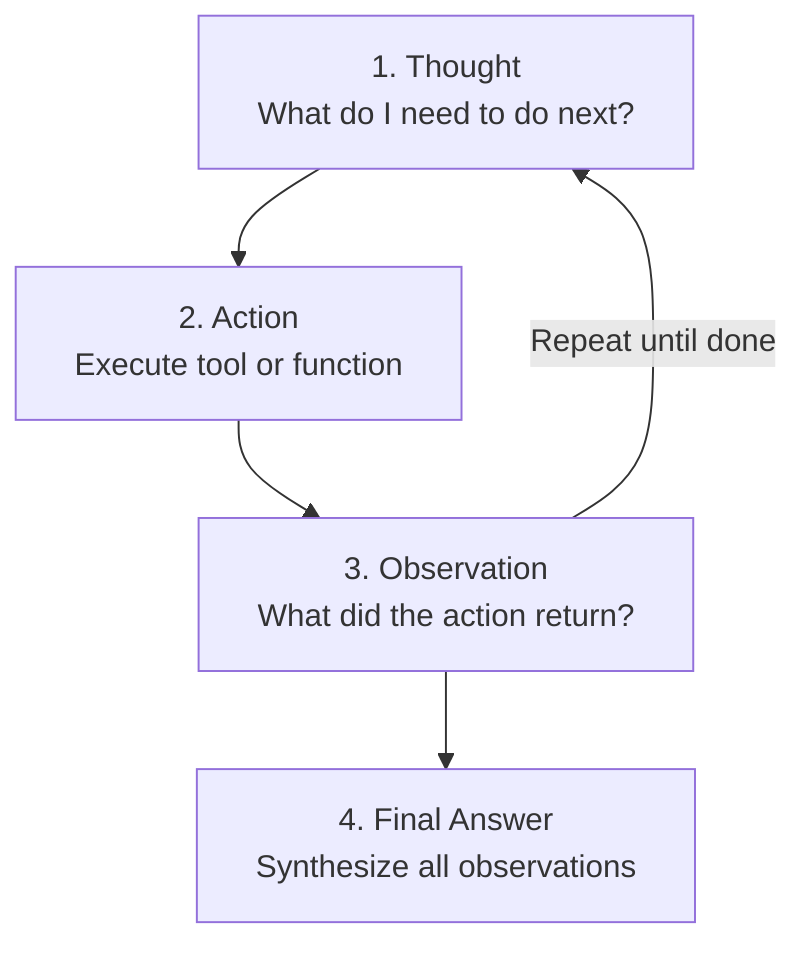

```python
import os
import json
from openai import OpenAI
from dotenv import load_dotenv
from typing import List, Dict, Any, Optional
import re

load_dotenv()
client = OpenAI(api_key=os.getenv("OPENAI_API_KEY"))

print("✅ Setup complete")
```

<a id="part1"></a>
## Part 1: What is ReAct?

### The Problem with Simple Agents

**Simple Agent:**
```
User: "What's the weather comparison between Tokyo and New York?"
Agent: Calls get_weather("Tokyo and New York") ❌ Wrong!
```

**ReAct Agent:**
```
User: "What's the weather comparison between Tokyo and New York?"

Thought: I need weather data for two cities separately
Action: get_weather("Tokyo")
Observation: Tokyo: 22°C, Sunny

Thought: Now I need New York's weather
Action: get_weather("New York")
Observation: New York: 18°C, Cloudy

Thought: I have both results, can now compare
Final Answer: Tokyo is warmer (22°C vs 18°C) and sunnier than New York
```

### ReAct Loop



### Part 2: Simple ReAct Agent

Building a ReAct agent requires three components: a **system prompt** that teaches the LLM the Thought/Action/Observation format, a **parser** that extracts structured fields from the model's free-text output, and an **execution loop** that runs tools and feeds observations back. The system prompt below defines the format contract and lists available tools. Unlike OpenAI's native function calling (which uses structured JSON), ReAct embeds reasoning directly in the text output, making the agent's decision process transparent and debuggable. The trade-off is that parsing free text is less reliable than structured tool calls, but the explicit reasoning chain often leads to better multi-step problem solving.

```python
# Define tools
def calculator(expression: str) -> float:
    """Safely evaluate a mathematical expression"""
    try:
        # Only allow safe math operations
        allowed_chars = set('0123456789+-*/(). ')
        if not set(expression) <= allowed_chars:
            return {"error": "Invalid characters in expression"}
        
        result = eval(expression)
        return {"result": result}
    except Exception as e:
        return {"error": str(e)}

# ReAct System Prompt
REACT_SYSTEM_PROMPT = """You are a helpful assistant that uses the ReAct (Reasoning + Acting) pattern.

For each step, you should:
1. Thought: Reason about what to do next
2. Action: Decide which tool to use (if any)
3. Observation: See the result of the action
4. Repeat until you can provide a Final Answer

Format your response as:
Thought: [your reasoning]
Action: [tool_name(arguments)]
Observation: [will be provided by system]
... (repeat as needed)
Thought: I now have enough information
Final Answer: [your final response]

Available tools:
- calculator(expression): Evaluate a math expression
"""

print("✅ ReAct system configured")
```

```python
def parse_react_response(response: str) -> Dict[str, Any]:
    """Parse a ReAct-formatted response"""
    
    # Extract thought
    thought_match = re.search(r'Thought:\s*(.+?)(?=\n|Action:|Final Answer:|$)', response, re.DOTALL)
    thought = thought_match.group(1).strip() if thought_match else None
    
    # Extract action
    action_match = re.search(r'Action:\s*(.+?)(?=\n|Observation:|$)', response)
    action = action_match.group(1).strip() if action_match else None
    
    # Extract final answer
    final_match = re.search(r'Final Answer:\s*(.+)', response, re.DOTALL)
    final_answer = final_match.group(1).strip() if final_match else None
    
    return {
        "thought": thought,
        "action": action,
        "final_answer": final_answer
    }

def execute_action(action_str: str, available_tools: Dict) -> Any:
    """Execute an action string like 'calculator(15 + 27)'"""
    
    # Parse function call
    match = re.match(r'(\w+)\((.+)\)', action_str)
    if not match:
        return {"error": "Invalid action format"}
    
    tool_name = match.group(1)
    args = match.group(2).strip('"\'')
    
    if tool_name not in available_tools:
        return {"error": f"Unknown tool: {tool_name}"}
    
    tool = available_tools[tool_name]
    return tool(args)

print("✅ ReAct utilities ready")
```

```python
def react_agent(user_query: str, max_iterations: int = 5) -> str:
    """
    Run a ReAct agent loop.
    """
    
    available_tools = {
        "calculator": calculator
    }
    
    messages = [
        {"role": "system", "content": REACT_SYSTEM_PROMPT},
        {"role": "user", "content": user_query}
    ]
    
    print(f"\n{'='*60}")
    print(f"🤔 Query: {user_query}")
    print(f"{'='*60}\n")
    
    for iteration in range(max_iterations):
        print(f"--- Iteration {iteration + 1} ---")
        
        # Get LLM response
        response = client.chat.completions.create(
            model="gpt-4",
            messages=messages,
            temperature=0
        )
        
        agent_response = response.choices[0].message.content
        messages.append({"role": "assistant", "content": agent_response})
        
        # Parse response
        parsed = parse_react_response(agent_response)
        
        if parsed["thought"]:
            print(f"💭 Thought: {parsed['thought']}")
        
        if parsed["action"]:
            print(f"🔧 Action: {parsed['action']}")
            
            # Execute action
            result = execute_action(parsed["action"], available_tools)
            print(f"👁️ Observation: {result}")
            
            # Add observation to messages
            observation_msg = f"Observation: {result}"
            messages.append({"role": "user", "content": observation_msg})
        
        if parsed["final_answer"]:
            print(f"\n✅ Final Answer: {parsed['final_answer']}")
            return parsed["final_answer"]
        
        print()
    
    return "Max iterations reached without final answer"

# Test it
result = react_agent("What is (15 + 27) * 3?")
```

### 🎯 Knowledge Check

**Q1:** What are the 3 main steps in the ReAct loop?  
**Q2:** Why do we parse the agent's response instead of using function calling?  
**Q3:** What prevents infinite loops?

<details>
<summary>Click for answers</summary>

**A1:** Thought (reasoning), Action (tool use), Observation (result)  
**A2:** ReAct makes reasoning explicit and traceable in the output  
**A3:** The `max_iterations` parameter  
</details>

### Part 3: Multi-Step Reasoning

The real power of ReAct emerges with **multi-step queries** that require gathering information from multiple sources and synthesizing it. The enhanced agent below has four tools: a calculator, Wikipedia search, date lookup, and age calculator. A question like "Who was Albert Einstein and how old would he be today?" requires three steps: search Wikipedia for Einstein's birth year, get today's date, and calculate his age. Each observation feeds into the next thought, creating a chain of evidence-based reasoning that converges on a well-supported answer.

```python
import wikipedia
from datetime import datetime

# Additional tools for complex reasoning
def search_wikipedia(query: str) -> Dict[str, Any]:
    """Search Wikipedia and return summary"""
    try:
        # Get summary (first 2 sentences)
        summary = wikipedia.summary(query, sentences=2)
        return {"success": True, "summary": summary}
    except wikipedia.exceptions.DisambiguationError as e:
        return {
            "success": False,
            "error": f"Ambiguous query. Options: {e.options[:5]}"
        }
    except wikipedia.exceptions.PageError:
        return {"success": False, "error": "Page not found"}
    except Exception as e:
        return {"success": False, "error": str(e)}

def get_current_date() -> Dict[str, str]:
    """Get current date and time"""
    now = datetime.now()
    return {
        "date": now.strftime("%Y-%m-%d"),
        "time": now.strftime("%H:%M:%S"),
        "day_of_week": now.strftime("%A")
    }

def calculate_age(birth_year: int) -> Dict[str, Any]:
    """Calculate age from birth year"""
    current_year = datetime.now().year
    if birth_year > current_year:
        return {"error": "Birth year cannot be in the future"}
    
    age = current_year - birth_year
    return {"age": age, "birth_year": birth_year, "current_year": current_year}

print("✅ Additional tools ready")
```

```python
# Enhanced ReAct system prompt
ENHANCED_REACT_PROMPT = """You are a research assistant using the ReAct pattern.

Available tools:
- calculator(expression): Evaluate mathematical expressions
- search_wikipedia(query): Search Wikipedia for information
- get_current_date(): Get today's date and time
- calculate_age(birth_year): Calculate age from birth year

For complex queries, break them down into steps:

Thought: [analyze what you need to find out]
Action: [tool_name(arguments)]
Observation: [result will be provided]
Thought: [reason about the result]
Action: [next action if needed]
...
Thought: I have all the information needed
Final Answer: [comprehensive answer]
"""

def enhanced_react_agent(user_query: str, max_iterations: int = 10) -> str:
    """
    Enhanced ReAct agent with multiple tools.
    """
    
    available_tools = {
        "calculator": calculator,
        "search_wikipedia": search_wikipedia,
        "get_current_date": get_current_date,
        "calculate_age": calculate_age
    }
    
    messages = [
        {"role": "system", "content": ENHANCED_REACT_PROMPT},
        {"role": "user", "content": user_query}
    ]
    
    print(f"\n{'='*70}")
    print(f"🤔 Query: {user_query}")
    print(f"{'='*70}\n")
    
    for iteration in range(max_iterations):
        print(f"--- Step {iteration + 1} ---")
        
        response = client.chat.completions.create(
            model="gpt-4",
            messages=messages,
            temperature=0
        )
        
        agent_response = response.choices[0].message.content
        messages.append({"role": "assistant", "content": agent_response})
        
        parsed = parse_react_response(agent_response)
        
        if parsed["thought"]:
            print(f"💭 Thought: {parsed['thought']}")
        
        if parsed["action"]:
            print(f"🔧 Action: {parsed['action']}")
            
            result = execute_action(parsed["action"], available_tools)
            print(f"👁️ Observation: {result}")
            
            messages.append({"role": "user", "content": f"Observation: {result}"})
        
        if parsed["final_answer"]:
            print(f"\n✅ Final Answer: {parsed['final_answer']}")
            return parsed["final_answer"]
        
        print()
    
    return "Max iterations reached"

# Test with complex query
result = enhanced_react_agent(
    "Who was Albert Einstein and how old would he be if he were alive today?"
)
```

### Part 4: Self-Correction

One of ReAct's most valuable capabilities is **self-correction**: when a tool returns an error or unexpected result, the agent can reason about what went wrong, adjust its approach, and try again. For example, searching Wikipedia for "Python" returns a disambiguation error -- the agent sees this in the Observation, reasons that it needs to be more specific, and retries with "Python programming language." This error-recovery loop is what distinguishes robust agents from brittle scripts. The explicit Thought step between observations is what enables this metacognition -- without it, the agent would just fail on the first error.

```python
SELF_CORRECTION_PROMPT = """You are an intelligent agent that can correct your own mistakes.

When you get an error or unexpected result:
1. Analyze what went wrong
2. Adjust your approach
3. Try again with a better strategy

Available tools:
- calculator(expression): Evaluate math (supports +, -, *, /, parentheses)
- search_wikipedia(query): Search Wikipedia

Use the ReAct format:
Thought: [reasoning]
Action: [tool]
Observation: [result]
...
Final Answer: [answer]

If an action fails, explain why and try a different approach.
"""

# Test with a query that requires correction
def self_correcting_agent(query: str, max_iterations: int = 10):
    available_tools = {
        "calculator": calculator,
        "search_wikipedia": search_wikipedia
    }
    
    messages = [
        {"role": "system", "content": SELF_CORRECTION_PROMPT},
        {"role": "user", "content": query}
    ]
    
    print(f"\n🎯 Testing Self-Correction")
    print(f"Query: {query}\n")
    
    for i in range(max_iterations):
        response = client.chat.completions.create(
            model="gpt-4",
            messages=messages,
            temperature=0
        )
        
        agent_response = response.choices[0].message.content
        messages.append({"role": "assistant", "content": agent_response})
        
        parsed = parse_react_response(agent_response)
        
        if parsed["thought"]:
            print(f"💭 {parsed['thought']}")
        
        if parsed["action"]:
            print(f"🔧 {parsed['action']}")
            result = execute_action(parsed["action"], available_tools)
            print(f"👁️ {result}")
            
            # Check if there's an error to trigger self-correction
            if isinstance(result, dict) and "error" in result:
                print("⚠️ Error detected - agent will self-correct\n")
            
            messages.append({"role": "user", "content": f"Observation: {result}"})
        
        if parsed["final_answer"]:
            print(f"\n✅ {parsed['final_answer']}")
            return parsed["final_answer"]
        
        print()
    
    return "Max iterations reached"

# Example: Wikipedia search with ambiguous term
result = self_correcting_agent(
    "Tell me about Python (the programming language, not the snake)"
)
```

### Self-Correction Strategies

**1. Refine Query**
```
Action: search_wikipedia("Python")
Observation: {error: "Ambiguous - Python (programming) or Python (snake)?"}
Thought: I need to be more specific
Action: search_wikipedia("Python programming language")
```

**2. Break Down Complex Queries**
```
Action: calculator("what is 50% of 200 + 30")
Observation: {error: "Invalid expression"}
Thought: Need to calculate in steps
Action: calculator("200 * 0.5")
Observation: 100
Action: calculator("100 + 30")
```

**3. Alternative Tools**
```
Action: search_wikipedia("XYZ company")
Observation: {error: "Page not found"}
Thought: Company might be too recent for Wikipedia
Action: web_search("XYZ company")
```

### Part 5: Production ReAct Agent

Moving from prototype to production requires **logging**, **error handling**, **step tracking**, and **token usage monitoring**. The `ProductionReActAgent` class wraps the ReAct loop in a structured interface: each step is recorded as an `AgentStep` dataclass with timestamps, total token usage is accumulated across iterations, and exceptions are caught and returned as structured error responses rather than crashing the application. The `get_trace()` method produces a human-readable audit trail of the agent's reasoning -- essential for debugging, compliance, and understanding why an agent produced a particular answer.

```python
import logging
from dataclasses import dataclass
from typing import List, Callable

# Set up logging
logging.basicConfig(level=logging.INFO)
logger = logging.getLogger(__name__)

@dataclass
class AgentStep:
    """Record of a single agent step"""
    iteration: int
    thought: Optional[str]
    action: Optional[str]
    observation: Optional[Any]
    timestamp: str

class ProductionReActAgent:
    """
    Production-ready ReAct agent with:
    - Comprehensive logging
    - Error handling
    - Step tracking
    - Configurable tools
    - Token usage tracking
    """
    
    def __init__(self, tools: Dict[str, Callable], max_iterations: int = 10):
        self.tools = tools
        self.max_iterations = max_iterations
        self.steps: List[AgentStep] = []
        self.total_tokens = 0
        
        # Build tool descriptions
        tool_desc = "\n".join([
            f"- {name}: {func.__doc__}"
            for name, func in tools.items()
        ])
        
        self.system_prompt = f"""You are an intelligent agent using ReAct pattern.

Available tools:
{tool_desc}

Format:
Thought: [your reasoning]
Action: [tool_name(arguments)]
Observation: [will be provided]
...
Thought: [final reasoning]
Final Answer: [complete answer]
"""
    
    def run(self, query: str) -> Dict[str, Any]:
        """
        Execute the agent on a query.
        """
        logger.info(f"Starting agent on query: {query}")
        self.steps = []
        
        messages = [
            {"role": "system", "content": self.system_prompt},
            {"role": "user", "content": query}
        ]
        
        for iteration in range(self.max_iterations):
            try:
                # Get LLM response
                response = client.chat.completions.create(
                    model="gpt-4",
                    messages=messages,
                    temperature=0
                )
                
                # Track tokens
                self.total_tokens += response.usage.total_tokens
                
                agent_response = response.choices[0].message.content
                messages.append({"role": "assistant", "content": agent_response})
                
                # Parse response
                parsed = parse_react_response(agent_response)
                
                # Execute action if present
                observation = None
                if parsed["action"]:
                    logger.info(f"Executing action: {parsed['action']}")
                    observation = execute_action(parsed["action"], self.tools)
                    messages.append({
                        "role": "user",
                        "content": f"Observation: {observation}"
                    })
                
                # Record step
                step = AgentStep(
                    iteration=iteration,
                    thought=parsed["thought"],
                    action=parsed["action"],
                    observation=observation,
                    timestamp=datetime.now().isoformat()
                )
                self.steps.append(step)
                
                # Check for final answer
                if parsed["final_answer"]:
                    logger.info(f"Agent completed in {iteration + 1} steps")
                    return {
                        "success": True,
                        "answer": parsed["final_answer"],
                        "steps": len(self.steps),
                        "tokens_used": self.total_tokens
                    }
            
            except Exception as e:
                logger.error(f"Error in iteration {iteration}: {str(e)}")
                return {
                    "success": False,
                    "error": str(e),
                    "steps_completed": len(self.steps)
                }
        
        logger.warning("Max iterations reached")
        return {
            "success": False,
            "error": "Max iterations reached",
            "steps_completed": len(self.steps)
        }
    
    def get_trace(self) -> str:
        """
        Get a formatted trace of all steps.
        """
        trace = []
        for step in self.steps:
            trace.append(f"\n--- Step {step.iteration + 1} ---")
            if step.thought:
                trace.append(f"💭 Thought: {step.thought}")
            if step.action:
                trace.append(f"🔧 Action: {step.action}")
            if step.observation:
                trace.append(f"👁️ Observation: {step.observation}")
        return "\n".join(trace)

print("✅ Production ReAct agent ready")
```

```python
# Test the production agent
tools = {
    "calculator": calculator,
    "search_wikipedia": search_wikipedia,
    "get_current_date": get_current_date
}

agent = ProductionReActAgent(tools=tools, max_iterations=8)

result = agent.run(
    "What is the square root of the current year?"
)

print("\n📊 Result:")
print(json.dumps(result, indent=2))

print("\n📝 Full Trace:")
print(agent.get_trace())
```

### Part 6: Real-World Examples

To demonstrate ReAct's practical value, the financial analysis agent below combines stock data retrieval, ROI calculation, and arithmetic into a coherent investment analysis. Given the question "If I invested $10,000 in AAPL 5 years ago at $100/share, what would my return be today?", the agent must look up the current price, compute the return percentage, and express the result in dollar terms. Each tool does one focused job, and the agent's reasoning chain connects them into a meaningful analysis. This same pattern applies to customer support, research, data analysis, and any domain where multi-step tool use is required.

```python
# Example 1: Financial Analysis Agent
def get_stock_data(symbol: str) -> Dict:
    """Get stock price data (mock)"""
    stocks = {
        "AAPL": {"price": 178.50, "pe_ratio": 29.5, "dividend": 0.96},
        "GOOGL": {"price": 140.25, "pe_ratio": 25.8, "dividend": 0.0},
        "MSFT": {"price": 380.75, "pe_ratio": 35.2, "dividend": 3.00}
    }
    return stocks.get(symbol.upper(), {"error": "Symbol not found"})

def calculate_roi(initial: float, final: float, years: int) -> Dict:
    """Calculate return on investment"""
    total_return = ((final - initial) / initial) * 100
    annual_return = ((final / initial) ** (1/years) - 1) * 100
    return {
        "total_return_pct": round(total_return, 2),
        "annual_return_pct": round(annual_return, 2)
    }

financial_tools = {
    "get_stock_data": get_stock_data,
    "calculate_roi": calculate_roi,
    "calculator": calculator
}

financial_agent = ProductionReActAgent(tools=financial_tools)

result = financial_agent.run(
    "If I invested $10,000 in AAPL 5 years ago at $100/share, what would my return be today?"
)

print(json.dumps(result, indent=2))
print("\n" + financial_agent.get_trace())
```

## 🎯 Final Knowledge Check

**Q1:** How does ReAct differ from simple function calling?  
**Q2:** What enables agents to self-correct in ReAct?  
**Q3:** Why track agent steps in production?  
**Q4:** When should you increase `max_iterations`?

<details>
<summary>Click for answers</summary>

**A1:** ReAct makes reasoning explicit via Thoughts, enabling multi-step planning  
**A2:** The agent sees Observations from failed actions and can reason about them  
**A3:** Debugging, optimization, understanding agent behavior, compliance  
**A4:** When queries are complex and require many tool calls  
</details>

## 🚀 Next Steps

1. Complete the **ReAct Challenge** in challenges.md
2. Try Notebook 4: **Agent Frameworks** (LangChain, LangGraph)
3. Experiment with different ReAct prompts
4. Build a ReAct agent for your own use case

---

**Excellent work! You now understand the ReAct pattern - one of the most powerful agent architectures! 🎉**
