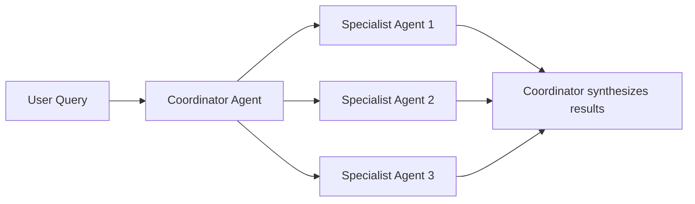
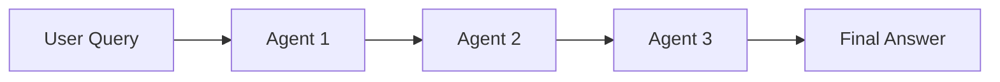
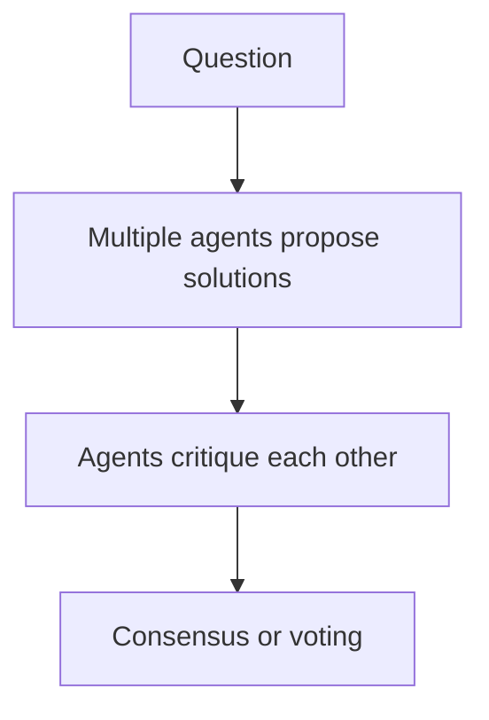

```python
import os
import json
from openai import OpenAI
from dotenv import load_dotenv
from typing import List, Dict, Any
from dataclasses import dataclass
from enum import Enum

load_dotenv()
client = OpenAI(api_key=os.getenv("OPENAI_API_KEY"))

print("✅ Setup complete")
```

<a id="part1"></a>
## Part 1: Multi-Agent Basics

### Why Multiple Agents?

**Single Agent Limitations:**
- Tries to do everything (jack of all trades, master of none)
- Complex prompts for diverse tasks
- Hard to maintain and debug

**Multi-Agent Benefits:**
- **Specialization:** Each agent excels at specific tasks
- **Modularity:** Easy to update individual agents
- **Scalability:** Distribute workload across agents
- **Quality:** Specialized agents produce better results

### Common Architectures

**1. Coordinator Pattern:**


**2. Pipeline Pattern:**


**3. Debate Pattern:**


<a id="part2"></a>
## Part 2: Agent Coordination

### Simple Coordinator Agent

The coordinator pattern implements a **hierarchical control structure** where one agent acts as a dispatcher, breaking a complex task into subtasks, routing each to the appropriate specialist, and synthesizing results into a coherent final output. The `CoordinatorAgent` below orchestrates a three-phase pipeline: research (gather facts with low temperature for accuracy), writing (draft engaging content with higher temperature for creativity), and review (quality-check against the original research with minimal temperature for consistency).

### Why Coordination Matters

Without a coordinator, multi-agent systems devolve into chaos -- agents duplicate work, produce contradictory outputs, or miss critical subtasks. The coordinator serves as both a **task planner** (decomposing the user's goal into agent-appropriate work units) and a **quality gate** (the review-then-revise loop ensures the final output incorporates feedback). The `AgentConfig` dataclass standardizes agent construction, while the `workflow_log` provides an audit trail of every inter-agent handoff. In production systems, this pattern extends naturally to include parallel execution of independent subtasks, timeout enforcement per agent, and fallback routing when a specialist fails.

```python
class AgentRole(Enum):
    COORDINATOR = "coordinator"
    RESEARCHER = "researcher"
    WRITER = "writer"
    REVIEWER = "reviewer"

@dataclass
class AgentConfig:
    role: AgentRole
    name: str
    system_prompt: str
    temperature: float = 0.7

class BaseAgent:
    def __init__(self, config: AgentConfig):
        self.config = config
        self.history = []
    
    def run(self, input_text: str) -> str:
        """Execute agent on input"""
        messages = [
            {"role": "system", "content": self.config.system_prompt},
            {"role": "user", "content": input_text}
        ]
        
        response = client.chat.completions.create(
            model="gpt-4",
            messages=messages,
            temperature=self.config.temperature
        )
        
        output = response.choices[0].message.content
        self.history.append({"input": input_text, "output": output})
        
        return output

print("✅ Base agent class created")
```

```python
# Create specialized agents
researcher = BaseAgent(AgentConfig(
    role=AgentRole.RESEARCHER,
    name="Research Agent",
    system_prompt="""You are a research specialist. 
    Your job is to gather accurate information on topics.
    Provide factual, well-sourced information.""",
    temperature=0.3
))

writer = BaseAgent(AgentConfig(
    role=AgentRole.WRITER,
    name="Writing Agent",
    system_prompt="""You are a creative writer.
    Transform research into engaging, readable content.
    Write clearly and concisely.""",
    temperature=0.8
))

reviewer = BaseAgent(AgentConfig(
    role=AgentRole.REVIEWER,
    name="Review Agent",
    system_prompt="""You are a quality reviewer.
    Check for accuracy, clarity, and completeness.
    Provide constructive feedback.""",
    temperature=0.2
))

print("✅ Created 3 specialized agents")
```

```python
class CoordinatorAgent:
    """Coordinates multiple specialized agents"""
    
    def __init__(self, agents: Dict[str, BaseAgent]):
        self.agents = agents
        self.workflow_log = []
    
    def execute_workflow(self, task: str) -> Dict[str, Any]:
        """Execute multi-agent workflow"""
        
        print(f"\n{'='*60}")
        print(f"📋 Task: {task}")
        print(f"{'='*60}\n")
        
        # Step 1: Research
        print("🔍 Step 1: Research Phase")
        research_output = self.agents['researcher'].run(
            f"Research this topic: {task}"
        )
        print(f"Research complete: {len(research_output)} characters\n")
        
        # Step 2: Writing
        print("✍️ Step 2: Writing Phase")
        writing_prompt = f"""Based on this research:
        {research_output}
        
        Write a clear, engaging summary."""
        
        draft = self.agents['writer'].run(writing_prompt)
        print(f"Draft complete: {len(draft)} characters\n")
        
        # Step 3: Review
        print("🔍 Step 3: Review Phase")
        review_prompt = f"""Review this content:
        {draft}
        
        Original research:
        {research_output}
        
        Provide feedback on accuracy and clarity."""
        
        review = self.agents['reviewer'].run(review_prompt)
        print(f"Review complete\n")
        
        # Step 4: Revision (if needed)
        print("🔄 Step 4: Revision Phase")
        final_draft = self.agents['writer'].run(
            f"""Revise this draft based on feedback:
            
            Draft: {draft}
            
            Feedback: {review}
            
            Provide the final version."""
        )
        print("✅ Final draft ready\n")
        
        return {
            "research": research_output,
            "first_draft": draft,
            "review": review,
            "final_output": final_draft
        }

# Create coordinator
coordinator = CoordinatorAgent({
    'researcher': researcher,
    'writer': writer,
    'reviewer': reviewer
})

print("✅ Coordinator agent ready")
```

```python
# Test the multi-agent system
result = coordinator.execute_workflow(
    "Explain what machine learning is in simple terms"
)

print("\n📊 FINAL OUTPUT:")
print("=" * 60)
print(result['final_output'])
print("=" * 60)
```

<a id="part3"></a>
## Part 3: Role-Based Teams

### Building a Software Development Team

Role-based teams mirror real organizational structures: a **product manager** translates ambiguous feature requests into precise requirements (user stories, acceptance criteria), a **developer** implements the specification in code, and a **QA engineer** reviews for bugs, edge cases, and missing test coverage. Each agent's `system_prompt` constrains its behavior to a narrow specialty, which produces higher-quality outputs than asking a single generalist agent to perform all three roles.

### The Iterative Development Loop

The `DevelopmentTeam.build_feature` method implements a feedback loop that mirrors agile development: requirements flow to implementation, implementation flows to review, and review feedback flows back to a revision step. This iterative refinement consistently produces better code than a single-pass generation because the QA agent catches issues the developer agent is blind to -- missing error handling, unvalidated inputs, untested edge cases. The pattern generalizes beyond software: any creative or analytical task benefits from separating generation (high temperature, broad exploration) from evaluation (low temperature, focused critique).

```python
# Define development team agents
product_manager = BaseAgent(AgentConfig(
    role=AgentRole.COORDINATOR,
    name="Product Manager",
    system_prompt="""You are a product manager.
    Break down feature requests into clear requirements.
    Create user stories and acceptance criteria."""
))

developer = BaseAgent(AgentConfig(
    role=AgentRole.WRITER,
    name="Developer",
    system_prompt="""You are a senior software developer.
    Write clean, well-structured Python code.
    Follow best practices and include error handling."""
))

qa_engineer = BaseAgent(AgentConfig(
    role=AgentRole.REVIEWER,
    name="QA Engineer",
    system_prompt="""You are a QA engineer.
    Review code for bugs, edge cases, and test coverage.
    Suggest test cases and improvements."""
))

print("✅ Development team created")
```

```python
class DevelopmentTeam:
    """Simulates a software development team"""
    
    def __init__(self):
        self.pm = product_manager
        self.dev = developer
        self.qa = qa_engineer
    
    def build_feature(self, feature_request: str) -> Dict[str, str]:
        """Complete development cycle"""
        
        print(f"\n🎯 Feature Request: {feature_request}\n")
        
        # PM creates requirements
        print("📋 Product Manager: Creating requirements...")
        requirements = self.pm.run(
            f"Create requirements for: {feature_request}"
        )
        print(f"Requirements:\n{requirements[:200]}...\n")
        
        # Developer implements
        print("💻 Developer: Writing code...")
        code = self.dev.run(
            f"""Implement this feature:
            {requirements}
            
            Write Python code with docstrings and error handling."""
        )
        print(f"Code written: {len(code)} characters\n")
        
        # QA reviews
        print("🔍 QA Engineer: Reviewing code...")
        qa_feedback = self.qa.run(
            f"""Review this code:
            {code}
            
            Check for bugs, edge cases, and suggest tests."""
        )
        print(f"QA Feedback:\n{qa_feedback[:200]}...\n")
        
        # Developer fixes issues
        print("🔧 Developer: Addressing feedback...")
        final_code = self.dev.run(
            f"""Improve this code based on QA feedback:
            
            Original code:
            {code}
            
            QA Feedback:
            {qa_feedback}
            
            Provide the improved version."""
        )
        
        print("✅ Feature complete!\n")
        
        return {
            "requirements": requirements,
            "initial_code": code,
            "qa_feedback": qa_feedback,
            "final_code": final_code
        }

team = DevelopmentTeam()
print("✅ Development team ready")
```

```python
# Test the development team
feature = team.build_feature(
    "A function to validate email addresses"
)

print("\n" + "="*60)
print("FINAL CODE:")
print("="*60)
print(feature['final_code'])
print("="*60)
```

<a id="part4"></a>
## Part 4: Communication Patterns

### Message Passing Between Agents

The `MessageBus` implements a **publish-subscribe** communication pattern that decouples agents from each other. Instead of agents calling each other directly (tight coupling that breaks when you add or remove agents), every message flows through a central hub that handles routing, logging, and subscriber notification. The `Message` dataclass provides a standardized envelope with sender, receiver, content, timestamp, and message type -- giving you a complete audit trail of every inter-agent interaction.

### Why Structured Communication Matters

In production multi-agent systems, debugging failures requires understanding exactly what information each agent received and when. The message bus provides this observability by default. The `subscribe` method enables reactive architectures where agents wake up and process messages as they arrive, rather than being polled by a coordinator. The `get_history` method supports both global views (all messages in the system) and agent-specific views (messages involving a particular agent), which is essential for diagnosing coordination failures. This pattern scales to distributed systems by replacing the in-memory list with a message broker like Redis Pub/Sub or Apache Kafka.

```python
from datetime import datetime
from typing import Optional

@dataclass
class Message:
    """Message between agents"""
    sender: str
    receiver: str
    content: str
    timestamp: str
    message_type: str = "info"

class MessageBus:
    """Central communication hub for agents"""
    
    def __init__(self):
        self.messages: List[Message] = []
        self.subscribers: Dict[str, List[callable]] = {}
    
    def send(self, message: Message):
        """Send message"""
        self.messages.append(message)
        print(f"📨 {message.sender} → {message.receiver}: {message.content[:50]}...")
        
        # Notify subscribers
        if message.receiver in self.subscribers:
            for callback in self.subscribers[message.receiver]:
                callback(message)
    
    def subscribe(self, agent_name: str, callback: callable):
        """Subscribe to messages"""
        if agent_name not in self.subscribers:
            self.subscribers[agent_name] = []
        self.subscribers[agent_name].append(callback)
    
    def get_history(self, agent_name: Optional[str] = None) -> List[Message]:
        """Get message history"""
        if agent_name:
            return [
                m for m in self.messages
                if m.sender == agent_name or m.receiver == agent_name
            ]
        return self.messages

print("✅ Message bus created")
```

```python
# Test message bus
bus = MessageBus()

# Send some messages
bus.send(Message(
    sender="Agent A",
    receiver="Agent B",
    content="Can you research topic X?",
    timestamp=datetime.now().isoformat()
))

bus.send(Message(
    sender="Agent B",
    receiver="Agent A",
    content="Research complete. Here are my findings...",
    timestamp=datetime.now().isoformat()
))

print(f"\n📬 Total messages: {len(bus.messages)}")
```

<a id="part5"></a>
## Part 5: Conflict Resolution

### Voting System for Agent Consensus

When multiple agents produce different answers to the same question, you need a mechanism to resolve disagreements. The `DebateSystem` implements a **multi-round deliberation protocol**: each agent first proposes an independent answer (avoiding groupthink), then critiques the other agents' proposals (surfacing weaknesses), and finally a synthesis step merges the best elements into a consensus answer. This mirrors the self-consistency technique from prompt engineering but applies it across separate agent personas rather than repeated samples from the same model.

### Why Diverse Perspectives Improve Quality

The three debate agents -- optimist, skeptic, and pragmatist -- are deliberately configured with contrasting system prompts to maximize viewpoint diversity. Research on LLM ensembles shows that agents with different biases catch different failure modes: the optimist identifies opportunities the skeptic would dismiss, the skeptic surfaces risks the optimist would overlook, and the pragmatist anchors the discussion in feasibility. The multi-round structure is key: agents that have seen and responded to critiques produce more nuanced final answers than agents that only generate once. This pattern is particularly valuable for high-stakes decisions (investment analysis, medical triage, policy recommendations) where no single perspective is sufficient.

```python
class DebateSystem:
    """Multiple agents debate and reach consensus"""
    
    def __init__(self, agents: List[BaseAgent]):
        self.agents = agents
    
    def debate(self, question: str, rounds: int = 2) -> str:
        """Run debate with multiple rounds"""
        
        print(f"\n🎭 Starting Debate: {question}\n")
        
        proposals = []
        
        # Round 1: Initial proposals
        print("📢 Round 1: Initial Proposals")
        for i, agent in enumerate(self.agents, 1):
            response = agent.run(question)
            proposals.append(response)
            print(f"Agent {i}: {response[:100]}...\n")
        
        # Round 2: Critique others
        print("🔍 Round 2: Critiques")
        critiques = []
        for i, agent in enumerate(self.agents, 1):
            other_proposals = [p for j, p in enumerate(proposals) if j != i-1]
            critique_prompt = f"""Question: {question}
            
            Other agents proposed:
            {chr(10).join(f'{j+1}. {p}' for j, p in enumerate(other_proposals))}
            
            Provide your critique and refined answer."""
            
            critique = agent.run(critique_prompt)
            critiques.append(critique)
            print(f"Agent {i} critique: {critique[:100]}...\n")
        
        # Final: Synthesize
        print("✨ Final: Synthesis")
        synthesis_agent = self.agents[0]
        final_answer = synthesis_agent.run(
            f"""Question: {question}
            
            After debate, synthesize a final answer incorporating:
            
            Initial proposals:
            {chr(10).join(f'{i+1}. {p}' for i, p in enumerate(proposals))}
            
            Critiques:
            {chr(10).join(f'{i+1}. {c}' for i, c in enumerate(critiques))}
            
            Provide the consensus answer."""
        )
        
        return final_answer

# Create debate agents with different perspectives
optimist = BaseAgent(AgentConfig(
    role=AgentRole.RESEARCHER,
    name="Optimist",
    system_prompt="You focus on benefits and positive aspects."
))

skeptic = BaseAgent(AgentConfig(
    role=AgentRole.REVIEWER,
    name="Skeptic",
    system_prompt="You focus on risks and potential problems."
))

pragmatist = BaseAgent(AgentConfig(
    role=AgentRole.COORDINATOR,
    name="Pragmatist",
    system_prompt="You focus on practical, balanced solutions."
))

debate_system = DebateSystem([optimist, skeptic, pragmatist])
print("✅ Debate system ready")
```

```python
# Run a debate
consensus = debate_system.debate(
    "Should companies adopt AI agents for customer service?"
)

print("\n" + "="*60)
print("CONSENSUS ANSWER:")
print("="*60)
print(consensus)
print("="*60)
```

<a id="part6"></a>
## Part 6: A2A Protocol & Parallel Execution

### A2A (Agent-to-Agent) Protocol

Google's A2A protocol (2025) allows agents to **discover** and **delegate** to other agents across organizational boundaries. Unlike MCP (which standardizes tool connections), A2A standardizes **agent-to-agent communication**.

```
MCP  = Agent ↔ Tool   (USB-C for tools)
A2A  = Agent ↔ Agent  (HTTP for agents)
```

**Key A2A concepts:**
- **Agent Card:** A JSON manifest describing what an agent can do, published at `/.well-known/agent.json`
- **Task:** A unit of work sent from one agent to another, with status tracking
- **Streaming:** Real-time updates via Server-Sent Events (SSE)

```python
# A2A Agent Card example
agent_card = {
    "name": "Research Agent",
    "description": "Searches academic papers and summarizes findings",
    "url": "https://research-agent.example.com",
    "capabilities": ["search", "summarize", "cite"],
    "authentication": {"type": "bearer"}
}

# A2A delegation pattern
# Coordinator discovers specialists via Agent Cards,
# then sends Task messages over HTTP+SSE
```

### Parallel Agent Execution

When subtasks are independent, run specialists in parallel with `asyncio.gather()`:

```python
import asyncio

async def parallel_specialists(task: str, specialists: dict):
    """Run independent specialist agents in parallel."""
    async def run_one(name, agent, subtask):
        return name, await asyncio.to_thread(agent.run, subtask)
    
    coros = [run_one(n, a, task) for n, a in specialists.items()]
    results = await asyncio.gather(*coros, return_exceptions=True)
    
    return {
        name: (result if not isinstance(result, Exception) else f"Error: {result}")
        for name, result in results
    }
```

---

<a id="part7"></a>
## Part 7: Production Systems

### Best Practices for Multi-Agent Systems

**1. Clear Responsibilities**
- Each agent should have a well-defined role
- Avoid overlapping responsibilities
- Document agent capabilities

**2. Communication Protocol**
- Standardized message format
- Clear routing rules
- Message history/logging

**3. Error Handling**
- Timeout mechanisms
- Fallback strategies
- Agent health monitoring

**4. Performance**
- Parallel execution when possible
- Caching shared knowledge
- Load balancing

**5. Quality Control**
- Validation agents
- Consensus mechanisms
- Human-in-the-loop for critical decisions

## 🎯 Final Knowledge Check

**Q1:** When should you use multiple agents vs a single agent?  
**Q2:** What's the coordinator pattern?  
**Q3:** How do agents resolve disagreements?  
**Q4:** What's a message bus?

<details>
<summary>Click for answers</summary>

**A1:** Use multiple agents when you need specialization, modularity, or parallel processing  
**A2:** One agent delegates tasks to specialized agents and synthesizes results  
**A3:** Through voting, debate, or having a final decision-maker agent  
**A4:** Central communication hub that routes messages between agents  
</details>

## 🚀 Next Steps

1. Complete the **Multi-Agent Challenge**
2. Build your own specialized agent team
3. Start the **Phase 14 Assignment**
4. Take the **Post-Quiz** to measure your progress

---

**Congratulations! You've completed Phase 14: AI Agents! 🎉**

You now know how to:
- Build intelligent agents with tools
- Design robust tool schemas
- Implement ReAct reasoning
- Use LangChain and LangGraph
- Create multi-agent systems

**You're ready to build production AI agents! 🚀**
