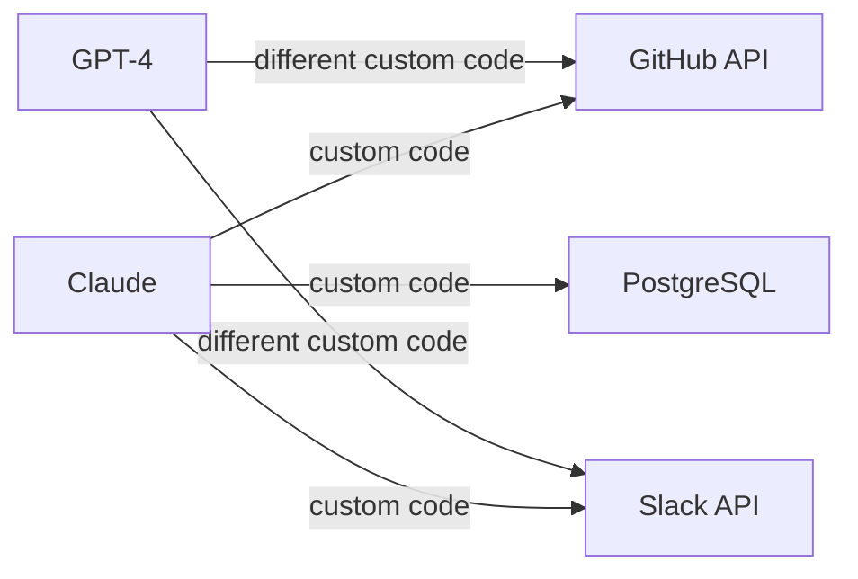
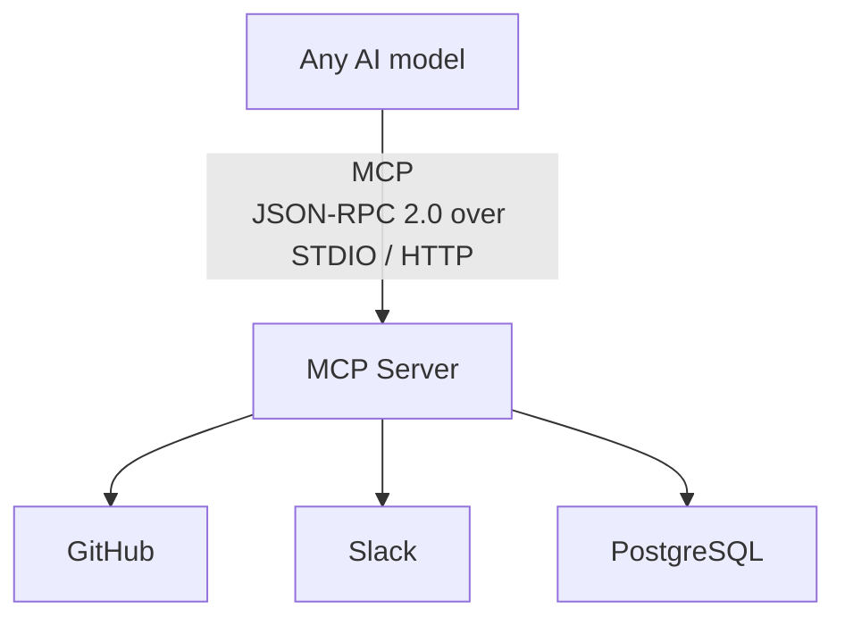
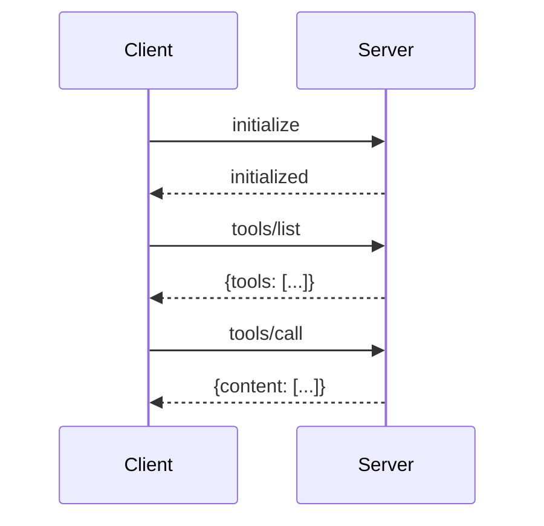

# MCP - Model Context Protocol
## The USB-C Standard for AI Agents

**Module 15 · Notebook 6**

---

Before MCP, every AI application had to write custom connectors for every tool and data source. Anthropic solved this in November 2024 by releasing the **Model Context Protocol (MCP)** - an open standard that lets any AI model speak to any tool or data source through one common interface.

By mid-2025:
- **13,000+ MCP servers** published on npm, PyPI, and GitHub
- **97 million+ monthly SDK downloads**
- **OpenAI, Google, Microsoft** all adopted MCP
- Now governed by the **Linux Foundation's Agentic AI Foundation**

This notebook covers MCP from first principles to production-ready servers.

## Table of Contents

1. What is MCP and why it matters
2. MCP architecture: Host, Client, Server, Transport
3. Core MCP primitives: Tools, Resources, Prompts, Sampling
4. Installing the MCP Python SDK
5. Building your first MCP server
6. Connecting Claude / OpenAI to MCP servers
7. Using existing MCP servers (GitHub, Filesystem, Brave Search, SQLite)
8. Building a full MCP server with multiple tools and resources
9. Running MCP in Claude Desktop
10. MCP vs custom tool use - when to use each
11. Security considerations
12. Tool search and programmatic tool calling (2025 spec)
13. Building a local MCP server for your own APIs
14. Practical project: Company knowledge-base MCP server

---
## 1. What is MCP and Why It Matters

### The problem before MCP



Every model × every tool = N² integration surface. MCP collapses this to N + M.

### The solution: one universal protocol



MCP uses **JSON-RPC 2.0** as its wire format, making it language-agnostic. SDKs exist for Python, TypeScript, Java, Go, Kotlin, C#, and more.

### Timeline
| Date | Event |
|------|-------|
| Nov 2024 | Anthropic releases MCP spec + reference servers |
| Jan 2025 | OpenAI announces MCP support |
| Feb 2025 | Google DeepMind adopts MCP |
| Mar 2025 | Microsoft Copilot adds MCP |
| Jun 2025 | Streamable HTTP transport standardised |
| Sep 2025 | Linux Foundation takes governance |
| Oct 2025 | 13,000+ published servers, 97M monthly downloads |

---
## 2. MCP Architecture

```mermaid
flowchart TB
    subgraph H[HOST PROCESS<br/>(Claude Desktop, IDE, custom)]
        C1[Client]
        C2[Client]
    end
    C1 -->|Transport| SA[MCP Server A]
    C2 -->|Transport| SB[MCP Server B]
```

### Roles
- **Host**: the application the user interacts with (Claude Desktop, Cursor, your custom app)
- **Client**: lives inside the host; manages one connection to one server; handles the protocol lifecycle
- **Server**: exposes tools / resources / prompts; can be local or remote

### Transport options

| Transport | Use case | How it works |
|-----------|----------|--------------|
| **STDIO** | Local tools, CLI | Client spawns server as subprocess; communicate via stdin/stdout |
| **HTTP + SSE** | Remote tools (pre-2025) | HTTP POST for client→server; SSE stream for server→client |
| **Streamable HTTP** | Remote tools (2025 standard) | Single HTTP endpoint, optional SSE upgrade; simpler than SSE |

### Message flow (simplified)



---
## 3. Core MCP Primitives

MCP defines four primitives that servers can expose:

### Tools
Callable functions - the most commonly used primitive. The model decides when to call them.
```json
{
  "name": "search_web",
  "description": "Search the web for current information",
  "inputSchema": {
    "type": "object",
    "properties": {"query": {"type": "string"}},
    "required": ["query"]
  }
}
```

### Resources
Data the server exposes (read-only). Think files, database rows, API responses. Identified by URI.
```json
{
  "uri": "file:///project/README.md",
  "name": "Project README",
  "mimeType": "text/markdown"
}
```

### Prompts
Reusable, parameterised prompt templates the host can surface to users.
```json
{
  "name": "code_review",
  "description": "Review code for quality and security",
  "arguments": [{"name": "language", "required": true}]
}
```

### Sampling
A server can ask the client to perform LLM inference on its behalf - enabling agentic servers that need AI reasoning without holding API keys themselves.
```json
// Server sends:
{"method": "sampling/createMessage",
 "params": {"messages": [...], "maxTokens": 500}}
// Client responds with the model completion
```

---
## 4. Installing the MCP Python SDK

The `mcp` Python package provides the official SDK for building MCP servers and clients. It includes typed dataclasses for every protocol message (`types.Tool`, `types.Resource`, `types.Prompt`), an async server framework with decorator-based handler registration, and a client library for connecting to servers over stdio or HTTP/SSE transports. The SDK handles JSON-RPC message framing, capability negotiation, and lifecycle management so you can focus on defining tools and resources rather than protocol plumbing.

### Why a Dedicated SDK Matters

MCP uses a stateful, bidirectional protocol -- not simple REST calls -- so hand-rolling the transport layer would require implementing JSON-RPC 2.0, capability advertisement, connection keepalives, and graceful shutdown. The SDK encapsulates all of this behind a clean async API. The `mcp.server.Server` class is the entry point: you instantiate it, register handlers for tools, resources, and prompts, then run it with `stdio_server()` or `sse_server()` depending on your deployment model.

```python
# Install the MCP Python SDK
# The SDK ships with both server and client utilities
%pip install mcp --quiet

# For HTTP transport support
%pip install mcp[http] --quiet

# Verify installation
import mcp
print(f"MCP SDK version: {mcp.__version__}")
```

```python
# Quick tour of the MCP SDK structure
import inspect
import mcp.server
import mcp.types as types

# The key classes
print("Server class:", mcp.server.Server)
print("\nMCP types available:")
mcp_types = [name for name in dir(types) if not name.startswith('_')]
for t in mcp_types[:20]:
    print(f"  types.{t}")
```

---
## 5. Building Your First MCP Server

We will build a minimal server with one tool, then test it in-process.

```python
# ─── minimal_server.py ───────────────────────────────────────────────────────
# This is what you would save as a standalone script and run via STDIO.

MCP_SERVER_CODE = '''
from mcp.server import Server
from mcp.server.stdio import stdio_server
import mcp.types as types
import asyncio

# 1. Create the server instance
app = Server("my-first-server")

# 2. Register a tool using the decorator
@app.list_tools()
async def list_tools() -> list[types.Tool]:
    return [
        types.Tool(
            name="search_web",
            description="Search the web for information",
            inputSchema={
                "type": "object",
                "properties": {
                    "query": {"type": "string", "description": "Search query"}
                },
                "required": ["query"]
            }
        )
    ]

@app.call_tool()
async def call_tool(name: str, arguments: dict) -> list[types.TextContent]:
    if name == "search_web":
        query = arguments["query"]
        # In a real server you would call an actual search API here
        result = f"[Mock search results for: {query}] Found 3 relevant articles."
        return [types.TextContent(type="text", text=result)]
    raise ValueError(f"Unknown tool: {name}")

# 3. Run the server over STDIO
async def main():
    async with stdio_server() as (read_stream, write_stream):
        await app.run(read_stream, write_stream, app.create_initialization_options())

if __name__ == "__main__":
    asyncio.run(main())
'''

print(MCP_SERVER_CODE)
```

```python
# Save the server to disk so we can reference it later
import os

server_path = "/tmp/minimal_mcp_server.py"
with open(server_path, "w") as f:
    f.write(MCP_SERVER_CODE.strip())

print(f"Server saved to {server_path}")
print("Run with: python", server_path)
```

### Modern FastMCP style (2025 recommended)

The `fastmcp` package (now part of the official SDK) provides a decorator-first API that is much more concise:

```python
%pip install fastmcp --quiet
```

```python
# fastmcp makes MCP servers feel like writing regular Python functions
from fastmcp import FastMCP

# Create server
mcp = FastMCP("demo-server")

# ── Tool ──────────────────────────────────────────────────────────────────────
@mcp.tool()
def search_web(query: str) -> str:
    """Search the web for current information."""
    return f"[Mock] Top results for '{query}': Article 1, Article 2, Article 3"

@mcp.tool()
def calculate(expression: str) -> str:
    """Evaluate a safe mathematical expression."""
    import ast, operator
    ops = {ast.Add: operator.add, ast.Sub: operator.sub,
           ast.Mult: operator.mul, ast.Div: operator.truediv}
    def eval_expr(node):
        if isinstance(node, ast.Constant):
            return node.value
        elif isinstance(node, ast.BinOp):
            return ops[type(node.op)](eval_expr(node.left), eval_expr(node.right))
        raise ValueError("Unsupported expression")
    tree = ast.parse(expression, mode='eval')
    result = eval_expr(tree.body)
    return str(result)

# ── Resource ──────────────────────────────────────────────────────────────────
@mcp.resource("docs://getting-started")
def getting_started() -> str:
    """Getting started guide."""
    return "# Getting Started\n\nWelcome to the demo MCP server!"

# ── Prompt ────────────────────────────────────────────────────────────────────
@mcp.prompt()
def summarize(text: str, style: str = "bullet") -> str:
    """Summarize text in the given style."""
    return f"Please summarize the following text using {style} points:\n\n{text}"

print("FastMCP server created successfully")
print(f"Tools registered: {[t.name for t in mcp._tool_manager.list_tools()]}")
```

```python
# Test tools directly (without running the full server)
import asyncio

async def test_tools():
    # Call tools directly for testing
    tools = mcp._tool_manager.list_tools()
    print("Available tools:")
    for tool in tools:
        print(f"  - {tool.name}: {tool.description}")
    
    # Test search_web
    result = await mcp._tool_manager.call_tool("search_web", {"query": "MCP protocol 2025"})
    print(f"\nsearch_web result: {result.content[0].text}")
    
    # Test calculate
    result = await mcp._tool_manager.call_tool("calculate", {"expression": "(100 + 50) * 2"})
    print(f"calculate result: {result.content[0].text}")

asyncio.run(test_tools())
```

---
## 6. Connecting Claude / OpenAI to MCP Servers

### Option A: Use the MCP client library to call your server

```python
# Pattern: use the MCP client to talk to your server, then pass tools to Claude
import anthropic
import json

# Simulate what a real MCP client would return after tools/list
# (In production this comes from mcp.ClientSession.list_tools())
MOCK_MCP_TOOLS = [
    {
        "name": "search_web",
        "description": "Search the web for current information",
        "input_schema": {
            "type": "object",
            "properties": {
                "query": {"type": "string", "description": "The search query"}
            },
            "required": ["query"]
        }
    },
    {
        "name": "calculate",
        "description": "Evaluate a mathematical expression",
        "input_schema": {
            "type": "object",
            "properties": {
                "expression": {"type": "string", "description": "Math expression to evaluate"}
            },
            "required": ["expression"]
        }
    }
]

def mcp_tool_executor(tool_name: str, tool_input: dict) -> str:
    """Simulate calling the MCP server for a tool result."""
    if tool_name == "search_web":
        return f"Search results for '{tool_input['query']}': [Result 1] MCP is widely adopted. [Result 2] 13,000+ servers exist."
    elif tool_name == "calculate":
        import ast, operator
        ops = {ast.Add: operator.add, ast.Sub: operator.sub,
               ast.Mult: operator.mul, ast.Div: operator.truediv}
        def eval_expr(node):
            if isinstance(node, ast.Constant): return node.value
            if isinstance(node, ast.BinOp): return ops[type(node.op)](eval_expr(node.left), eval_expr(node.right))
            raise ValueError("Unsupported")
        return str(eval_expr(ast.parse(tool_input['expression'], mode='eval').body))
    return f"Unknown tool: {tool_name}"

print("MCP tool bridge ready")
print("Tools available:", [t['name'] for t in MOCK_MCP_TOOLS])
```

```python
# Full agentic loop: Claude + MCP tools
import os

def run_claude_with_mcp_tools(user_message: str, tools: list, tool_executor):
    """Run Claude with MCP-provided tools in an agentic loop."""
    client = anthropic.Anthropic(api_key=os.environ.get("ANTHROPIC_API_KEY", "your-key-here"))
    
    messages = [{"role": "user", "content": user_message}]
    
    print(f"User: {user_message}\n")
    
    while True:
        response = client.messages.create(
            model="claude-opus-4-6",
            max_tokens=1024,
            tools=tools,
            messages=messages
        )
        
        if response.stop_reason == "end_turn":
            # Extract final text
            for block in response.content:
                if hasattr(block, 'text'):
                    print(f"Claude: {block.text}")
            break
        
        if response.stop_reason == "tool_use":
            # Process all tool calls
            tool_results = []
            for block in response.content:
                if block.type == "tool_use":
                    print(f"[MCP Tool Call] {block.name}({json.dumps(block.input)})")
                    result = tool_executor(block.name, block.input)
                    print(f"[MCP Result] {result[:100]}..." if len(result) > 100 else f"[MCP Result] {result}")
                    tool_results.append({
                        "type": "tool_result",
                        "tool_use_id": block.id,
                        "content": result
                    })
            
            messages.append({"role": "assistant", "content": response.content})
            messages.append({"role": "user", "content": tool_results})

# Demo (comment out if no API key)
# run_claude_with_mcp_tools(
#     "How many MCP servers exist in 2025? Also calculate 97 * 1000000.",
#     MOCK_MCP_TOOLS,
#     mcp_tool_executor
# )
print("Claude + MCP integration pattern ready. Uncomment the call above to run.")
```

```python
# OpenAI + MCP tools pattern
# OpenAI uses 'functions' format which maps to MCP's inputSchema

def mcp_tool_to_openai_function(mcp_tool: dict) -> dict:
    """Convert an MCP tool definition to OpenAI function format."""
    return {
        "type": "function",
        "function": {
            "name": mcp_tool["name"],
            "description": mcp_tool["description"],
            "parameters": mcp_tool["input_schema"]
        }
    }

openai_tools = [mcp_tool_to_openai_function(t) for t in MOCK_MCP_TOOLS]
print("OpenAI-formatted tools from MCP:")
for t in openai_tools:
    print(f"  {t['function']['name']}: {t['function']['description']}")

# OpenAI agentic loop would be identical in structure to the Claude example above,
# just using openai.OpenAI() and the chat.completions.create() API.
```

---
## 7. Using Existing MCP Servers

The MCP ecosystem has hundreds of pre-built servers. Here are the most popular ones and how to use them.

```python
# Popular MCP servers and their installation commands

POPULAR_MCP_SERVERS = [
    {
        "name": "@modelcontextprotocol/server-filesystem",
        "install": "npm install -g @modelcontextprotocol/server-filesystem",
        "description": "Read/write local files and directories",
        "tools": ["read_file", "write_file", "list_directory", "search_files"],
        "transport": "STDIO"
    },
    {
        "name": "@modelcontextprotocol/server-github",
        "install": "npm install -g @modelcontextprotocol/server-github",
        "description": "GitHub repos, issues, PRs, commits",
        "tools": ["search_repositories", "create_issue", "get_file_contents", "list_commits"],
        "transport": "STDIO"
    },
    {
        "name": "@modelcontextprotocol/server-brave-search",
        "install": "npm install -g @modelcontextprotocol/server-brave-search",
        "description": "Real-time web search via Brave Search API",
        "tools": ["brave_web_search", "brave_local_search"],
        "transport": "STDIO"
    },
    {
        "name": "@modelcontextprotocol/server-sqlite",
        "install": "npm install -g @modelcontextprotocol/server-sqlite",
        "description": "Query and modify SQLite databases",
        "tools": ["read_query", "write_query", "list_tables", "describe_table"],
        "transport": "STDIO"
    },
    {
        "name": "mcp-server-fetch (Python)",
        "install": "pip install mcp-server-fetch",
        "description": "Fetch and convert web pages to markdown",
        "tools": ["fetch"],
        "transport": "STDIO"
    },
]

print("Popular MCP Servers\n" + "="*60)
for server in POPULAR_MCP_SERVERS:
    print(f"\n{server['name']}")
    print(f"  Description : {server['description']}")
    print(f"  Install     : {server['install']}")
    print(f"  Tools       : {', '.join(server['tools'])}")
    print(f"  Transport   : {server['transport']}")
```

```python
# Example: Using the SQLite MCP server programmatically via the Python client
# This pattern works for any STDIO-based MCP server

SQLITE_MCP_CLIENT_EXAMPLE = '''
import asyncio
from mcp import ClientSession, StdioServerParameters
from mcp.client.stdio import stdio_client

async def use_sqlite_mcp_server():
    server_params = StdioServerParameters(
        command="npx",
        args=["-y", "@modelcontextprotocol/server-sqlite", "/path/to/database.db"]
    )
    
    async with stdio_client(server_params) as (read, write):
        async with ClientSession(read, write) as session:
            # Initialize the connection
            await session.initialize()
            
            # List available tools
            tools = await session.list_tools()
            print("Tools:", [t.name for t in tools.tools])
            
            # List all tables
            result = await session.call_tool("list_tables", {})
            print("Tables:", result.content[0].text)
            
            # Run a query
            result = await session.call_tool("read_query", {
                "query": "SELECT * FROM users LIMIT 5"
            })
            print("Query result:", result.content[0].text)

asyncio.run(use_sqlite_mcp_server())
'''

print("SQLite MCP client pattern:")
print(SQLITE_MCP_CLIENT_EXAMPLE)
```

---
## 8. Building a Full MCP Server with Multiple Tools and Resources

A production MCP server typically exposes three primitive types: **tools** (actions the model can invoke, like `get_weather` or `save_note`), **resources** (read-only data endpoints the model can reference, like `notes://all`), and **prompts** (reusable prompt templates the client can request). The `FastMCP` decorator API makes registering each primitive a one-liner, while the underlying SDK handles JSON Schema generation from Python type hints, argument validation, and response serialization.

### Why Separate Tools, Resources, and Prompts

This three-primitive design enforces a clean separation of concerns: tools perform side effects (writes, API calls), resources provide read-only context (the model can pull data without triggering actions), and prompts encapsulate reusable interaction patterns. The distinction matters for security -- a client can grant a model access to resources without granting tool execution rights -- and for caching, since resource responses can be cached aggressively while tool responses generally cannot.

```python
# A more complete server: weather + news + notes
from fastmcp import FastMCP
from datetime import datetime
import json

mcp_full = FastMCP("productivity-server")

# In-memory notes store
_notes: dict[str, dict] = {}

# ── Tools ─────────────────────────────────────────────────────────────────────

@mcp_full.tool()
def get_weather(city: str, units: str = "celsius") -> dict:
    """Get current weather for a city."""
    # Mock implementation - replace with real weather API
    mock_data = {
        "city": city,
        "temperature": 22 if units == "celsius" else 72,
        "units": units,
        "condition": "Partly cloudy",
        "humidity": 65,
        "retrieved_at": datetime.now().isoformat()
    }
    return mock_data

@mcp_full.tool()
def get_news_headlines(topic: str, count: int = 5) -> list[dict]:
    """Get recent news headlines for a topic."""
    # Mock implementation - replace with News API
    return [
        {"title": f"Breaking: {topic} reaches new milestone", "source": "TechNews", "url": "https://example.com/1"},
        {"title": f"{topic} adoption surges in 2025",         "source": "AIDaily",  "url": "https://example.com/2"},
        {"title": f"Experts weigh in on {topic} future",       "source": "Wired",     "url": "https://example.com/3"},
    ][:count]

@mcp_full.tool()
def save_note(title: str, content: str, tags: list[str] | None = None) -> dict:
    """Save a note with title, content, and optional tags."""
    note_id = f"note_{len(_notes) + 1:04d}"
    _notes[note_id] = {
        "id": note_id,
        "title": title,
        "content": content,
        "tags": tags or [],
        "created_at": datetime.now().isoformat()
    }
    return {"id": note_id, "message": f"Note '{title}' saved successfully"}

@mcp_full.tool()
def search_notes(query: str) -> list[dict]:
    """Search saved notes by title or content."""
    results = []
    for note in _notes.values():
        if query.lower() in note["title"].lower() or query.lower() in note["content"].lower():
            results.append(note)
    return results

# ── Resources ─────────────────────────────────────────────────────────────────

@mcp_full.resource("notes://all")
def get_all_notes() -> str:
    """All saved notes as JSON."""
    return json.dumps(list(_notes.values()), indent=2)

@mcp_full.resource("config://server-info")
def server_info() -> str:
    """Information about this MCP server."""
    return json.dumps({
        "name": "productivity-server",
        "version": "1.0.0",
        "tools": ["get_weather", "get_news_headlines", "save_note", "search_notes"],
        "description": "A productivity MCP server with weather, news, and notes"
    }, indent=2)

# ── Prompts ───────────────────────────────────────────────────────────────────

@mcp_full.prompt()
def daily_briefing(location: str, topics: str = "AI, technology") -> str:
    """Generate a daily briefing request."""
    return (
        f"Please provide my daily briefing. Get the weather for {location}, "
        f"fetch the latest news on these topics: {topics}, and summarize everything "
        f"in a concise morning update format."
    )

print("Full productivity MCP server created!")
tools = mcp_full._tool_manager.list_tools()
print(f"Tools ({len(tools)}): {[t.name for t in tools]}")
```

```python
# Test the full server tools directly
import asyncio

async def test_full_server():
    tm = mcp_full._tool_manager
    
    # Test weather
    r = await tm.call_tool("get_weather", {"city": "San Francisco"})
    weather = json.loads(r.content[0].text) if r.content[0].text.startswith('{') else r.content[0].text
    print("Weather:", weather)
    
    # Test news
    r = await tm.call_tool("get_news_headlines", {"topic": "MCP protocol", "count": 2})
    print("\nNews:", r.content[0].text[:200])
    
    # Test save note
    r = await tm.call_tool("save_note", {
        "title": "MCP Learning",
        "content": "MCP is the USB-C standard for AI agents",
        "tags": ["AI", "MCP", "agents"]
    })
    print("\nSaved note:", r.content[0].text)
    
    # Test search notes
    r = await tm.call_tool("search_notes", {"query": "USB-C"})
    print("Search results:", r.content[0].text)

asyncio.run(test_full_server())
```

---
## 9. Running MCP in Claude Desktop

Claude Desktop reads a config file to know which MCP servers to start. On macOS it lives at:
```
~/Library/Application Support/Claude/claude_desktop_config.json
```
On Windows:
```
%APPDATA%\Claude\claude_desktop_config.json
```

```python
import json

# Example claude_desktop_config.json
claude_desktop_config = {
    "mcpServers": {
        # Local filesystem access
        "filesystem": {
            "command": "npx",
            "args": [
                "-y",
                "@modelcontextprotocol/server-filesystem",
                "/Users/yourname/Documents",
                "/Users/yourname/Desktop"
            ]
        },
        # GitHub integration
        "github": {
            "command": "npx",
            "args": ["-y", "@modelcontextprotocol/server-github"],
            "env": {
                "GITHUB_PERSONAL_ACCESS_TOKEN": "<your-token>"
            }
        },
        # Brave Search
        "brave-search": {
            "command": "npx",
            "args": ["-y", "@modelcontextprotocol/server-brave-search"],
            "env": {
                "BRAVE_API_KEY": "<your-api-key>"
            }
        },
        # Your custom Python MCP server
        "my-company-kb": {
            "command": "python",
            "args": ["/path/to/company_kb_server.py"]
        }
    }
}

print("Claude Desktop config (claude_desktop_config.json):")
print(json.dumps(claude_desktop_config, indent=2))
```

```python
# Helper to write the config file on macOS
import os
import json
import platform

def get_claude_config_path() -> str:
    """Return the path to claude_desktop_config.json for this OS."""
    if platform.system() == "Darwin":  # macOS
        return os.path.expanduser("~/Library/Application Support/Claude/claude_desktop_config.json")
    elif platform.system() == "Windows":
        return os.path.join(os.environ.get("APPDATA", ""), "Claude", "claude_desktop_config.json")
    else:  # Linux
        return os.path.expanduser("~/.config/claude/claude_desktop_config.json")

def add_mcp_server_to_claude(server_name: str, server_config: dict, dry_run: bool = True):
    """Add an MCP server to Claude Desktop config."""
    config_path = get_claude_config_path()
    
    # Load existing config or start fresh
    if os.path.exists(config_path):
        with open(config_path) as f:
            config = json.load(f)
    else:
        config = {"mcpServers": {}}
    
    config["mcpServers"][server_name] = server_config
    
    if dry_run:
        print(f"[DRY RUN] Would write to: {config_path}")
        print(json.dumps(config, indent=2))
    else:
        os.makedirs(os.path.dirname(config_path), exist_ok=True)
        with open(config_path, "w") as f:
            json.dump(config, f, indent=2)
        print(f"Written to {config_path}")
        print("Restart Claude Desktop for changes to take effect.")

# Demo
add_mcp_server_to_claude(
    "my-company-kb",
    {"command": "python", "args": ["/tmp/company_kb_server.py"]},
    dry_run=True
)
```

---
## 10. MCP vs Custom Tool Use - When to Use Each

| Dimension | Custom Tool Use | MCP |
|-----------|----------------|-----|
| **Setup complexity** | Low (just pass JSON schema) | Medium (need a server process) |
| **Reusability** | Tied to one app | Any model, any host |
| **Language** | Same as your app | Any language |
| **Security boundary** | In-process | Separate process / network |
| **Ecosystem** | Build from scratch | 13,000+ ready-made servers |
| **Streaming** | Depends on SDK | Built into protocol |
| **Best for** | Tightly coupled, simple tools | Shared tooling, teams, platforms |

**Use custom tool use when:**
- Prototyping quickly
- Tools are tightly coupled to one specific application
- You want the simplest possible integration

**Use MCP when:**
- You want to share tools across multiple AI models or apps
- You need a security boundary (sandboxed subprocess)
- You want to leverage the existing server ecosystem
- Building a platform where others will connect agents to your data

---
## 11. Security Considerations for MCP

MCP servers execute real-world actions -- reading files, querying databases, calling external APIs -- on behalf of an AI model that may be influenced by adversarial user inputs or prompt injection attacks. Every tool invocation is a potential attack surface: a malicious prompt could trick the model into calling `read_file('../../etc/passwd')` or executing destructive database mutations. Securing MCP servers requires defense-in-depth across authentication, input validation, process isolation, and transport encryption.

### The Threat Model

The primary risk in MCP is **confused deputy attacks**: the AI model (the deputy) is tricked into using its tool-calling privileges to perform actions the human user or a third-party data source intended. Mitigations include path allowlists (never resolve paths outside approved directories), parameterized queries (prevent SQL injection), tool call budgets (limit total invocations per session), and human-in-the-loop confirmation for destructive operations. The checklist below provides a comprehensive security audit framework for any MCP deployment.

```python
# Key security principles for MCP servers

security_checklist = {
    "Authentication & Authorization": [
        "Verify caller identity before executing tools (OAuth 2.0 / API keys)",
        "Use scoped permissions - each client gets only the tools it needs",
        "Never embed secrets in tool descriptions (the model sees those)",
        "For remote servers: use HTTPS + TLS 1.3 minimum",
    ],
    "Input Validation": [
        "Validate all tool inputs against JSON Schema before execution",
        "Sanitize file paths - prevent directory traversal (../../etc/passwd)",
        "Limit query sizes and rate-limit API calls",
        "For SQL tools: use parameterised queries, never raw string concatenation",
    ],
    "Process Isolation": [
        "Run MCP servers with minimum required OS permissions",
        "Consider running in a container or VM for sensitive operations",
        "Set resource limits (CPU, memory, file handles)",
        "Use separate servers for read-only vs write operations",
    ],
    "Prompt Injection Defence": [
        "Treat tool output as untrusted data - never inject it directly into system prompts",
        "Validate that tool responses match expected schemas",
        "Log all tool calls with inputs/outputs for audit trails",
        "Implement tool call budgets to prevent runaway agents",
    ],
    "Transport Security": [
        "STDIO: ensure the spawned process inherits only needed environment variables",
        "HTTP: require authentication headers on every request",
        "Use allowlists for which hosts can connect to remote MCP servers",
    ]
}

for category, items in security_checklist.items():
    print(f"\n{category}")
    print("-" * len(category))
    for item in items:
        print(f"  [ ] {item}")
```

```python
# Example: Secure file-access tool with path validation
from fastmcp import FastMCP
import os
import pathlib

mcp_secure = FastMCP("secure-file-server")

# Allowed directories (allowlist)
ALLOWED_DIRS = ["/tmp", os.path.expanduser("~/Documents")]

def is_safe_path(path: str) -> bool:
    """Check that the resolved path is within an allowed directory."""
    try:
        resolved = pathlib.Path(path).resolve()
        return any(
            resolved.is_relative_to(pathlib.Path(allowed).resolve())
            for allowed in ALLOWED_DIRS
        )
    except (ValueError, OSError):
        return False

@mcp_secure.tool()
def read_file(path: str) -> str:
    """
    Read a file. Only files inside allowed directories can be read.
    Allowed directories: /tmp, ~/Documents
    """
    if not is_safe_path(path):
        # Return an error - do NOT raise an exception that leaks stack traces
        return f"ERROR: Access denied. Path '{path}' is outside allowed directories."
    
    resolved = pathlib.Path(path).resolve()
    if not resolved.exists():
        return f"ERROR: File not found: {path}"
    if not resolved.is_file():
        return f"ERROR: Not a file: {path}"
    if resolved.stat().st_size > 10 * 1024 * 1024:  # 10 MB limit
        return "ERROR: File too large (max 10 MB)"
    
    return resolved.read_text(errors="replace")

# Test path validation
print("Path safety checks:")
test_paths = ["/tmp/test.txt", "/etc/passwd", "../../etc/shadow", "/tmp/../etc/hosts"]
for p in test_paths:
    print(f"  {p!r:40s} -> {'SAFE' if is_safe_path(p) else 'BLOCKED'}")
```

---
## 12. Tool Search and Programmatic Tool Calling (2025 MCP Spec)

The 2025 MCP spec added **tool search** - the ability to find relevant tools without listing all of them. This is critical when a server exposes hundreds of tools.

```python
# Tool search pattern from the 2025 MCP spec
# tools/list now accepts an optional 'filter' parameter

TOOL_SEARCH_REQUEST = {
    "jsonrpc": "2.0",
    "id": 1,
    "method": "tools/list",
    "params": {
        "filter": {
            "keywords": ["search", "web"],  # semantic search over tool descriptions
        },
        "cursor": None  # pagination cursor for large tool sets
    }
}

print("Tool search request (2025 spec):")
print(json.dumps(TOOL_SEARCH_REQUEST, indent=2))

# The response contains only matching tools + a nextCursor for pagination
TOOL_SEARCH_RESPONSE = {
    "jsonrpc": "2.0",
    "id": 1,
    "result": {
        "tools": [
            {"name": "brave_web_search", "description": "Search the web using Brave"},
            {"name": "search_knowledge_base", "description": "Search internal documents"}
        ],
        "nextCursor": None
    }
}
print("\nResponse:")
print(json.dumps(TOOL_SEARCH_RESPONSE, indent=2))
```

```python
# Programmatic tool calling via the low-level MCP client
# This is useful when you want to orchestrate tools without an LLM in the loop

PROGRAMMATIC_TOOL_CALL = '''
import asyncio
from mcp import ClientSession, StdioServerParameters
from mcp.client.stdio import stdio_client

async def programmatic_mcp_usage():
    """Call MCP tools directly from code, without an LLM."""
    server_params = StdioServerParameters(
        command="python",
        args=["/path/to/your_mcp_server.py"]
    )
    
    async with stdio_client(server_params) as (read, write):
        async with ClientSession(read, write) as session:
            await session.initialize()
            
            # Step 1: search for relevant tools
            tools_response = await session.list_tools()
            tool_names = [t.name for t in tools_response.tools]
            print("Available tools:", tool_names)
            
            # Step 2: call a specific tool
            result = await session.call_tool(
                "get_weather",
                {"city": "New York", "units": "celsius"}
            )
            
            # Step 3: read a resource
            resources = await session.list_resources()
            if resources.resources:
                resource = await session.read_resource(resources.resources[0].uri)
                print("Resource content:", resource.contents[0].text[:100])
            
            return result.content[0].text

result = asyncio.run(programmatic_mcp_usage())
print("Tool result:", result)
'''

print("Programmatic MCP tool calling pattern:")
print(PROGRAMMATIC_TOOL_CALL)
```

---
## 13. Building a Local MCP Server for Your Own APIs

The most practical use of MCP is wrapping your organization's existing REST APIs as MCP servers, making internal data and services accessible to any AI model without writing custom integration code for each model provider. The pattern is straightforward: create a thin API client class that handles authentication and HTTP requests, then register `FastMCP` tools that delegate to client methods and format responses as structured JSON.

### Why Wrap REST APIs as MCP Servers

Once your internal metrics, CRM, or ticketing system is exposed through MCP, any MCP-compatible AI assistant (Claude Desktop, Cursor, custom agents) can query it using natural language. This avoids the fragile approach of teaching each model provider's function-calling format separately. The MCP server also provides a natural security boundary -- it runs as a separate process with its own credentials, so the AI model never sees raw API keys or database connection strings.

```python
# Template: wrap any REST API as an MCP server
# This example wraps a hypothetical internal metrics API

from fastmcp import FastMCP
import json
from datetime import datetime, timedelta
import random

mcp_api = FastMCP("internal-metrics-server")

# ── Simulate an internal REST API client ─────────────────────────────────────

class MetricsAPIClient:
    """Thin wrapper around an internal metrics REST API."""
    
    def __init__(self, base_url: str, api_key: str):
        self.base_url = base_url
        self.api_key = api_key
    
    def get_metric(self, metric_name: str, start: str, end: str) -> list[dict]:
        """Mock API call - returns random time-series data."""
        start_dt = datetime.fromisoformat(start)
        end_dt = datetime.fromisoformat(end)
        hours = int((end_dt - start_dt).total_seconds() / 3600)
        return [
            {
                "timestamp": (start_dt + timedelta(hours=i)).isoformat(),
                "value": round(random.gauss(100, 15), 2)
            }
            for i in range(min(hours, 24))
        ]
    
    def list_services(self) -> list[str]:
        return ["api-gateway", "auth-service", "payments", "recommendations"]
    
    def get_alerts(self, severity: str = "all") -> list[dict]:
        alerts = [
            {"id": "ALT-001", "severity": "critical", "service": "payments",    "msg": "High latency"},
            {"id": "ALT-002", "severity": "warning",  "service": "api-gateway", "msg": "High error rate"},
            {"id": "ALT-003", "severity": "info",     "service": "auth-service", "msg": "Deployment"},
        ]
        return [a for a in alerts if severity == "all" or a["severity"] == severity]

# Create API client (in production, read from env vars)
api_client = MetricsAPIClient("https://metrics.internal.company.com", "secret-key")

# ── MCP tools that wrap the API ───────────────────────────────────────────────

@mcp_api.tool()
def get_service_metric(service: str, metric: str, hours_back: int = 24) -> str:
    """Get time-series metric data for a service."""
    end = datetime.now()
    start = end - timedelta(hours=hours_back)
    data = api_client.get_metric(f"{service}.{metric}", start.isoformat(), end.isoformat())
    if not data:
        return f"No data found for {service}/{metric}"
    values = [d["value"] for d in data]
    return json.dumps({
        "service": service,
        "metric": metric,
        "avg": round(sum(values) / len(values), 2),
        "min": round(min(values), 2),
        "max": round(max(values), 2),
        "points": data[-5:]  # Return last 5 points as sample
    })

@mcp_api.tool()
def list_services() -> list[str]:
    """List all monitored services."""
    return api_client.list_services()

@mcp_api.tool()
def get_active_alerts(severity: str = "all") -> str:
    """Get active alerts. severity: 'all', 'critical', 'warning', or 'info'."""
    alerts = api_client.get_alerts(severity)
    return json.dumps(alerts, indent=2)

# Test
import asyncio

async def test_metrics_server():
    tm = mcp_api._tool_manager
    r = await tm.call_tool("list_services", {})
    print("Services:", r.content[0].text)
    
    r = await tm.call_tool("get_active_alerts", {"severity": "critical"})
    print("Critical alerts:", r.content[0].text)

asyncio.run(test_metrics_server())
```

---
## 14. Practical Project: Company Knowledge-Base MCP Server

A complete, production-ready MCP server that lets any AI model search and query a company knowledge base.

```python
# company_kb_server.py - a complete company knowledge base MCP server
# Save this file and add it to claude_desktop_config.json to use it

KB_SERVER_CODE = '''
#!/usr/bin/env python3
"""
Company Knowledge Base MCP Server
Exposes company docs, FAQs, and policies as MCP tools + resources.
Run with: python company_kb_server.py
"""
from fastmcp import FastMCP
import json
import re
from datetime import datetime

mcp = FastMCP("company-kb")

# ── Knowledge base (in production: connect to a real vector DB or search API) ─

KB_DOCUMENTS = [
    {
        "id": "kb-001",
        "title": "Vacation Policy",
        "category": "HR",
        "content": "Full-time employees accrue 15 days PTO per year. PTO rolls over up to 5 days. "
                   "Requests must be submitted 2 weeks in advance via the HR portal.",
        "updated": "2024-11-01"
    },
    {
        "id": "kb-002",
        "title": "Remote Work Policy",
        "category": "HR",
        "content": "Employees may work remotely up to 3 days per week. All remote work requires "
                   "manager approval and use of the company VPN. Core hours are 10am–3pm local time.",
        "updated": "2025-01-15"
    },
    {
        "id": "kb-003",
        "title": "Engineering On-Call Runbook",
        "category": "Engineering",
        "content": "On-call rotation is weekly. Pages go to PagerDuty. P1 incidents require "
                   "acknowledgement within 5 minutes. Escalation path: engineer -> lead -> VP Eng.",
        "updated": "2025-03-10"
    },
    {
        "id": "kb-004",
        "title": "Expense Reimbursement",
        "category": "Finance",
        "content": "Submit expenses via Concur within 30 days. Meals capped at $75/person. "
                   "Flights over $500 require pre-approval. International travel needs VP sign-off.",
        "updated": "2024-12-01"
    },
]

def simple_search(query: str, docs: list[dict]) -> list[dict]:
    """Simple keyword search - replace with vector search in production."""
    query_words = set(query.lower().split())
    scored = []
    for doc in docs:
        text = (doc["title"] + " " + doc["content"]).lower()
        score = sum(1 for w in query_words if w in text)
        if score > 0:
            scored.append((score, doc))
    scored.sort(key=lambda x: x[0], reverse=True)
    return [doc for _, doc in scored]

# ── Tools ─────────────────────────────────────────────────────────────────────

@mcp.tool()
def search_knowledge_base(query: str, category: str | None = None, max_results: int = 3) -> str:
    """
    Search the company knowledge base for policies, runbooks, and FAQs.
    
    Args:
        query: Natural language search query
        category: Optional filter: HR, Engineering, Finance, Legal, etc.
        max_results: Maximum number of results to return (default 3)
    """
    docs = KB_DOCUMENTS
    if category:
        docs = [d for d in docs if d["category"].lower() == category.lower()]
    
    results = simple_search(query, docs)[:max_results]
    
    if not results:
        return f"No results found for: {query}"
    
    output = []
    for doc in results:
        output.append(f"## {doc[\'title\']} (ID: {doc[\'id\']})")  
        output.append(f"Category: {doc[\'category\']} | Updated: {doc[\'updated\']}")
        output.append(doc["content"])
        output.append("")
    return "\\n".join(output)

@mcp.tool()
def get_document(doc_id: str) -> str:
    """Get a specific knowledge base document by its ID (e.g. kb-001)."""
    for doc in KB_DOCUMENTS:
        if doc["id"] == doc_id:
            return json.dumps(doc, indent=2)
    return f"Document not found: {doc_id}"

@mcp.tool()
def list_categories() -> list[str]:
    """List all available knowledge base categories."""
    return sorted(set(d["category"] for d in KB_DOCUMENTS))

# ── Resources ─────────────────────────────────────────────────────────────────

@mcp.resource("kb://index")
def kb_index() -> str:
    """Full index of all knowledge base documents."""
    index = [{"id": d["id"], "title": d["title"], "category": d["category"], "updated": d["updated"]} 
             for d in KB_DOCUMENTS]
    return json.dumps(index, indent=2)

# ── Prompts ───────────────────────────────────────────────────────────────────

@mcp.prompt()
def answer_hr_question(question: str) -> str:
    """Generate a prompt to answer an HR question using the knowledge base."""
    return (
        f"You are a helpful HR assistant. Use the search_knowledge_base tool to find "
        f"relevant company policies, then answer this question accurately and concisely:\\n\\n"
        f"Question: {question}\\n\\n"
        f"Always cite the policy name and note when it was last updated."
    )

if __name__ == "__main__":
    mcp.run()  # FastMCP handles STDIO by default
'''

# Save to disk
kb_server_path = "/tmp/company_kb_server.py"
with open(kb_server_path, "w") as f:
    # Fix the escaped quotes for actual Python file
    code = KB_SERVER_CODE.replace("\\'", "'")
    f.write(code.strip())

print(f"Knowledge base MCP server saved to: {kb_server_path}")
print(f"\nTo use in Claude Desktop, add to claude_desktop_config.json:")
print(json.dumps({
    "company-kb": {
        "command": "python",
        "args": [kb_server_path]
    }
}, indent=2))
```

```python
# Demo the KB server inline
from fastmcp import FastMCP
import json, asyncio

mcp_kb = FastMCP("company-kb-demo")

KB_DOCUMENTS = [
    {"id": "kb-001", "title": "Vacation Policy",        "category": "HR",          "content": "Full-time employees accrue 15 days PTO per year.", "updated": "2024-11-01"},
    {"id": "kb-002", "title": "Remote Work Policy",     "category": "HR",          "content": "Employees may work remotely up to 3 days per week.", "updated": "2025-01-15"},
    {"id": "kb-003", "title": "Engineering On-Call",    "category": "Engineering", "content": "On-call rotation is weekly. P1 incidents require ack within 5 mins.", "updated": "2025-03-10"},
    {"id": "kb-004", "title": "Expense Reimbursement",  "category": "Finance",     "content": "Submit expenses via Concur within 30 days.", "updated": "2024-12-01"},
]

@mcp_kb.tool()
def search_knowledge_base(query: str, category: str | None = None) -> str:
    """Search the company knowledge base."""
    docs = KB_DOCUMENTS
    if category:
        docs = [d for d in docs if d["category"].lower() == category.lower()]
    query_words = set(query.lower().split())
    results = []
    for doc in docs:
        text = (doc["title"] + " " + doc["content"]).lower()
        if any(w in text for w in query_words):
            results.append(f"[{doc['id']}] {doc['title']}: {doc['content']}")
    return "\n".join(results) if results else "No results found."

@mcp_kb.tool()
def list_categories() -> list[str]:
    """List all knowledge base categories."""
    return sorted(set(d["category"] for d in KB_DOCUMENTS))

async def demo_kb_server():
    tm = mcp_kb._tool_manager
    
    print("Demo: Company KB MCP Server")
    print("="*50)
    
    r = await tm.call_tool("list_categories", {})
    print(f"Categories: {r.content[0].text}\n")
    
    queries = ["vacation days", "remote work", "expense reimbursement"]
    for query in queries:
        r = await tm.call_tool("search_knowledge_base", {"query": query})
        print(f"Query: '{query}'")
        print(f"Result: {r.content[0].text[:120]}...\n")

asyncio.run(demo_kb_server())
```

---
## Summary

| Concept | Key takeaway |
|---------|-------------|
| **What is MCP** | Open protocol (JSON-RPC 2.0) for AI ↔ tool communication - the USB-C standard for AI |
| **Architecture** | Host → Client → Server; STDIO for local, Streamable HTTP for remote |
| **Primitives** | Tools (callable), Resources (readable), Prompts (templates), Sampling (server asks LLM) |
| **Python SDK** | `pip install mcp` or `pip install fastmcp` for the decorator-friendly API |
| **Ecosystem** | 13,000+ servers - use them via `npx` or `pip` + STDIO |
| **Claude Desktop** | Config JSON at `~/Library/Application Support/Claude/claude_desktop_config.json` |
| **Security** | Validate paths, sanitise inputs, separate read/write servers, use process isolation |
| **vs custom tools** | MCP when you need reusability; custom tools when tightly coupled to one app |

### Next steps
- Notebook 07: OpenAI Agents SDK + LangGraph 1.0 - production agent frameworks
- Browse the official MCP server registry: https://github.com/modelcontextprotocol/servers
- MCP specification: https://spec.modelcontextprotocol.io
