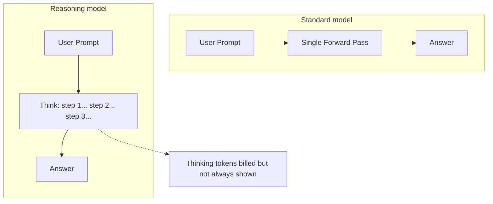
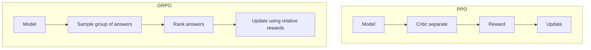
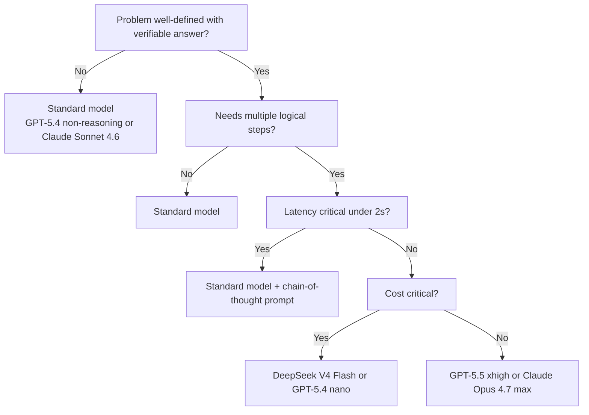
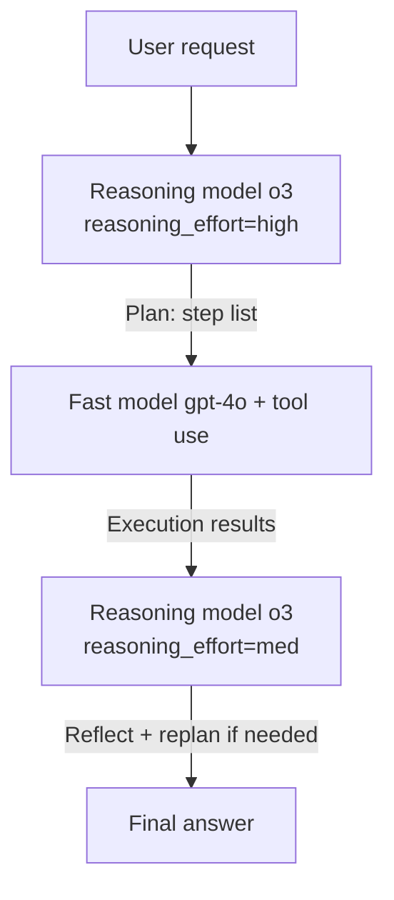

# Notebook 08: Working with Reasoning Models

## o3, DeepSeek R1, and Claude Extended Thinking

---

### What You'll Learn

1. **What are reasoning models?** - Fast vs slow thinking, test-time compute scaling
2. **OpenAI o-series** - o1, o3, o3-mini, o4-mini with `reasoning_effort`
3. **DeepSeek R1** - Open-source reasoning via API and locally with Ollama
4. **Claude Extended Thinking** - Budget tokens and thinking blocks
5. **When to use reasoning models** - Cost-benefit analysis
6. **Practical comparison** - Same problem across models
7. **Prompt engineering** for reasoning models
8. **Benchmark comparison table** - AIME, MATH-500, HumanEval, SWE-bench

---

**Prerequisites:** OpenAI API key, Anthropic API key (optional), Ollama installed (optional)

```python
# Install required packages
!pip install openai anthropic python-dotenv ollama -q

import os
import time
import json
import re
from dotenv import load_dotenv

load_dotenv()

OPENAI_API_KEY = os.getenv("OPENAI_API_KEY")
ANTHROPIC_API_KEY = os.getenv("ANTHROPIC_API_KEY")

print("OpenAI API key:", "SET" if OPENAI_API_KEY else "NOT SET - some cells will be skipped")
print("Anthropic API key:", "SET" if ANTHROPIC_API_KEY else "NOT SET - some cells will be skipped")
```

---

## Part 1: What Are Reasoning Models?

### System 1 vs System 2 Thinking

Psychologist Daniel Kahneman's framework maps perfectly onto LLM architectures:

| | **System 1 (Fast Thinking)** | **System 2 (Slow Thinking)** |
|---|---|---|
| **Speed** | Instant | Deliberate |
| **Effort** | Automatic | Effortful |
| **LLM Example** | GPT-4o, Claude 3.5 Sonnet | o3, DeepSeek R1, Claude Extended Thinking |
| **Good For** | Chat, summarization, classification | Math, code, logic, planning |
| **Failure Mode** | Wrong on hard problems | Slow and expensive |

### Test-Time Compute Scaling

Traditional scaling: train bigger models with more data and parameters.

**Test-time compute scaling:** spend more compute *at inference time* to improve accuracy.



### Chain-of-Thought in Latent Space

Classic chain-of-thought (CoT) prompts models to "think step by step" in the output.
Reasoning models do this **internally** via special "thinking tokens" before producing the final answer.

- **OpenAI o-series:** Thinking tokens are hidden (you pay for them but cannot read them)
- **DeepSeek R1:** Thinking is exposed inside `<think>...</think>` XML tags
- **Claude Extended Thinking:** Thinking is returned as separate `thinking` content blocks

### Why They Outperform Standard Models

1. **Self-verification:** The model checks its own work before committing to an answer
2. **Backtracking:** If a reasoning path fails, the model tries a different approach
3. **Deeper decomposition:** Complex problems are broken into sub-problems
4. **Reduced hallucination:** Structured reasoning catches logical errors

---

```python
# Demonstration: Standard model vs reasoning model on a hard problem
# This cell illustrates the concept even without an API key

HARD_MATH_PROBLEM = """
A farmer has 17 sheep. All but 9 die. How many sheep are left?
"""

# Classic "trick" problem - standard models often answer 8 (wrong)
# Reasoning models parse "all but 9" correctly = 9 remain

print("Problem:", HARD_MATH_PROBLEM.strip())
print()
print("Common wrong answer: 8  (model calculates 17 - 9 = 8)")
print("Correct answer: 9      ('all but 9' means 9 survive)")
print()
print("Reasoning model approach:")
print("  <think>")
print("  The phrase 'all but 9 die' means 9 sheep do NOT die.")
print("  Therefore 9 sheep are left alive.")
print("  The total count of 17 is a distractor.")
print("  </think>")
print("  Answer: 9")
```

---

## Part 2: OpenAI Reasoning Models (o1, o3, o4-mini, GPT-5.4/5.5 Thinking)

### Model Lineup (April 2026)

| Model | Release | Intelligence Index | Cost (blended/1M) | Strengths |
|---|---|---|---|---|
| **GPT-5.5 (xhigh)** | Apr 2026 | **60** (#1 overall) | $11.25 | Highest intelligence ever measured |
| **GPT-5.4 (xhigh)** | Mar 2026 | **57** | $5.63 | Computer use, tool search, 1.05M context |
| **GPT-5.4 mini (xhigh)** | Mar 2026 | **49** | $1.69 | Best value reasoning (146 tok/s) |
| **GPT-5.4 nano (xhigh)** | Mar 2026 | **44** | $0.46 | Budget reasoning (167 tok/s) |
| **o3** | Apr 2025 | **38** | $3.50 | Strong math/science specialist |
| **o4-mini** | Apr 2025 | - | ~$1.10 | Reasoning, cost-efficient |

*Intelligence Index scores from [artificialanalysis.ai](https://artificialanalysis.ai/leaderboards/models) - April 2026.*

> **Key shift (2026)**: GPT-5.4/5.5 Thinking modes have largely superseded the standalone o-series. The `reasoning_effort` parameter (xhigh/high/medium/low) now scales across the main GPT-5.x family. o3 remains available but the 5.x family offers better quality and more flexible effort control.

### The `reasoning_effort` Parameter

OpenAI reasoning models expose effort tiers that control how much "thinking" the model does:

- **`xhigh`** - Maximum reasoning. Best accuracy on hard problems, most expensive.
- **`high`** - Strong reasoning with lower cost than xhigh.
- **`medium`** - Balanced. Default for most use cases.
- **`low`** - Fastest, least thinking. Good for simple reasoning tasks.

### Key Limitations

- **No streaming of thinking tokens** (only final answer can be streamed)
- **System prompt restrictions** on some older o-series models (use `developer` role)
- **Reasoning tokens** are billed in addition to input/output tokens
- **No `temperature` support** on o-series (model manages its own exploration)

---

```python
from openai import OpenAI

def call_o3_mini(problem: str, effort: str = "medium") -> dict:
    """
    Call o3-mini with a specified reasoning_effort level.
    Returns response text, token usage, and latency.
    """
    if not OPENAI_API_KEY:
        print("[SKIP] OPENAI_API_KEY not set.")
        return {"text": None, "usage": None, "latency": None}

    client = OpenAI(api_key=OPENAI_API_KEY)
    start = time.time()

    response = client.chat.completions.create(
        model="o3-mini",
        reasoning_effort=effort,   # "low" | "medium" | "high"
        messages=[
            {"role": "user", "content": problem}
        ]
    )

    latency = round(time.time() - start, 2)
    message = response.choices[0].message.content
    usage = response.usage

    return {
        "text": message,
        "latency": latency,
        "input_tokens": usage.prompt_tokens,
        "output_tokens": usage.completion_tokens,
        "reasoning_tokens": getattr(usage.completion_tokens_details, "reasoning_tokens", "N/A"),
    }


# --- Example problem ---
LOGIC_PROBLEM = """
There are 5 houses in a row. Each house is painted a different color and
inhabited by a person of a different nationality, who drinks a different
beverage, smokes a different brand of cigars, and keeps a different pet.

Clues:
1. The Brit lives in the red house.
2. The Swede keeps dogs as pets.
3. The Dane drinks tea.
4. The green house is on the left of the white house.
5. The green house owner drinks coffee.
6. The person who smokes Pall Mall rears birds.
7. The owner of the yellow house smokes Dunhill.
8. The man living in the center house drinks milk.
9. The Norwegian lives in the first house.
10. The man who smokes Blends lives next to the one who keeps cats.
11. The man who keeps horses lives next to the man who smokes Dunhill.
12. The owner who smokes BlueMaster drinks beer.
13. The German smokes Prince.
14. The Norwegian lives next to the blue house.
15. The man who smokes Blends has a neighbor who drinks water.

Who owns the fish?
"""

print("Einstein's Riddle (Zebra Puzzle) loaded.")
print("This is a classic logic puzzle that requires systematic reasoning.")
print("We will test it with different reasoning_effort levels.")
```

```python
# Test with low reasoning effort
print("=" * 60)
print("o3-mini with reasoning_effort='low'")
print("=" * 60)

result_low = call_o3_mini(LOGIC_PROBLEM, effort="low")

if result_low["text"]:
    print(f"Answer: {result_low['text'][:500]}...")
    print(f"\nLatency: {result_low['latency']}s")
    print(f"Input tokens: {result_low['input_tokens']}")
    print(f"Output tokens: {result_low['output_tokens']}")
    print(f"Reasoning tokens: {result_low['reasoning_tokens']}")
```

```python
# Test with high reasoning effort
print("=" * 60)
print("o3-mini with reasoning_effort='high'")
print("=" * 60)

result_high = call_o3_mini(LOGIC_PROBLEM, effort="high")

if result_high["text"]:
    print(f"Answer: {result_high['text'][:500]}...")
    print(f"\nLatency: {result_high['latency']}s")
    print(f"Input tokens: {result_high['input_tokens']}")
    print(f"Output tokens: {result_high['output_tokens']}")
    print(f"Reasoning tokens: {result_high['reasoning_tokens']}")

    # Compare
    if result_low["latency"]:
        print(f"\n--- Effort Comparison ---")
        print(f"low  reasoning_tokens: {result_low['reasoning_tokens']}  | latency: {result_low['latency']}s")
        print(f"high reasoning_tokens: {result_high['reasoning_tokens']} | latency: {result_high['latency']}s")
```

```python
# Cost calculator for reasoning tokens
# o3-mini pricing (as of 2025): $1.10 per M input, $4.40 per M output/reasoning

def estimate_cost_o3_mini(input_tokens: int, output_tokens: int, reasoning_tokens: int) -> float:
    """
    Estimate cost for o3-mini.
    Pricing: $1.10/M input, $4.40/M output (reasoning tokens billed as output).
    """
    input_cost  = (input_tokens / 1_000_000) * 1.10
    output_cost = ((output_tokens + reasoning_tokens) / 1_000_000) * 4.40
    return input_cost + output_cost


# Simulate a batch of 1000 requests
print("Cost simulation: 1000 identical o3-mini requests")
print("=" * 50)

scenarios = [
    ("low",    300,  100,  200),
    ("medium", 300,  150,  800),
    ("high",   300,  200, 3000),
]

for effort, inp, out, reason in scenarios:
    cost_per_req = estimate_cost_o3_mini(inp, out, reason)
    cost_1000    = cost_per_req * 1000
    print(f"reasoning_effort='{effort}':")
    print(f"  Estimated reasoning tokens per req : {reason}")
    print(f"  Cost per request                   : ${cost_per_req:.5f}")
    print(f"  Cost for 1000 requests             : ${cost_1000:.2f}")
    print()
```

### Best Use Cases for OpenAI o-series

| Use Case | Reasoning Effort | Why |
|---|---|---|
| Math olympiad / AIME | high | Requires deep multi-step proof |
| LeetCode hard / competitive programming | high | Subtle edge cases |
| Complex debugging (multi-file) | medium-high | Root cause analysis |
| SQL query optimization | medium | Logical planning |
| Scientific hypothesis checking | medium | Literature reasoning |
| Simple arithmetic / classification | Skip o-series | Standard GPT-4o is cheaper |
| Creative writing | Skip o-series | Reasoning doesn't help creativity |

---

---

## Part 3: DeepSeek R1 - Open Source Reasoning

### Why DeepSeek R1 Matters

DeepSeek R1 was released in January 2025 and shocked the AI community:

- **Matches o1 on benchmarks** at a fraction of training cost
- **Fully open weights** (MIT license) - you can run it locally
- **Thinking is visible** - `<think>` tags expose the full reasoning trace
- **GRPO training** - uses Group Relative Policy Optimization instead of PPO

### Model Sizes (Distilled)

R1 knowledge was distilled into smaller Qwen/Llama base models:

| Model | Parameters | VRAM Required | Use Case |
|---|---|---|---|
| deepseek-r1:1.5b | 1.5B | ~2 GB | Embedded, mobile |
| deepseek-r1:7b   | 7B   | ~6 GB | Laptop GPU |
| deepseek-r1:8b   | 8B   | ~8 GB | Laptop GPU |
| deepseek-r1:14b  | 14B  | ~12 GB | Desktop GPU |
| deepseek-r1:32b  | 32B  | ~24 GB | High-end GPU |
| deepseek-r1:70b  | 70B  | ~48 GB | Multi-GPU |
| deepseek-r1 (full) | 671B | ~400 GB | Cluster |

### GRPO Training (Brief Overview)

Standard RLHF uses PPO (Proximal Policy Optimization) which requires a separate critic model.
DeepSeek R1 used **GRPO** (Group Relative Policy Optimization):



GRPO eliminates the critic model, cutting memory and compute requirements by ~50%.
Full R1 training details are covered in Phase 12 (RLHF).

---

```python
# --- Option A: DeepSeek R1 via OpenRouter (cloud API) ---
# OpenRouter provides unified access to many models including DeepSeek R1.
# API is OpenAI-compatible - just change the base_url and model name.

OPENROUTER_API_KEY = os.getenv("OPENROUTER_API_KEY")

def call_deepseek_r1_openrouter(problem: str) -> dict:
    """
    Call DeepSeek R1 via OpenRouter.
    OpenRouter API is OpenAI-compatible.
    Sign up at https://openrouter.ai to get a free API key.
    """
    if not OPENROUTER_API_KEY:
        print("[SKIP] OPENROUTER_API_KEY not set. Get one free at https://openrouter.ai")
        return {"text": None, "think": None, "latency": None}

    client = OpenAI(
        api_key=OPENROUTER_API_KEY,
        base_url="https://openrouter.ai/api/v1"
    )

    start = time.time()
    response = client.chat.completions.create(
        model="deepseek/deepseek-r1",
        messages=[{"role": "user", "content": problem}]
    )
    latency = round(time.time() - start, 2)

    full_text = response.choices[0].message.content
    think_text, answer_text = parse_think_tags(full_text)

    return {
        "text": answer_text,
        "think": think_text,
        "latency": latency
    }


def parse_think_tags(text: str) -> tuple[str, str]:
    """
    Parse <think>...</think> tags from DeepSeek R1 output.
    Returns (thinking_content, final_answer).
    """
    if text is None:
        return "", ""

    think_match = re.search(r"<think>(.*?)</think>", text, re.DOTALL)
    think_content = think_match.group(1).strip() if think_match else ""

    # Answer is everything after the closing </think> tag
    answer = re.sub(r"<think>.*?</think>", "", text, flags=re.DOTALL).strip()

    return think_content, answer


# Test the parser on a synthetic example
sample_r1_output = """
<think>
Let me think about this step by step.
The problem asks for the sum of the first 10 natural numbers.
Using the formula n*(n+1)/2 where n=10:
10 * 11 / 2 = 55
</think>

The sum of the first 10 natural numbers is **55**.
"""

think, answer = parse_think_tags(sample_r1_output)
print("Parsed <think> content:")
print(think)
print("\nParsed final answer:")
print(answer)
```

```python
# Call DeepSeek R1 via OpenRouter on our logic problem
MATH_PROBLEM_SIMPLE = """
A train leaves City A at 9:00 AM traveling at 60 mph toward City B.
Another train leaves City B at 10:00 AM traveling at 80 mph toward City A.
The cities are 280 miles apart. At what time will the trains meet?
"""

print("Problem:", MATH_PROBLEM_SIMPLE.strip())
print()

result_r1_cloud = call_deepseek_r1_openrouter(MATH_PROBLEM_SIMPLE)

if result_r1_cloud["text"]:
    print("=" * 60)
    print("DeepSeek R1 Thinking Process:")
    print("=" * 60)
    print(result_r1_cloud["think"][:1000] if result_r1_cloud["think"] else "(thinking hidden)")
    print()
    print("=" * 60)
    print("Final Answer:")
    print("=" * 60)
    print(result_r1_cloud["text"])
    print(f"\nLatency: {result_r1_cloud['latency']}s")
```

```python
# --- Option B: DeepSeek R1 via Ollama (local, fully private) ---
# Requirements:
#   1. Install Ollama: https://ollama.ai
#   2. Pull the model: ollama pull deepseek-r1:7b
#   3. Ollama must be running (it starts automatically on install)

try:
    import ollama
    OLLAMA_AVAILABLE = True
except ImportError:
    OLLAMA_AVAILABLE = False
    print("ollama package not installed. Run: pip install ollama")


def call_deepseek_r1_ollama(problem: str, model: str = "deepseek-r1:7b") -> dict:
    """
    Call DeepSeek R1 locally via Ollama.
    
    First time setup:
        brew install ollama          # macOS
        ollama pull deepseek-r1:7b   # ~5 GB download
    
    Available sizes: 1.5b, 7b, 8b, 14b, 32b, 70b
    """
    if not OLLAMA_AVAILABLE:
        print("[SKIP] ollama not installed.")
        return {"text": None, "think": None, "latency": None}

    # Check if Ollama daemon is running
    try:
        models = ollama.list()
        available_models = [m["name"] for m in models.get("models", [])]
    except Exception:
        print("[SKIP] Ollama daemon not running. Start with: ollama serve")
        return {"text": None, "think": None, "latency": None}

    if not any(model.split(":")[0] in m for m in available_models):
        print(f"[SKIP] Model '{model}' not found locally.")
        print(f"       Pull it with: ollama pull {model}")
        print(f"       Available models: {available_models}")
        return {"text": None, "think": None, "latency": None}

    start = time.time()
    response = ollama.chat(
        model=model,
        messages=[{"role": "user", "content": problem}]
    )
    latency = round(time.time() - start, 2)

    full_text = response["message"]["content"]
    think_content, answer = parse_think_tags(full_text)

    return {
        "text": answer,
        "think": think_content,
        "full_response": full_text,
        "latency": latency
    }


# Run locally
result_r1_local = call_deepseek_r1_ollama(MATH_PROBLEM_SIMPLE, model="deepseek-r1:7b")

if result_r1_local["text"]:
    print("DeepSeek R1 7B (local via Ollama)")
    print("=" * 60)
    print("Thinking:")
    print(result_r1_local["think"][:800])
    print("\nAnswer:")
    print(result_r1_local["text"])
    print(f"\nLatency: {result_r1_local['latency']}s (local inference)")
```

```python
# Advanced: Streaming DeepSeek R1 from Ollama
# Streaming lets you see the <think> tokens as they arrive

def stream_deepseek_r1_ollama(problem: str, model: str = "deepseek-r1:7b"):
    """
    Stream DeepSeek R1 output from Ollama.
    Prints thinking tokens in real-time.
    """
    if not OLLAMA_AVAILABLE:
        print("[SKIP] ollama not installed.")
        return

    try:
        stream = ollama.chat(
            model=model,
            messages=[{"role": "user", "content": problem}],
            stream=True
        )

        print("Streaming response (including <think> tokens):")
        print("-" * 40)

        in_think = False
        buffer = ""

        for chunk in stream:
            token = chunk["message"]["content"]
            buffer += token

            # Color-code thinking vs answer
            if "<think>" in buffer:
                in_think = True
            if "</think>" in buffer:
                in_think = False

            prefix = "[THINK] " if in_think else "[ANS]   "
            print(token, end="", flush=True)

        print("\n" + "-" * 40)

    except Exception as e:
        print(f"[SKIP] Streaming failed: {e}")


# Uncomment to stream (requires Ollama + model)
# stream_deepseek_r1_ollama("What is 15 factorial?")
print("Streaming function defined. Uncomment the last line to test with a running Ollama instance.")
```

---

## Part 4: Anthropic Claude Extended Thinking (Claude Opus 4.6)

### How Claude Extended Thinking Works

Claude's extended thinking is activated by passing a `thinking` configuration block:

```python
thinking={"type": "enabled", "budget_tokens": N}
```

The response will contain a **list of content blocks**, some of type `"thinking"` and others of type `"text"`.

### Budget Tokens

- **Minimum:** 1,024 tokens
- **Maximum:** 100,000 tokens (with max_tokens >= budget_tokens + 1)
- **Recommended starting point:** 5,000-10,000 for most hard problems
- **When to increase:** If the model says "I need more space to think" or gives incorrect answers

Thinking tokens are **billed at the same rate as output tokens**.

### Key Differences from o-series

| Feature | OpenAI o-series | Claude Extended Thinking |
|---|---|---|
| Thinking visible? | No (hidden) | Yes (thinking blocks) |
| Control granularity | `reasoning_effort` (3 levels) | `budget_tokens` (continuous) |
| Streaming | Final answer only | Thinking + answer streamable |
| System prompt | Restricted on older models | Normal support |

---

```python
import anthropic

def call_claude_extended_thinking(
    problem: str,
    budget_tokens: int = 10000,
    model: str = "claude-opus-4-6"
) -> dict:
    """
    Call Claude with extended thinking enabled.
    Returns thinking blocks and final answer separately.

    Args:
        problem: The problem to solve
        budget_tokens: Max tokens Claude can use for thinking (min 1024)
        model: Claude model - must support extended thinking (claude-opus-4-6)
    """
    if not ANTHROPIC_API_KEY:
        print("[SKIP] ANTHROPIC_API_KEY not set.")
        return {"thinking": None, "answer": None, "latency": None}

    client = anthropic.Anthropic(api_key=ANTHROPIC_API_KEY)

    # max_tokens must be > budget_tokens to leave room for the final answer
    max_tokens = budget_tokens + 4000

    start = time.time()

    response = client.messages.create(
        model=model,
        max_tokens=max_tokens,
        thinking={
            "type": "enabled",
            "budget_tokens": budget_tokens
        },
        messages=[
            {"role": "user", "content": problem}
        ]
    )

    latency = round(time.time() - start, 2)

    # Separate thinking blocks from text blocks
    thinking_blocks = []
    text_blocks = []

    for block in response.content:
        if block.type == "thinking":
            thinking_blocks.append(block.thinking)
        elif block.type == "text":
            text_blocks.append(block.text)

    return {
        "thinking": "\n\n".join(thinking_blocks),
        "answer": "\n\n".join(text_blocks),
        "latency": latency,
        "input_tokens": response.usage.input_tokens,
        "output_tokens": response.usage.output_tokens,
        # cache_read_input_tokens available in newer SDK versions
        "stop_reason": response.stop_reason
    }


print("Claude extended thinking function defined.")
```

```python
# Test Claude extended thinking on a hard math problem
HARD_MATH = """
Find all integer solutions (x, y) to the equation:
    x^2 - y^2 = 2024

Show all solutions and prove there are no others.
"""

print("Problem:", HARD_MATH.strip())
print()

result_claude = call_claude_extended_thinking(HARD_MATH, budget_tokens=8000)

if result_claude["thinking"]:
    print("=" * 60)
    print("Claude's Thinking (first 800 chars):")
    print("=" * 60)
    print(result_claude["thinking"][:800])
    print()
    print("=" * 60)
    print("Final Answer:")
    print("=" * 60)
    print(result_claude["answer"])
    print(f"\nLatency: {result_claude['latency']}s")
    print(f"Input tokens: {result_claude['input_tokens']}")
    print(f"Output tokens: {result_claude['output_tokens']} (includes thinking)")
```

```python
# Streaming Claude Extended Thinking
# With streaming, thinking blocks arrive as they are generated

def stream_claude_extended_thinking(problem: str, budget_tokens: int = 5000):
    """
    Stream Claude extended thinking response.
    Thinking blocks stream as they are generated.
    """
    if not ANTHROPIC_API_KEY:
        print("[SKIP] ANTHROPIC_API_KEY not set.")
        return

    client = anthropic.Anthropic(api_key=ANTHROPIC_API_KEY)

    print("Streaming extended thinking response...")
    print("-" * 40)

    with client.messages.stream(
        model="claude-opus-4-6",
        max_tokens=budget_tokens + 4000,
        thinking={
            "type": "enabled",
            "budget_tokens": budget_tokens
        },
        messages=[{"role": "user", "content": problem}]
    ) as stream:
        current_block_type = None

        for event in stream:
            event_type = type(event).__name__

            if event_type == "ContentBlockStart":
                block = event.content_block
                current_block_type = block.type
                if block.type == "thinking":
                    print("\n[THINKING BLOCK STARTED]")
                elif block.type == "text":
                    print("\n[ANSWER BLOCK STARTED]")

            elif event_type == "ContentBlockDelta":
                delta = event.delta
                if hasattr(delta, "thinking"):
                    print(delta.thinking, end="", flush=True)
                elif hasattr(delta, "text"):
                    print(delta.text, end="", flush=True)

            elif event_type == "ContentBlockStop":
                if current_block_type == "thinking":
                    print("\n[THINKING BLOCK ENDED]")
                elif current_block_type == "text":
                    print("\n[ANSWER BLOCK ENDED]")

    print("-" * 40)


# Test streaming (requires Anthropic API key)
SIMPLE_REASONING = "What is the 20th Fibonacci number? Show your work."

stream_claude_extended_thinking(SIMPLE_REASONING, budget_tokens=3000)
```

---

## Part 5: When to Use Reasoning Models

### Decision Framework (April 2026)



### Problem Taxonomy

| Problem Type | Standard | Reasoning | Notes |
|---|---|---|---|
| Math olympiad (AIME) | Poor | Excellent | Deep multi-step proof |
| LeetCode hard | Poor | Excellent | Algorithm design |
| Simple arithmetic | Good | Overkill | Waste of money |
| Multi-step debugging | Fair | Good | Root cause analysis |
| Simple bug fix | Good | Overkill | |
| Complex planning | Fair | Good | Constraint satisfaction |
| Simple Q&A | Excellent | Overkill | |
| Code generation (hard) | Fair | Good | Edge cases |
| Creative writing | Excellent | Worse | Reasoning hurts creativity |
| Summarization | Excellent | Overkill | |
| Agentic tasks (GDPval) | Fair | Good | GPT-5.5 leads GDPval-AA benchmark |

---

```python
# Cost-benefit calculator for reasoning models (updated April 2026)
# Pricing from artificialanalysis.ai

PRICING = {
    "gpt-5.4-non-reasoning": {
        "input_per_M": 5.63,
        "output_per_M": 5.63,
        "reasoning_per_M": 0,
    },
    "gpt-5.4-nano-xhigh": {
        "input_per_M": 0.46,
        "output_per_M": 0.46,
        "reasoning_per_M": 0.46,
    },
    "gpt-5.4-mini-xhigh": {
        "input_per_M": 1.69,
        "output_per_M": 1.69,
        "reasoning_per_M": 1.69,
    },
    "gpt-5.5-xhigh": {
        "input_per_M": 11.25,
        "output_per_M": 11.25,
        "reasoning_per_M": 11.25,
    },
    "claude-opus-4.7": {
        "input_per_M": 10.00,
        "output_per_M": 10.00,
        "reasoning_per_M": 10.00,   # thinking tokens billed as output
    },
    "deepseek-v4-flash": {
        "input_per_M": 0.14,
        "output_per_M": 0.17,
        "reasoning_per_M": 0,       # extremely cheap
    },
    "deepseek-v4-pro": {
        "input_per_M": 2.17,
        "output_per_M": 2.17,
        "reasoning_per_M": 0,
    },
    "deepseek-r1-local": {
        "input_per_M": 0,
        "output_per_M": 0,
        "reasoning_per_M": 0,       # electricity cost only
    },
}

# Typical token estimates per task type
TASK_PROFILES = {
    "math_olympiad": {
        "description": "AIME-level competition problem",
        "input": 500,
        "output": 800,
        "reasoning_tokens": {"gpt-5.4-nano-xhigh": 5000, "gpt-5.4-mini-xhigh": 10000, "gpt-5.5-xhigh": 15000},
        "claude_thinking": 12000,
    },
    "agentic_task": {
        "description": "GDPval-AA real-world knowledge work",
        "input": 2000,
        "output": 3000,
        "reasoning_tokens": {"gpt-5.4-nano-xhigh": 8000, "gpt-5.4-mini-xhigh": 15000, "gpt-5.5-xhigh": 25000},
        "claude_thinking": 20000,
    },
    "simple_qa": {
        "description": "Simple factual question",
        "input": 100,
        "output": 100,
        "reasoning_tokens": {"gpt-5.4-nano-xhigh": 200, "gpt-5.4-mini-xhigh": 300, "gpt-5.5-xhigh": 500},
        "claude_thinking": 1024,
    },
}


def calculate_cost(model: str, input_tokens: int, output_tokens: int, reasoning_tokens: int = 0) -> float:
    p = PRICING[model]
    return (
        (input_tokens / 1_000_000) * p["input_per_M"]
        + (output_tokens / 1_000_000) * p["output_per_M"]
        + (reasoning_tokens / 1_000_000) * p["reasoning_per_M"]
    )


print("Cost-Benefit Analysis: Reasoning vs Standard Models (April 2026)")
print("=" * 65)
print("Pricing data from artificialanalysis.ai")
print()

for task_name, task in TASK_PROFILES.items():
    print(f"\nTask: {task['description']}")
    print(f"  {'Model':<28} {'$/request':>10} {'$1000 reqs':>12}")
    print(f"  {'-'*28} {'-'*10} {'-'*12}")

    for model in ["gpt-5.4-non-reasoning", "gpt-5.4-nano-xhigh", "gpt-5.4-mini-xhigh",
                   "gpt-5.5-xhigh", "deepseek-v4-flash", "deepseek-v4-pro", "claude-opus-4.7"]:
        r_tokens = 0
        if model in task.get("reasoning_tokens", {}):
            r_tokens = task["reasoning_tokens"][model]
        elif model == "claude-opus-4.7":
            r_tokens = task["claude_thinking"]

        cost = calculate_cost(model, task["input"], task["output"], r_tokens)
        print(f"  {model:<28} ${cost:>9.5f} ${cost*1000:>11.2f}")
```

---

## Part 6: Practical Comparison - Same Problem Across Models

We will run the same challenging problem through:
1. Standard GPT-4o (fast thinking)
2. o3-mini with high reasoning (slow thinking)
3. DeepSeek R1 via cloud API (open source reasoning)

**Comparison dimensions:** accuracy, latency, reasoning trace quality, token cost

---

```python
COMPARISON_PROBLEM = """
A snail is at the bottom of a 30-foot well.
Each day it climbs up 3 feet, but each night it slides back 2 feet.
On what day does the snail reach or pass the top of the well?

Also: if the well were 100 feet deep instead of 30, what day would it escape?
Provide a general formula for a well of depth D, day-climb C, night-slide S.
"""

results = {}

# --- Model 1: Standard GPT-4o ---
def call_gpt4o(problem: str) -> dict:
    if not OPENAI_API_KEY:
        return {"text": None, "latency": None}

    client = OpenAI(api_key=OPENAI_API_KEY)
    start = time.time()

    response = client.chat.completions.create(
        model="gpt-4o",
        messages=[{"role": "user", "content": problem}]
    )

    return {
        "text": response.choices[0].message.content,
        "latency": round(time.time() - start, 2),
        "input_tokens": response.usage.prompt_tokens,
        "output_tokens": response.usage.completion_tokens,
        "reasoning_tokens": 0
    }


print("Running comparison across models...")
print("(Models will be skipped if API keys are not set)")
print()

# GPT-4o
print("[1/3] Testing GPT-4o...")
results["gpt-4o"] = call_gpt4o(COMPARISON_PROBLEM)
if results["gpt-4o"]["text"]:
    print(f"    Done in {results['gpt-4o']['latency']}s")

# o3-mini high
print("[2/3] Testing o3-mini (high reasoning)...")
results["o3-mini-high"] = call_o3_mini(COMPARISON_PROBLEM, effort="high")
if results["o3-mini-high"]["text"]:
    print(f"    Done in {results['o3-mini-high']['latency']}s")

# DeepSeek R1 cloud
print("[3/3] Testing DeepSeek R1 (OpenRouter)...")
results["deepseek-r1"] = call_deepseek_r1_openrouter(COMPARISON_PROBLEM)
if results["deepseek-r1"]["text"]:
    print(f"    Done in {results['deepseek-r1']['latency']}s")

print("\nAll models tested.")
```

```python
# Display comparison results
print("=" * 65)
print("COMPARISON RESULTS")
print("=" * 65)

for model_name, result in results.items():
    print(f"\nModel: {model_name}")
    print("-" * 40)

    if result.get("text") is None:
        print("  [Not run - API key not available]")
        continue

    print(f"  Latency        : {result.get('latency')}s")
    print(f"  Input tokens   : {result.get('input_tokens', 'N/A')}")
    print(f"  Output tokens  : {result.get('output_tokens', 'N/A')}")
    print(f"  Reasoning tkns : {result.get('reasoning_tokens', 'N/A')}")

    # Show thinking trace if available (DeepSeek)
    if result.get("think"):
        think_preview = result["think"][:300].replace("\n", " ")
        print(f"  Thinking trace : {think_preview}...")

    # Show answer
    answer_preview = result["text"][:400]
    print(f"  Answer preview : {answer_preview}...")

print()
print("Note: The correct answers are:")
print("  30-foot well : Day 28 (snail reaches top on day 28)")
print("  100-foot well: Day 98")
print("  General formula: ceil((D - C) / (C - S)) + 1 when C > S")
```

---

## Part 7: Prompt Engineering for Reasoning Models

### How Reasoning Models Differ

Standard models need prompts that guide them step-by-step. Reasoning models have internalized this.

**Key differences:**

| Technique | Standard Model | Reasoning Model |
|---|---|---|
| Chain-of-thought examples | Very helpful | Redundant (can hurt) |
| "Think step by step" | Essential | Unnecessary |
| Verbose system prompts | OK | Worse (can constrain reasoning) |
| Specific output format | Required | State clearly once |
| Few-shot examples | Very helpful | Minimal needed |
| Constraints | Enumerate all | Trust model judgment |

### Best Practices

1. **Be concise in the system prompt** - long system prompts can anchor the reasoning in wrong directions
2. **Don't demonstrate reasoning** - the model does it internally; examples can confuse it
3. **State the goal, not the method** - let the model find the best path
4. **Avoid over-constraining** - don't say "first do X, then do Y" unless required
5. **Specify output format clearly once** - the model will follow formatting without being told how to think

---

```python
# Prompt engineering: bad vs good prompts for reasoning models

CODING_PROBLEM = """
Given an array of integers, find the length of the longest subarray
where the absolute difference between any two elements is at most 1.

Example: [1, 3, 2, 2, 5, 2, 3, 7] -> 5 (subarray [3,2,2,2,3])
"""

# BAD prompt for reasoning model - over-constrains the thinking
BAD_PROMPT_SYSTEM = """
You are a coding assistant. When solving coding problems:
Step 1: First read the problem carefully.
Step 2: Think about brute force solutions.
Step 3: Then think about optimizations.
Step 4: Consider time complexity.
Step 5: Consider edge cases.
Step 6: Write the final solution.
Always show your reasoning. Use chain of thought.
Think out loud before writing code.
"""

# GOOD prompt for reasoning model - states the goal, trusts the model
GOOD_PROMPT_SYSTEM = """
You are an expert Python programmer.
Provide the optimal solution with time and space complexity analysis.
"""

print("BAD system prompt (over-constrains reasoning):")
print("-" * 40)
print(BAD_PROMPT_SYSTEM)
print("Problems:")
print("  - Forces a specific reasoning order that may not be optimal")
print("  - 'Think out loud' is redundant (reasoning model already does this internally)")
print("  - Over-verbose instructions consume input token budget")
print()
print("GOOD system prompt (concise, goal-focused):")
print("-" * 40)
print(GOOD_PROMPT_SYSTEM)
print("Why it's better:")
print("  - Concise: doesn't interfere with internal reasoning")
print("  - States the goal (optimal solution + analysis)")
print("  - Trusts the model to figure out HOW to reason")
```

```python
# Additional prompt engineering tips with examples

prompt_tips = [
    {
        "tip": "Avoid few-shot examples that show reasoning steps",
        "bad": """Example 1:
Q: What is 5+3?
A: Let me think step by step. First I have 5. Then I add 3. So 5+3=8.

Example 2:
Q: What is 7*6?
A: Let me think step by step. I know 7*6... [etc]""",
        "good": """Q: What is 5+3? A: 8
Q: What is 7*6? A: 42""",
        "reason": "Showing reasoning examples trains the model to mimic your style, "
                  "overriding its more capable internal reasoning."
    },
    {
        "tip": "State constraints in the problem, not as process instructions",
        "bad": "First check if x > 0, then check if x < 100, then compute log(x)",
        "good": "Compute log(x) for x in range (0, 100), exclusive. Handle edge cases.",
        "reason": "Let the model decide HOW to validate. State WHAT is needed."
    },
    {
        "tip": "For multi-part problems, number parts clearly but don't prescribe order",
        "bad": "Part 1: Do A. Then for Part 2: build on Part 1 to do B. Then Part 3...",
        "good": "Answer all three parts:\n1. [Part A description]\n2. [Part B description]\n3. [Part C description]",
        "reason": "Clear structure without imposing sequential dependency the model may not need."
    }
]

for i, tip in enumerate(prompt_tips, 1):
    print(f"Tip {i}: {tip['tip']}")
    print(f"  Why: {tip['reason']}")
    print()
```

```python
# Live test: concise prompt with o3-mini on a coding problem

def call_o3_mini_with_system(system: str, user: str, effort: str = "medium") -> dict:
    if not OPENAI_API_KEY:
        return {"text": None}

    client = OpenAI(api_key=OPENAI_API_KEY)
    start = time.time()

    response = client.chat.completions.create(
        model="o3-mini",
        reasoning_effort=effort,
        messages=[
            {"role": "developer", "content": system},  # o-series uses 'developer' role
            {"role": "user", "content": user}
        ]
    )

    return {
        "text": response.choices[0].message.content,
        "latency": round(time.time() - start, 2),
        "reasoning_tokens": getattr(
            response.usage.completion_tokens_details, "reasoning_tokens", "N/A"
        )
    }


print("Testing good prompt vs bad prompt on o3-mini:")
print()

print("[1/2] Good prompt (concise system):")
r_good = call_o3_mini_with_system(GOOD_PROMPT_SYSTEM, CODING_PROBLEM, effort="medium")
if r_good["text"]:
    print(f"  Latency: {r_good['latency']}s | Reasoning tokens: {r_good['reasoning_tokens']}")
    print(f"  Answer preview: {r_good['text'][:400]}...")

print()
print("[2/2] Bad prompt (over-constrained system):")
r_bad = call_o3_mini_with_system(BAD_PROMPT_SYSTEM, CODING_PROBLEM, effort="medium")
if r_bad["text"]:
    print(f"  Latency: {r_bad['latency']}s | Reasoning tokens: {r_bad['reasoning_tokens']}")
    print(f"  Answer preview: {r_bad['text'][:400]}...")
```

---

## Part 8: Benchmark Comparison Table

### Key Benchmarks (April 2026)

The [Artificial Analysis Intelligence Index v4.0](https://artificialanalysis.ai/methodology/intelligence-benchmarking) now uses 10 evaluations across 4 categories:

| Category (25% each) | Evaluations | What They Test |
|---|---|---|
| **Agents** | GDPval-AA, τ²-Bench Telecom | Real-world work tasks, agentic workflows |
| **Coding** | Terminal-Bench Hard, SciCode | Terminal-based tasks, scientific coding |
| **General** | AA-LCR, AA-Omniscience, IFBench | Long context, knowledge/hallucination, instruction following |
| **Scientific Reasoning** | HLE, GPQA Diamond, CritPt | Humanity's Last Exam, science Q&A, physics |

### Legacy Benchmarks Still Tracked

| Benchmark | What It Tests | Status |
|---|---|---|
| **AIME 2025** | Competition math (30 problems) | Standalone (removed from Index) |
| **MMLU-Pro** | Multi-task knowledge (12K questions) | Standalone (removed from Index) |
| **LiveCodeBench** | Code generation (315 problems) | Standalone (removed from Index) |
| **HumanEval** | Python function generation (164 problems) | Largely superseded by SciCode/Terminal-Bench |
| **SWE-bench** | Real GitHub issue resolution | Superseded by GDPval-AA and Terminal-Bench |

### Performance Scores (April 2026 - [artificialanalysis.ai](https://artificialanalysis.ai/leaderboards/models))

---

```python
# Benchmark comparison table (April 2026)
# Sources: artificialanalysis.ai Intelligence Index v4.0.4

benchmarks = {
    "Model": [
        "GPT-5.5 (xhigh)",
        "Claude Opus 4.7 (max)",
        "Gemini 3.1 Pro Preview",
        "GPT-5.4 (xhigh)",
        "Kimi K2.6",
        "MiMo-V2.5-Pro",
        "Claude Sonnet 4.6 (max)",
        "DeepSeek V4 Pro (Max)",
        "Grok 4.3 v2",
        "DeepSeek V4 Flash (Max)",
        "o3",
    ],
    "Type": [
        "Reasoning",
        "Reasoning",
        "Reasoning",
        "Reasoning",
        "Reasoning (OW)",
        "Reasoning (OW)",
        "Reasoning",
        "Reasoning (OW)",
        "Reasoning",
        "Reasoning (OW)",
        "Reasoning",
    ],
    "Intelligence Index": [
        "60",
        "57",
        "57",
        "57",
        "54",
        "54",
        "52",
        "52",
        "49",
        "47",
        "38",
    ],
    "GPQA Diamond (%)": [
        "~94",
        "91",
        "94",
        "92",
        "91",
        "--",
        "--",
        "--",
        "91",
        "89",
        "87.7",
    ],
    "Price (blended/1M)": [
        "$11.25",
        "$10.00",
        "$4.50",
        "$5.63",
        "$1.71",
        "$1.50",
        "$6.00",
        "$2.17",
        "$3.00",
        "$0.17",
        "$3.50",
    ],
    "Speed (tok/s)": [
        "72",
        "48",
        "119",
        "80",
        "--",
        "63",
        "58",
        "38",
        "88",
        "83",
        "90",
    ],
    "Open Weights": [
        "No",
        "No",
        "No",
        "No",
        "Yes",
        "Yes",
        "No",
        "Yes",
        "No",
        "Yes",
        "No",
    ],
}

# Print as a formatted table
col_widths = {k: max(len(k), max(len(str(v)) for v in vals))
              for k, vals in benchmarks.items()}

header = "  ".join(k.ljust(col_widths[k]) for k in benchmarks)
print(header)
print("-" * len(header))

n_rows = len(list(benchmarks.values())[0])
for i in range(n_rows):
    row = "  ".join(str(benchmarks[k][i]).ljust(col_widths[k]) for k in benchmarks)
    print(row)

print()
print("Data source: artificialanalysis.ai Intelligence Index v4.0.4 (April 2026)")
print("OW = Open Weights")
```

```python
# Key insights from the benchmark table (April 2026)

print("Key Insights from Benchmark Comparison (April 2026)")
print("=" * 55)
print()

insights = [
    {
        "finding": "GPT-5.5 is the new #1",
        "detail": "GPT-5.5 (xhigh) scores 60 on the Intelligence Index, the highest ever."
                  " The effort-scaling tiers (xhigh/high/medium/low) provide flexible cost-quality tradeoffs."
    },
    {
        "finding": "Open-weight models close the gap",
        "detail": "Kimi K2.6 and MiMo-V2.5-Pro both score 54 - within 6 points of GPT-5.5."
                  " DeepSeek V4 Pro matches Claude Sonnet 4.6 at score 52."
    },
    {
        "finding": "DeepSeek V4 Flash is the value king",
        "detail": "At $0.17/1M tokens and score 47, DeepSeek V4 Flash offers the best"
                  " intelligence-per-dollar ratio. It costs 66x less than GPT-5.5."
    },
    {
        "finding": "Benchmarks now emphasize agentic tasks",
        "detail": "Intelligence Index v4.0 replaced MMLU-Pro and LiveCodeBench with"
                  " GDPval-AA (real-world work) and AA-Omniscience (hallucination)."
                  " Agents category is 25% of the score."
    },
    {
        "finding": "API provider choice matters hugely",
        "detail": "For gpt-oss-120B, Cerebras delivers 1,833 tok/s vs DeepInfra at 200 tok/s."
                  " Same model, 9x speed difference. See artificialanalysis.ai/leaderboards/providers."
    },
]

for i, insight in enumerate(insights, 1):
    print(f"{i}. {insight['finding']}")
    print(f"   {insight['detail']}")
    print()
```

---

## Part 9: Reasoning Models as Agent Brains

The biggest 2025-2026 shift is using **reasoning models inside agent loops**. Instead of a single chain-of-thought call, the reasoning model serves as the agent's **planner** while cheaper models or direct tool calls handle execution.

### Architecture Pattern



### When Each Model Role Applies

| Step | Model Choice | Why |
|------|-------------|-----|
| **Planning** | o3 / Claude extended | Needs deep reasoning to decompose complex tasks |
| **Tool calls** | gpt-4o / Claude 3.5 | Fast, cheap, good at structured output (JSON) |
| **Summarization** | gpt-4o-mini | Routine text compression - don't waste reasoning tokens |
| **Reflection / QA** | o3-mini medium | Verify correctness without full reasoning cost |
| **Math / proofs** | o3 high or o4-mini | Accuracy-critical - worth the latency |

### Cost Optimization Rule

**Use reasoning tokens only at decision points.** A typical agent spends 80% of tokens on tool formatting, summaries, and system prompts - none of which benefit from extended thinking. Route only the planning and reflection steps through the reasoning model; everything else goes through the fast path.

```python
# Pseudocode: dual-model agent loop

def dual_model_agent(task: str) -> str:
    """Use a reasoning model for planning, fast model for execution."""

    # Step 1: Plan with reasoning model
    plan = client.chat.completions.create(
        model="o3-mini",
        reasoning_effort="high",
        messages=[{"role": "user", "content": f"Break this task into numbered steps: {task}"}]
    ).choices[0].message.content
    print(f"Plan:\n{plan}\n")

    # Step 2: Execute each step with fast model + tools
    results = []
    for step in plan.strip().split('\n'):
        if not step.strip():
            continue
        result = client.chat.completions.create(
            model="gpt-4o",
            messages=[{"role": "user", "content": f"Execute this step: {step}"}]
        ).choices[0].message.content
        results.append(result)

    # Step 3: Reflect with reasoning model
    combined = '\n'.join(results)
    final = client.chat.completions.create(
        model="o3-mini",
        reasoning_effort="medium",
        messages=[{"role": "user", "content": f"Review and synthesize these results into a final answer:\n{combined}"}]
    ).choices[0].message.content

    return final

# Example (commented out to avoid API costs):
# answer = dual_model_agent("Research the pros and cons of microservices vs monoliths")
# print(answer)

print("✅ Dual-model agent pattern defined")
print("Key insight: reasoning tokens only at planning & reflection steps")
```

---

## Summary

### What We Covered

1. **Reasoning models** use test-time compute scaling to "think" before answering
2. **OpenAI o-series** (o3, o4-mini) use `reasoning_effort` to control the compute budget
3. **DeepSeek R1** is open-source reasoning: run via API or locally with Ollama; exposes `<think>` tags
4. **Claude Extended Thinking** uses `budget_tokens` to control thinking depth; thinking blocks are readable
5. **Prompt engineering** for reasoning models means being concise and trusting the model's reasoning
6. **Cost-benefit** analysis shows reasoning models are only worth using for problems where accuracy matters

### Quick Reference

| Goal | Recommended Model | Key Parameter |
|---|---|---|
| Hard math / olympiad | o3 or o4-mini | `reasoning_effort="high"` |
| Balanced reasoning + cost | o3-mini | `reasoning_effort="medium"` |
| Open source reasoning (cloud) | DeepSeek R1 via OpenRouter | Standard chat API |
| Open source reasoning (local) | DeepSeek R1:7B via Ollama | `ollama.chat()` |
| Transparent reasoning trace | Claude Opus 4.6 extended | `budget_tokens=10000` |
| Fast, cheap, good enough | GPT-4o | Standard completion |

### Next Steps

- **Phase 12:** RLHF and GRPO training - learn how R1 was built
- **Notebook 09:** Agentic workflows with reasoning models (o3 as the "brain")
- **Advanced:** Combining reasoning models with tool use for complex agent tasks

---

```python
# Final exercise: choose the right model for each task

print("Exercise: Match the task to the right model")
print("=" * 55)

tasks = [
    {"task": "Summarize a 5-page document",                     "answer": "GPT-4o or Claude 3.5 Sonnet (no reasoning needed)"},
    {"task": "Solve a 3-variable system of equations",          "answer": "GPT-4o is usually enough; o3-mini if accuracy critical"},
    {"task": "Debug why a distributed system deadlocks",        "answer": "o3-mini high or Claude extended thinking"},
    {"task": "Write a product description",                     "answer": "Standard model - creativity, not reasoning"},
    {"task": "Prove a number theory theorem",                   "answer": "o3 high or Claude extended (budget_tokens=20000)"},
    {"task": "Generate 10 tweet variations",                    "answer": "Standard model (GPT-4o, Claude 3.5 Sonnet)"},
    {"task": "Optimize a complex SQL query with 8 joins",       "answer": "o3-mini medium or DeepSeek R1"},
    {"task": "Private: analyze confidential medical data",      "answer": "DeepSeek R1:7B locally via Ollama (no data leaves machine)"},
]

for i, item in enumerate(tasks, 1):
    print(f"{i}. Task: {item['task']}")
    print(f"   Best choice: {item['answer']}")
    print()

print("Remember: reasoning models are more expensive and slower.")
print("Only use them when the accuracy boost justifies the cost.")
```
