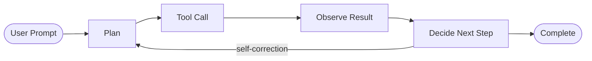

# Agentic Coding IDEs - The Complete 2026 Guide

> **Learn how AI coding agents work, compare every major agentic IDE, and understand the features, workflows, and architecture patterns that define the new era of software development.**

---

## Table of Contents

1. [What Are Agentic Coding IDEs?](#what-are-agentic-coding-ides)
2. [The Five Major Agentic IDEs](#the-five-major-agentic-ides)
3. [Feature Comparison Matrix](#feature-comparison-matrix)
4. [Deep Dive: GitHub Copilot (VS Code)](#deep-dive-github-copilot)
5. [Deep Dive: Cursor](#deep-dive-cursor)
6. [Deep Dive: Claude Code (Anthropic)](#deep-dive-claude-code)
7. [Deep Dive: OpenAI Codex](#deep-dive-openai-codex)
8. [Deep Dive: Google Antigravity](#deep-dive-google-antigravity)
9. [Core Concepts Across All Agentic IDEs](#core-concepts-across-all-agentic-ides)
10. [How to Choose the Right Agentic IDE](#how-to-choose-the-right-agentic-ide)
11. [Learning Path & Resources](#learning-path-and-resources)

---

## What Are Agentic Coding IDEs?

An **agentic coding IDE** is a development environment where an AI agent can autonomously:

1. **Understand** your entire codebase (read files, search semantically, trace dependencies)
2. **Plan** a multi-step approach to accomplish a task
3. **Execute** by editing files across your project, running terminal commands, and installing dependencies
4. **Verify** results by running tests, checking builds, and self-correcting when something fails
5. **Iterate** based on feedback until the task is complete

### How Agents Differ from Code Completion

| Aspect | Code Completion (2022–2024) | Agentic IDE (2025–2026) |
|--------|---------------------------|-------------------------|
| **Scope** | Single line / single file | Entire project, multiple files |
| **Autonomy** | Suggests; you accept/reject | Plans, executes, and verifies autonomously |
| **Tools** | Text generation only | File editing, terminal, browser, search, MCP servers |
| **Context** | Current file + neighbors | Full codebase + web + external tools |
| **Loop** | One-shot suggestion | Multi-step reasoning loop (plan → act → observe → repeat) |
| **Verification** | None | Runs tests, checks builds, self-corrects |

### The Agent Loop (Universal Pattern)



Every agentic IDE implements this loop, differing in:
- Which **models** power the reasoning
- Which **tools** are available (file edit, terminal, browser, MCP, etc.)
- How **permissions** and **safety** are handled
- Where agents **run** (local, cloud, background)

---

## The Five Major Agentic IDEs

| IDE | Company | Base Editor | Primary Model(s) | Launched |
|-----|---------|-------------|-------------------|----------|
| **[GitHub Copilot](https://code.visualstudio.com/docs/copilot/overview)** | Microsoft / GitHub | VS Code (extension) | Claude, GPT, Gemini, custom | 2021 (completions), 2025 (agents) |
| **[Cursor](https://cursor.com/docs)** | Anysphere | VS Code fork | Claude, GPT, Gemini, Composer 2.5 | 2023 (editor), 2025 (agent) |
| **[Claude Code](https://code.claude.com/docs/en/overview)** | Anthropic | Terminal CLI + IDE extensions | Claude Sonnet, Claude Opus | 2025 |
| **[OpenAI Codex](https://developers.openai.com/codex/quickstart)** | OpenAI | Standalone app + IDE + CLI | GPT-5.x, o3, o1 | 2025 |
| **[Google Antigravity](https://antigravity.google/docs/getting-started)** | Google | Standalone app (editor + agent manager) | Gemini 3.x, Claude, GPT-OSS | 2025 |

---

## Feature Comparison Matrix

### Agent Execution Modes

| Feature | GitHub Copilot | Cursor | Claude Code | OpenAI Codex | Google Antigravity |
|---------|---------------|--------|-------------|-------------|--------------------|
| **Local Agent** | ✅ (VS Code) | ✅ (Desktop) | ✅ (Terminal CLI) | ✅ (App, CLI) | ✅ (Editor) |
| **Cloud / Background Agent** | ✅ (Cloud agents, GitHub PR) | ✅ (Cloud agents - Slack, GitHub, Linear, API) | ✅ (Web, Routines, GitHub Actions) | ✅ (Cloud threads) | ✅ (Agent Manager - parallel tasks) |
| **Background/Async Execution** | ✅ (Background agent sessions) | ✅ (Cloud agents run independently) | ✅ (Routines, scheduled tasks) | ✅ (Non-interactive mode) | ✅ (Task groups, parallel conversations) |
| **Mobile / Web Access** | ✅ (github.com) | ✅ (cursor.com/agents PWA) | ✅ (Web, iOS app) | ✅ (Cloud browser) | ✅ (Agent Manager web) |

### Model Support

| Feature | GitHub Copilot | Cursor | Claude Code | OpenAI Codex | Google Antigravity |
|---------|---------------|--------|-------------|-------------|--------------------|
| **Anthropic Claude** | ✅ | ✅ | ✅ (native) | ❌ | ✅ (Sonnet, Opus) |
| **OpenAI GPT** | ✅ | ✅ | ❌ | ✅ (native) | ✅ (GPT-OSS-120b) |
| **Google Gemini** | ✅ | ✅ | ❌ | ❌ | ✅ (native - Gemini 3.x) |
| **Custom / Open Models** | ✅ (bring your own) | ✅ (OpenRouter, Azure, custom) | ✅ (third-party providers) | ❌ | ❌ |
| **Model Switching** | ✅ (per-session) | ✅ (per-request) | ✅ (via config) | ❌ (fixed) | ✅ (per-message dropdown) |

### Core Agent Capabilities

| Feature | GitHub Copilot | Cursor | Claude Code | OpenAI Codex | Google Antigravity |
|---------|---------------|--------|-------------|-------------|--------------------|
| **File Editing (multi-file)** | ✅ | ✅ | ✅ | ✅ | ✅ |
| **Terminal Commands** | ✅ | ✅ | ✅ (native CLI) | ✅ | ✅ |
| **Codebase Search (semantic)** | ✅ | ✅ | ✅ | ✅ | ✅ |
| **Web Search** | ✅ | ✅ | ✅ (via MCP) | ✅ | ✅ |
| **Browser Interaction** | ✅ (experimental - Playwright) | ✅ (computer use) | ✅ (Chrome extension) | ✅ (computer use in cloud) | ✅ (Browser subagent - full Chromium) |
| **Image Understanding** | ✅ | ✅ | ✅ | ✅ | ✅ |
| **Image Generation** | ❌ | ✅ | ❌ | ❌ | ✅ (Nano Banana Pro 2) |
| **MCP Server Support** | ✅ | ✅ | ✅ | ✅ | ✅ |
| **Subagents / Delegation** | ✅ (Plan agent, custom agents) | ❌ | ✅ (Agent SDK) | ✅ (Subagents) | ✅ (Browser subagent, task groups) |
| **Checkpoints / Rollback** | ✅ | ✅ | ✅ (git-based) | ✅ | ✅ |

### Customization & Rules

| Feature | GitHub Copilot | Cursor | Claude Code | OpenAI Codex | Google Antigravity |
|---------|---------------|--------|-------------|-------------|--------------------|
| **Project Rules File** | `.github/*.instructions.md`, `.instructions.md` | `.cursor/rules/*.mdc` | `CLAUDE.md` | `AGENTS.md` | Rules / Workflows (project-level) |
| **Custom Instructions** | ✅ (per-file, per-folder, global) | ✅ (always, auto-attached, agent-requested) | ✅ (project, user, repo) | ✅ (project rules) | ✅ (rules + workflows) |
| **Skills** | ✅ (`SKILL.md` files) | ✅ (skills system) | ✅ (skills) | ✅ (skills) | ✅ (skills) |
| **Hooks (pre/post actions)** | ✅ (hooks system) | ✅ (hooks.json) | ✅ (hooks - pre/post tool events) | ✅ (hooks) | ❌ |
| **Custom Agents** | ✅ (`.agent.md` files) | ❌ | ✅ (Agent SDK for custom agents) | ❌ | ❌ |
| **Tool Restrictions** | ✅ (per-agent tool config) | ✅ (per-rule tool config) | ✅ (permissions - allow/deny) | ✅ (agent approvals) | ✅ (agent permissions, strict mode) |

### Collaboration & CI/CD

| Feature | GitHub Copilot | Cursor | Claude Code | OpenAI Codex | Google Antigravity |
|---------|---------------|--------|-------------|-------------|--------------------|
| **GitHub Integration** | ✅ (native - PR review, issues, Actions) | ✅ (Cloud agent via @cursor on PRs/issues) | ✅ (GitHub Actions, Code Review) | ✅ (GitHub Action) | ❌ |
| **GitLab Integration** | ❌ | ✅ (Cloud agent) | ✅ (GitLab CI/CD) | ❌ | ❌ |
| **Slack Integration** | ❌ | ✅ (@cursor in Slack) | ✅ (Channels) | ❌ | ❌ |
| **Linear Integration** | ❌ | ✅ (@cursor in Linear) | ❌ | ❌ | ❌ |
| **Scheduled Tasks** | ❌ | ❌ | ✅ (Routines, Desktop scheduled) | ❌ | ❌ |
| **API / SDK** | ✅ (Copilot Extensions) | ✅ (Cloud Agent API) | ✅ (Agent SDK, CLI scripting) | ✅ (Codex SDK) | ❌ |

### Security & Sandboxing

| Feature | GitHub Copilot | Cursor | Claude Code | OpenAI Codex | Google Antigravity |
|---------|---------------|--------|-------------|-------------|--------------------|
| **Permission System** | ✅ (ask, auto-allow per tool) | ✅ (YOLO mode, per-command) | ✅ (allowlist / denylist commands) | ✅ (agent approvals - suggest, auto-edit, full-auto) | ✅ (agent permissions, strict mode) |
| **Sandboxing** | ❌ (runs locally) | ✅ (cloud agents in VMs) | ❌ (runs in your shell) | ✅ (cloud threads sandboxed) | ✅ (sandbox mode - Docker container) |
| **Network Restrictions** | ❌ | ✅ (cloud agent network controls) | ❌ | ❌ | ✅ (allowlist/denylist URLs) |

---

## Deep Dive: GitHub Copilot (VS Code)

> **Docs:** [code.visualstudio.com/docs/copilot/overview](https://code.visualstudio.com/docs/copilot/overview)

### Architecture

GitHub Copilot is **built into VS Code** as an extension. It provides three tiers of AI assistance:

1. **Inline Suggestions** - Tab completions, next-edit suggestions as you type
2. **Inline Chat** - Press `⌘I` for in-editor chat (targeted refactors, explanations)
3. **Agent Mode** - Full autonomous agents in the Chat panel (`⌃⌘I`)

### Agent Types

| Type | Where It Runs | Use Case |
|------|--------------|----------|
| **Local Agent** | Your VS Code instance | Interactive coding, debugging, feature building |
| **Background Agent** | VS Code background process | Autonomous tasks while you work on other things |
| **Cloud Agent** | GitHub cloud infrastructure | Creates branches, implements changes, opens PRs |
| **Third-party Agent** | Anthropic / OpenAI infrastructure | Use Claude Code or Codex directly from VS Code |

### Key Features

- **Plan Agent** - Break tasks into structured implementation plans before writing code
- **Multi-session** - Run multiple agent sessions in parallel (Sessions view)
- **Agent delegation** - Hand off tasks between local, background, cloud, and third-party agents
- **Custom Agents** - Create `.agent.md` files with specialized roles (code reviewer, doc writer)
- **Skills** - Teach Copilot specialized capabilities via `SKILL.md` files
- **MCP Servers** - Extend agents with external tools from MCP servers
- **Hooks** - Execute custom commands at specific events (pre-commit, post-edit)
- **Browser Testing** - (Experimental) Ask agents to open and verify web apps
- **Agents Window** (Preview) - Agent-first surface with a Changes panel for reviewing edits; connect to remote machines via SSH or dev tunnel; monitor all sessions from any browser at [insiders.vscode.dev/agents](https://insiders.vscode.dev/agents)

### Customization Files

```
.github/
  *.instructions.md      # Global project instructions
  .copilot/
    *.instructions.md  # Per-topic instructions
    agents/*.agent.md               # Custom agent definitions
    skills/*/SKILL.md               # Skill definitions
.vscode/
  mcp.json                     # MCP server configurations
```

### Pricing

- **Free tier** - Limited monthly completions and chat
- **Pro / Pro+** - More usage, premium models
- **Enterprise** - Org-wide policies, SSO, IP indemnity

> **Note (April 2026):** New sign-ups for Copilot Pro and Pro+ plans are temporarily paused; weekly usage limits have been tightened. See [GitHub Copilot plans](https://docs.github.com/en/copilot/get-started/plans) for current availability.

> **Learn more:** [Agents tutorial](https://code.visualstudio.com/docs/copilot/agents/agents-tutorial) | [Custom instructions](https://code.visualstudio.com/docs/copilot/customization/custom-instructions) | [MCP servers](https://code.visualstudio.com/docs/copilot/customization/mcp-servers)

---

## Deep Dive: Cursor

> **Docs:** [cursor.com/docs](https://cursor.com/docs)

### Architecture

Cursor is a **fork of VS Code** that replaces the AI layer with its own agent system. It looks and feels like VS Code but has a deeply integrated agent that can be accessed via `⌘I`.

### How Agent Works

Built on three components:
1. **Instructions** - System prompt + project [rules](https://cursor.com/docs/rules)
2. **Tools** - File editing, codebase search, terminal, web, browser, image generation
3. **Model** - Your choice per-request; Cursor optimizes tool calling for each model

No limit on tool calls per task.

### Agent Types

| Type | Where It Runs | Use Case |
|------|--------------|----------|
| **Local Agent** | Cursor desktop app | Interactive coding (`⌘I`) |
| **Cloud Agent** | Isolated cloud VMs | Parallel tasks, CI-like workflows |

### Cloud Agents (formerly Background Agents)

- Clone your repo from GitHub/GitLab, work on a separate branch, push changes
- Start from: **Cursor Web**, **Desktop**, **Slack** (`@cursor`), **GitHub** (`@cursor` on PR/issue), **Linear** (`@cursor`), **API**
- Run in **Max Mode** (always) with full MCP support
- Can use **computer use** to control desktop and browser in the cloud VM
- Support **hooks** (`hooks.json`) for formatters, audit scripts, policy checks

### Key Features

- **Checkpoints** - Automatic snapshots before changes; click to preview/restore
- **Queued Messages** - Queue follow-up instructions while agent works; executed sequentially
- **Immediate Send** - `⌘+Enter` bypasses queue for urgent interrupts
- **Rules System** - `.cursor/rules/*.mdc` with frontmatter (`always`, `auto-attached`, `agent-requested`)
- **Tab Autocomplete** - Intelligent multi-line completions beyond single-line
- **Models** - Claude 4.6 Sonnet / 4.7 Opus, GPT-5.3 Codex / 5.5, Gemini 3.1 Pro / 3.5 Flash, Grok 4.3, Composer 2.5 (custom)

### Rules Format

```markdown
---
description: TypeScript coding standards
globs: **/*.ts
alwaysApply: false
---

Use strict TypeScript. Prefer interfaces over types.
Always use named exports.
```

### Pricing

- **Free** - Limited requests
- **Pro ($20/mo)** - 500 fast requests/month
- **Business** - Team features, admin controls
- **Enterprise** - SSO, compliance, custom deployment
- **Cloud Agents** - Charged at API pricing per model

> **Learn more:** [Agent overview](https://cursor.com/docs/agent) | [Cloud agents](https://cursor.com/docs/cloud-agent) | [Rules](https://cursor.com/docs/rules) | [MCP](https://cursor.com/docs/mcp)

---

## Deep Dive: Claude Code (Anthropic)

> **Docs:** [code.claude.com/docs/en/overview](https://code.claude.com/docs/en/overview)

### Architecture

Claude Code is **terminal-first** - install it, `cd` into your project, and type `claude`. It reads your codebase, edits files, runs commands, and integrates with your development tools. Available in:

| Surface | Description |
|---------|-------------|
| **Terminal CLI** | Full-featured CLI in your terminal |
| **VS Code Extension** | Integrated into VS Code sidebar |
| **JetBrains Plugin** | IntelliJ, PyCharm, WebStorm, etc. |
| **Desktop App** | Standalone Electron app |
| **Web** | Browser-based at code.claude.com |

All surfaces connect to the **same underlying Claude Code engine** - your `CLAUDE.md` files, settings, and MCP servers work across all of them.

### What You Can Do

- **Build features and fix bugs** - Describe what you want; Claude edits files across your project
- **Create commits and pull requests** - Automated git workflow
- **Connect tools with MCP** - Extend Claude with external data sources and APIs
- **Customize with instructions, skills, and hooks** - Fine-tune behavior per project
- **Run agent teams** - Build custom agents with the Agent SDK
- **Pipe, script, and automate** - Use the CLI in scripts and CI/CD pipelines
- **Schedule recurring tasks** - Routines for automated maintenance

### Unique Features

- **CLAUDE.md** - Project memory and instructions (similar to AGENTS.md / *.instructions.md)
- **Auto Memory** - Claude can learn and persist memories across sessions
- **Remote Control** - Continue a local session from phone or another device
- **Channels** - Push events from Telegram, Discord, iMessage, webhooks into sessions
- **Routines** - Scheduled recurring tasks (daily code review, dependency updates)
- **Agent SDK** - Build custom multi-agent workflows
- **Chrome Extension** - Debug live web applications
- **GitHub Code Review** - Automatic code review on every PR
- **Slack Integration** - Route bug reports from Slack to pull requests

### Installation

```bash
# macOS / Linux / WSL (CLI)
curl -fsSL https://claude.ai/install.sh | bash

# VS Code extension
code --install-extension Anthropic.claude-code

# Then use the CLI
cd your-project
claude
```

> **Marketplace:** [marketplace.visualstudio.com/items?itemName=Anthropic.claude-code](https://marketplace.visualstudio.com/items?itemName=Anthropic.claude-code)

### Essential CLI Commands

| Command | Description | Example |
|---------|-------------|---------|
| `claude` | Start interactive mode | `claude` |
| `claude "task"` | Run a one-time task | `claude "fix the build error"` |
| `claude -p "query"` | One-off query, then exit | `claude -p "explain this function"` |
| `claude -c` | Continue most recent conversation | `claude -c` |
| `claude -r` | Resume a previous conversation | `claude -r` |
| `/clear` | Clear conversation history | `/clear` |
| `/help` | Show available commands | `/help` |
| `exit` / `Ctrl+D` | Exit Claude Code | `exit` |

### Pricing

- Requires a **Claude subscription** (Pro, Team, Enterprise) or Anthropic Console API key
- Third-party API providers also supported (AWS Bedrock, Google Vertex)

> **Learn more:** [Quickstart](https://code.claude.com/docs/en/quickstart) | [Memory (CLAUDE.md)](https://code.claude.com/docs/en/memory) | [Best practices](https://code.claude.com/docs/en/best-practices) | [Common workflows](https://code.claude.com/docs/en/common-workflows)

---

## Deep Dive: OpenAI Codex

> **Docs:** [developers.openai.com/codex](https://developers.openai.com/codex)

### Architecture

OpenAI Codex is a **standalone coding agent** available as:

| Surface | Description |
|---------|-------------|
| **Desktop App** | macOS and Windows native app (recommended) |
| **IDE Extension** | VS Code extension |
| **CLI** | Terminal-based agent |
| **Cloud** | Browser-based at developers.openai.com |

Every ChatGPT plan includes Codex. You can also use it with API credits.

### Key Features

- **Write code** - Describe intent; Codex generates code matching your project structure
- **Understand codebases** - Read and explain complex or legacy code
- **Review code** - Identify bugs, logic errors, unhandled edge cases
- **Debug and fix** - Trace failures, diagnose root causes, suggest fixes
- **Automate tasks** - Refactoring, testing, migrations, setup

### Unique Features

- **AGENTS.md** - Project instructions file (equivalent to CLAUDE.md / *.instructions.md)
- **Rules** - Project-level behavioral constraints
- **Hooks** - Pre/post event automation
- **Skills** - Teachable capabilities
- **Subagents** - Delegate sub-tasks to specialized agents
- **Non-interactive Mode** - Run Codex headlessly in CI/CD
- **Codex SDK** - Build programmatic integrations
- **App Server** - Host Codex as a service
- **GitHub Action** - Automate PR reviews and code changes in CI
- **Cloud Threads** - Run tasks in sandboxed cloud environments

### Use Cases (Official Categories)

| Category | Examples |
|----------|----------|
| **Production Systems** | Navigate codebases, make controlled changes, codify repeatable work |
| **Productivity** | Analyze data, combine apps/services, turn insights into action |
| **Web Development** | Design to responsive UI, frontend iteration |
| **Native Development** | iOS (SwiftUI), macOS apps, Liquid Glass adoption |
| **Game Development** | First playable loop to production quality |
| **Integrations** | GitHub code reviews, ChatGPT apps |

### Installation

```bash
# VS Code extension
code --install-extension openai.codex
```

> **Marketplace:** [marketplace.visualstudio.com/items?itemName=openai.codex](https://marketplace.visualstudio.com/items?itemName=openai.codex)

### Pricing

- Included with **ChatGPT Plus, Pro, Business, Edu, Enterprise** plans
- Also usable with **OpenAI API credits**

> **Learn more:** [Quickstart](https://developers.openai.com/codex/quickstart) | [AGENTS.md guide](https://developers.openai.com/codex/guides/agents-md) | [Best practices](https://developers.openai.com/codex/learn/best-practices) | [Use cases](https://developers.openai.com/codex/use-cases) | [MCP](https://developers.openai.com/codex/mcp)

---

## Deep Dive: Google Antigravity

> **Docs:** [antigravity.google/docs](https://antigravity.google/docs)

### Architecture

Google Antigravity is a **standalone application** (not a VS Code extension) with two main surfaces:

1. **Editor** - Full code editor with agent side panel (open via `⌘E`)
2. **Agent Manager** - Multi-workspace dashboard to manage parallel agent conversations (open via `⌘E`)

The Agent is a **multi-step reasoning system** powered by frontier LLMs that can reason over existing code, use a wide range of tools (including a full browser), and communicate through tasks, artifacts, and more.

### Agent Modes (Starting a Session)

When spawning an agent in a Project, choose a mode:

| Mode | Description |
|------|-------------|
| **Local Mode** | Agent operates directly in your active project folders |
| **New Worktree Mode** | Agent operates in an isolated Git worktree (safe parallel experimentation) |

### Core Components

| Component | Description |
|-----------|-------------|
| **Reasoning Model** | User-selectable: Gemini 3.1 Pro, Claude Sonnet 4.6, Claude Opus 4.6, GPT-OSS-120b |
| **Tools** | File editing, terminal, search, browser subagent, image generation |
| **Artifacts** | Task lists, implementation plans, walkthroughs, screenshots, browser recordings, knowledge |
| **Knowledge** | Persistent project knowledge base |

### Unique Features

- **Browser Subagent** - Full Chromium browser controlled by AI for testing, form filling, web research
- **Task Groups** - Run multiple agent tasks in parallel
- **Agent Modes / Settings** - Configure agent behavior per workspace
- **Strict Mode** - Restrict agent to only approved actions
- **Sandboxing** - Run agent in a Docker container for safety
- **Implementation Plans** - Structured plans as artifacts before coding
- **Walkthroughs** - Step-by-step guided explanations of code changes
- **Screenshots & Browser Recordings** - Visual artifacts from browser subagent
- **Playground** - Quick experimentation space
- **Inbox** - Notification center for agent completions
- **Allowlist / Denylist** - Fine-grained URL access control for browser

### Additional Models Used

| Model | Purpose |
|-------|--------|
| **Nano Banana Pro 2** | Image generation (UI mockups, diagrams, web assets) |
| **Gemini 2.5 Pro UI Checkpoint** | Browser subagent actuation (click, scroll, fill) |
| **Gemini 2.5 Flash** | Checkpointing and context summarization |
| **Gemini 2.5 Flash Lite** | Codebase semantic search |

### Slash Commands

| Command | Description |
|---------|-------------|
| `/goal` | Run until the task is fully finished — no intermediate input from user |
| `/grill-me` | Agent asks clarifying questions before starting to implement |
| `/schedule` | Run an instruction as a one-time or recurring scheduled task |
| `/browser` | Explicitly enable browser primitives for the session (requires Chrome permission) |

### Basic Navigation

| Action | macOS | Windows |
|--------|-------|---------|
| Open Conversation Picker | `⌘K` | `Ctrl+K` |
| Open File Search | `⌘P` | `Ctrl+P` |
| Focus Input | `⌘L` | `Ctrl+L` |
| New Conversation | `⌘N` | `Ctrl+N` |
| Next / Previous Conversation | `⌥↑` / `⌥↓` | `Alt+↑` / `Alt+↓` |

### Platform Support

- **macOS** - Min Version 12 (Monterey), Apple Silicon only
- **Windows** - Windows 10 (64 bit)
- **Linux** - glibc >= 2.28 (Ubuntu 20+, Debian 10+, Fedora 36+, RHEL 8+)

### Pricing

- See [plans page](https://antigravity.google/docs/plans) for tier details and rate limits

> **Learn more:** [Agent](https://antigravity.google/docs/agent) | [Models](https://antigravity.google/docs/models) | [Rules/Workflows](https://antigravity.google/docs/rules-workflows) | [Skills](https://antigravity.google/docs/skills) | [MCP](https://antigravity.google/docs/mcp) | [Browser Subagent](https://antigravity.google/docs/browser-subagent) | [Sandboxing](https://antigravity.google/docs/sandbox-mode)

---

## Core Concepts Across All Agentic IDEs

### 1. Project Instructions (Rules Files)

Every agentic IDE supports a project-level instructions file that tells the agent about your codebase conventions:

| IDE | File | Location |
|-----|------|----------|
| GitHub Copilot | `*.instructions.md` | `.github/*.instructions.md` |
| Cursor | `*.mdc` rules | `.cursor/rules/*.mdc` |
| Claude Code | `CLAUDE.md` | Project root |
| OpenAI Codex | `AGENTS.md` | Project root |
| Google Antigravity | Rules / Workflows | Agent settings UI |

**Best practice:** Include coding standards, architecture decisions, preferred libraries, testing conventions, and deployment patterns.

### 2. MCP (Model Context Protocol)

**All five IDEs** support MCP - a standard protocol for connecting AI agents to external tools and data sources.

```json
// .vscode/mcp.json (Copilot) or similar
{
  "servers": {
    "github": {
      "type": "stdio",
      "command": "npx",
      "args": ["@modelcontextprotocol/server-github"]
    },
    "postgres": {
      "type": "stdio",
      "command": "npx",
      "args": ["@modelcontextprotocol/server-postgres"],
      "env": { "DATABASE_URL": "postgresql://..." }
    }
  }
}
```

MCP gives agents access to: databases, APIs, GitHub/GitLab, Slack, file systems, web scraping, and any custom tool you build.

### 3. Skills

Skills are **reusable, domain-specific knowledge packages** that teach agents specialized capabilities:

- **GitHub Copilot**: `SKILL.md` files in `.github/instructions/` or extension-provided
- **Cursor**: Skills referenced in rules
- **Claude Code**: Skills via project config
- **OpenAI Codex**: Skills system
- **Google Antigravity**: Skills system in agent settings

### 4. Hooks

Hooks let you run custom commands at specific points in the agent workflow:

| Event | Example Use Case |
|-------|------------------|
| **Pre-edit** | Run linter before applying changes |
| **Post-edit** | Auto-format code after changes |
| **Pre-commit** | Run security scan before committing |
| **Post-terminal** | Validate command output |

### 5. Agent Permissions & Safety

All IDEs provide ways to control what agents can do:

| Level | Description | Example |
|-------|-------------|--------|
| **Ask** | Agent asks before every action | Default in most IDEs |
| **Auto-allow** | Pre-approve specific tools/commands | Allow `npm test`, `git status` |
| **Deny** | Block specific actions | Never delete files, never run `rm -rf` |
| **Sandbox** | Run in isolated environment | Docker container, cloud VM |

### 6. Cloud / Background Agents

The trend in 2026 is **async agent execution** - kick off tasks and let them run independently:

| IDE | Cloud Agent | How to Trigger |
|-----|------------|----------------|
| **Copilot** | Cloud agents (GitHub infra) | VS Code, github.com |
| **Cursor** | Cloud agents (isolated VMs) | Web, Desktop, Slack, GitHub, Linear, API |
| **Claude Code** | Web + Routines | Browser, CLI scripting, GitHub Actions |
| **Codex** | Cloud threads | App, browser |
| **Antigravity** | Agent Manager (parallel tasks) | App UI |

---

## How to Choose the Right Agentic IDE

### Decision Matrix

| If You... | Best Choice | Why |
|-----------|------------|-----|
| Already use VS Code and want minimal change | **GitHub Copilot** | Native extension, no editor switch, multi-model |
| Want the best fork of VS Code with AI-first design | **Cursor** | Deepest agent integration, Tab autocomplete, Cloud agents |
| Prefer terminal workflows, CLI-first | **Claude Code** | Terminal-native, powerful CLI scripting, piping |
| Are already on ChatGPT Plus/Pro | **OpenAI Codex** | Included in subscription, native iOS/macOS development |
| Want a fully standalone agentic environment | **Google Antigravity** | Editor + Agent Manager, browser subagent, image generation |
| Need the best GitHub integration | **GitHub Copilot** or **Claude Code** | Native PR review, Actions, issue triage |
| Need Slack/Linear integration | **Cursor** | `@cursor` in Slack/Linear triggers cloud agents |
| Want scheduled/recurring tasks | **Claude Code** | Routines for automated daily maintenance |
| Need the strongest sandboxing | **Google Antigravity** or **Cursor** | Docker sandbox / isolated cloud VMs |
| Want to use open/custom models | **GitHub Copilot** or **Cursor** | Both support bring-your-own model endpoints |

### The Pragmatic Approach

Most developers in 2026 use **2-3 of these tools** simultaneously:

1. **Primary IDE** - Copilot in VS Code or Cursor for day-to-day coding
2. **CLI agent** - Claude Code for terminal tasks, scripting, and CI/CD
3. **Cloud agent** - Cursor Cloud or Copilot Cloud for background tasks and PR automation

They are **not mutually exclusive** - you can use Copilot for inline suggestions while using Claude Code for complex multi-file tasks from the terminal.

---

## Learning Path & Resources

### Step 1: Understand Agents (Theory)

| Topic | Resource |
|-------|----------|
| What are AI agents? | [Section 2: Intro to Agents](../02_intro_to_agents/) |
| Function calling / tool use | [Section 3: Function Calling](../03_function_calling/) |
| ReAct pattern | [Section 4: ReAct Pattern](../04_react_pattern/) |
| Agent frameworks | [Section 5: Agent Frameworks](../05_agent_frameworks/) |
| MCP protocol | [Section 7: MCP](../07_mcp_model_context_protocol/) |

### Step 2: Try Each IDE (Hands-On)

| IDE | Getting Started Guide | Time to First Task |
|-----|----------------------|--------------------|
| **GitHub Copilot** | [VS Code Quickstart](https://code.visualstudio.com/docs/copilot/getting-started) | 5 minutes |
| **Cursor** | [Cursor Quickstart](https://cursor.com/docs/get-started/quickstart) | 5 minutes |
| **Claude Code** | [Claude Code Quickstart](https://code.claude.com/docs/en/quickstart) | 3 minutes |
| **OpenAI Codex** | [Codex Quickstart](https://developers.openai.com/codex/quickstart) | 5 minutes |
| **Google Antigravity** | [Antigravity Getting Started](https://antigravity.google/docs/getting-started) | 5 minutes |

### Step 3: Master Advanced Features

| Skill | Resources |
|-------|----------|
| Writing effective rules files | [Copilot instructions](https://code.visualstudio.com/docs/copilot/customization/custom-instructions), [Cursor rules](https://cursor.com/docs/rules), [CLAUDE.md](https://code.claude.com/docs/en/memory), [AGENTS.md](https://developers.openai.com/codex/guides/agents-md) |
| MCP server setup | [Copilot MCP](https://code.visualstudio.com/docs/copilot/customization/mcp-servers), [Cursor MCP](https://cursor.com/docs/mcp), [Codex MCP](https://developers.openai.com/codex/mcp), [Antigravity MCP](https://antigravity.google/docs/mcp) |
| Cloud/background agents | [Copilot cloud agents](https://code.visualstudio.com/docs/copilot/agents/cloud-agents), [Cursor cloud agents](https://cursor.com/docs/cloud-agent), [Claude Code web](https://code.claude.com/docs/en/claude-code-on-the-web) |
| Hooks & automation | [Copilot hooks](https://code.visualstudio.com/docs/copilot/customization/hooks), [Cursor hooks](https://cursor.com/docs/hooks), [Claude Code hooks](https://code.claude.com/docs/en/hooks), [Codex hooks](https://developers.openai.com/codex/hooks) |
| Building custom agents | [Copilot custom agents](https://code.visualstudio.com/docs/copilot/customization/custom-agents), [Claude Code Agent SDK](https://code.claude.com/docs/en/agent-sdk), [Codex subagents](https://developers.openai.com/codex/subagents) |

### Step 4: Interview Topics

**Q: What is an agentic coding IDE and how does it differ from code completion?**
> An agentic coding IDE gives an AI agent autonomous ability to plan, edit multiple files, run terminal commands, browse the web, and self-correct - operating in a loop of plan→act→observe→repeat. Code completion only suggests the next few lines passively.

**Q: What is MCP and why does it matter?**
> Model Context Protocol (MCP) is an open standard for connecting AI agents to external tools. All five major agentic IDEs support it, making it the universal extension mechanism. It enables agents to query databases, call APIs, interact with GitHub, and access any custom tool.

**Q: How would you set up an effective rules file for a team project?**
> Include: (1) project architecture overview, (2) coding conventions (language, style), (3) preferred libraries and frameworks, (4) testing strategy, (5) deployment workflow, (6) security requirements, (7) file/folder naming conventions. Keep it concise - agents have context limits.

**Q: Compare local agents vs cloud agents. When would you use each?**
> Local agents are best for interactive, real-time coding where you want to review changes as they happen. Cloud agents are best for: (1) long-running tasks that don't need supervision, (2) CI/CD integration (PR reviews, issue triage), (3) running multiple tasks in parallel, (4) working from mobile/web.

**Q: What are the key safety considerations with agentic IDEs?**
> (1) Permission systems - use ask-first for destructive actions, (2) Sandboxing - run untrusted tasks in containers/VMs, (3) Hooks - enforce linting/security scans before commits, (4) Network restrictions - control what URLs agents can access, (5) Code review - always review agent-generated code before merging, (6) Never give agents access to production credentials.

---

## Summary Table: Quick Reference

| | Copilot | Cursor | Claude Code | Codex | Antigravity |
|---|---------|--------|-------------|-------|-------------|
| **Form factor** | VS Code extension | VS Code fork | Terminal CLI + extensions | Standalone app | Standalone app |
| **Best for** | VS Code users, GitHub teams | Power users, cloud agents | CLI-first, scripting | ChatGPT subscribers, iOS dev | Standalone agent environment |
| **Rules file** | `*.instructions.md` | `.cursor/rules/*.mdc` | `CLAUDE.md` | `AGENTS.md` | Rules UI |
| **MCP** | ✅ | ✅ | ✅ | ✅ | ✅ |
| **Cloud agents** | ✅ | ✅ | ✅ | ✅ | ✅ (parallel) |
| **Browser agent** | Experimental | ✅ (computer use) | ✅ (Chrome) | ✅ (computer use) | ✅ (full Chromium) |
| **Custom agents** | ✅ (.agent.md) | ❌ | ✅ (Agent SDK) | ❌ | ❌ |
| **Unique strength** | GitHub ecosystem | Cloud agents + integrations | CLI power + routines | Native dev (iOS/macOS) | Browser subagent + image gen |
