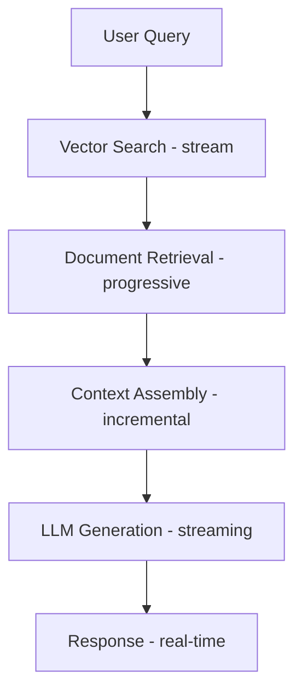

# Real-Time & Streaming AI

> **Status:** This phase is currently an introduction, not one of the repo's deepest modules yet.
> Use it to learn the core patterns, then pair it with MLOps, local LLMs, or multimodal work for stronger projects.

## Overview
Learn how to build real-time AI applications with streaming responses, WebSocket connections, progressive loading, and live voice or multimodal interaction patterns.

**Duration:** 10 hours (5 notebooks + materials)

**Topics Covered:**
1. Streaming LLM Responses
2. WebSocket Connections  
3. Real-Time RAG
4. Production Streaming Systems
5. Realtime voice and multimodal interactions

## Learning Objectives

By the end of this phase, you will be able to:
- Implement Server-Sent Events (SSE) for streaming
- Build WebSocket-based real-time chat applications
- Understand when WebRTC is a better fit than SSE/WebSockets
- Handle progressive loading and chunked responses
- Create streaming RAG pipelines
- Design production streaming systems with backpressure and observability in mind
- Optimize for latency and throughput
- Design interruption-safe realtime voice loops

## Prerequisites

- Strong Python programming skills
- Understanding of LLMs and API-based workflows
- Basic knowledge of async/await
- Familiarity with web technologies
- Prior exposure to prompting, embeddings, or simple app integration work is helpful

## How To Use This Phase Right Now

1. Learn the transport patterns first: SSE, WebSockets, and when WebRTC enters the picture.
2. Build one small streaming project before optimizing everything.
3. Add `06_realtime_voice_multimodal.ipynb` when you move from text streaming to turn-taking voice or live multimodal assistants.
4. Treat this phase as a systems-pattern module that complements [../09-mlops/09-mlops.ipynb](../09-mlops/09-mlops.ipynb), [../13-multimodal/13-multimodal.ipynb](../13-multimodal/13-multimodal.ipynb), and [../14-local-llms/14-local-llms.ipynb](../14-local-llms/14-local-llms.ipynb).

## Course Content

### 1. Streaming Responses (90 minutes)
**File:** `02_streaming_responses.ipynb`

**Topics:**
- OpenAI Responses API event streaming
- Server-Sent Events (SSE) protocol
- Handling semantic stream events and text deltas
- Measuring TTFT and output rate
- Error handling in streams
- Progress indicators

**Key Code:**
```python
# OpenAI Responses API streaming
for event in client.responses.create(
    model="gpt-4.1",
    input="Tell me a story",
    stream=True
):
    if event.type == "response.output_text.delta":
        print(event.delta, end="")

# SSE frame format
def format_sse(delta: str) -> str:
    return f"data: {delta}\\n\\n"
```

### 2. WebSocket Connections (90 minutes)
**File:** `03_websocket_connections.ipynb`

**Topics:**
- WebSocket protocol basics
- Bidirectional communication
- FastAPI WebSocket endpoints
- Client-side WebSocket handling
- Connection management
- Heartbeat and reconnection

**Key Code:**
```python
import asyncio

async def process_message(data: str) -> str:
    return f"assistant: {data}"

async def websocket_style_roundtrip(messages: list[str]) -> list[str]:
    replies = []
    for data in messages:
        replies.append(await process_message(data))
    return replies
```

### 3. Real-Time RAG (90 minutes)
**File:** `04_real_time_rag.ipynb`

**Topics:**
- Streaming search results
- Progressive context loading
- Incremental vector search
- Streaming summarization
- Real-time document processing
- Hybrid search streaming

**Architecture:**


### 4. Production Streaming (120 minutes)
**File:** `05_production_streaming.ipynb`

**Topics:**
- Load balancing streaming connections
- Connection pooling
- Rate limiting
- Backpressure handling
- Monitoring and metrics
- Error recovery
- Scaling strategies

**Production Considerations:**
- Connection limits
- Timeout management
- Memory management
- Graceful degradation
- Observability

### 5. Realtime Voice and Multimodal Patterns (90 minutes)
**File:** `06_realtime_voice_multimodal.ipynb`

**Topics:**
- Turn-taking state machines
- Interruption and cancellation semantics
- Audio frame chunking
- WebRTC vs WebSocket transport choices
- Live session state for voice and multimodal assistants

## Technical Stack

**Backend:**
- FastAPI
- OpenAI Python SDK
- WebSockets library
- asyncio

**Frontend:**
- HTML/CSS/JavaScript
- EventSource API
- WebSocket API
- React (optional)

**Infrastructure:**
- Nginx (reverse proxy)
- Redis (connection management)
- Prometheus (monitoring)
- Docker
- WebRTC / LiveKit style realtime media transport

## 2026 Realtime Topics To Know

- Realtime APIs for voice and multimodal assistants
- Turn-taking, interruption, and low-latency audio streaming
- WebRTC for browser-to-browser media and live copilot experiences
- Disaggregated retrieval + generation pipelines to keep end-to-end latency low

## Best Practices

### Performance
- Use connection pooling
- Implement backpressure
- Buffer appropriately
- Monitor latency

### Reliability
- Handle disconnections gracefully
- Implement retry logic
- Timeout management
- Circuit breakers

### Security
- Rate limiting per user
- Input validation
- Authentication tokens
- CORS configuration

### User Experience
- Loading indicators
- Smooth animations
- Error messages
- Offline support

## Common Patterns

### Pattern 1: Simple SSE Streaming
```python
for event in client.responses.create(model="gpt-4.1-mini", input=prompt, stream=True):
    if event.type == "response.output_text.delta":
        yield f"data: {event.delta}\\n\\n"
```

### Pattern 2: WebSocket with Heartbeat
```python
async def heartbeat(websocket):
    while True:
        await asyncio.sleep(30)
        await websocket.send_json({"type": "ping"})
```

### Pattern 3: Streaming RAG
```python
async def streaming_rag(query):
    # Search
    docs = await vector_search(query)
    yield {"type": "sources", "data": docs}
    
    # Generate
    async for chunk in llm_generate(query, docs):
        yield {"type": "text", "data": chunk}
```

## Real-World Examples

1. **ChatGPT-style Interface**
   - Streaming responses
   - Typing indicators
   - Stop generation
   - Copy/retry

2. **Live Document Q&A**
   - Upload and index
   - Real-time search
   - Streaming answers
   - Source citations

3. **Multi-User Chat**
   - WebSocket rooms
   - Broadcast messages
   - User presence
   - Typing indicators

## Resources

### Documentation
- [OpenAI Responses API](https://platform.openai.com/docs/api-reference/responses)
- [FastAPI WebSockets](https://fastapi.tiangolo.com/advanced/websockets/)
- [MDN Server-Sent Events](https://developer.mozilla.org/en-US/docs/Web/API/Server-sent_events)
- [WebSocket Protocol](https://datatracker.ietf.org/doc/html/rfc6455)

### Libraries
- `fastapi` - Modern Python web framework
- `websockets` - WebSocket client/server
- `sse-starlette` - SSE for Starlette/FastAPI
- `httpx` - Async HTTP client

### Tools
- Postman - API testing with WebSocket support
- k6 - Load testing
- WebSocket King - WebSocket client tester

## Troubleshooting

### Issue: Stream stops unexpectedly
**Solution:** Check timeout settings, implement heartbeat

### Issue: High latency
**Solution:** Optimize chunk size, reduce buffering, check network

### Issue: Connection drops
**Solution:** Implement reconnection logic, use exponential backoff

### Issue: Memory leaks
**Solution:** Close connections properly, cleanup event listeners

## What Comes Next

After completing this phase:
1. Review Phase 19 (AI Safety) for securing streaming apps
2. Explore Phase 15 (AI Agents) for multi-agent streaming
3. Check Phase 18 (Low-Code) for Gradio/Streamlit streaming
4. Build your own production streaming application

## Time Estimates

- **Total Duration:** 8 hours
- **Notebooks:** 6-7 hours
- **Assignment:** 4-6 hours  
- **Challenges:** 6-8 hours
- **Total with Practice:** 16-20 hours

## Success Criteria

- ✅ Implement SSE and WebSocket endpoints
- ✅ Build real-time chat interface
- ✅ Create streaming RAG pipeline
- ✅ Handle 100+ concurrent connections
- ✅ Deploy production streaming app
- ✅ Monitor and optimize performance

---

**Note:** This is a foundational module for building modern AI applications. Master these concepts to create responsive, real-time user experiences.
