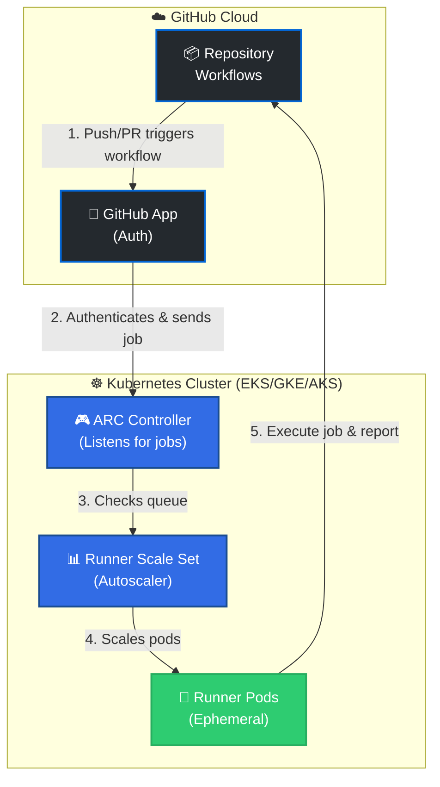
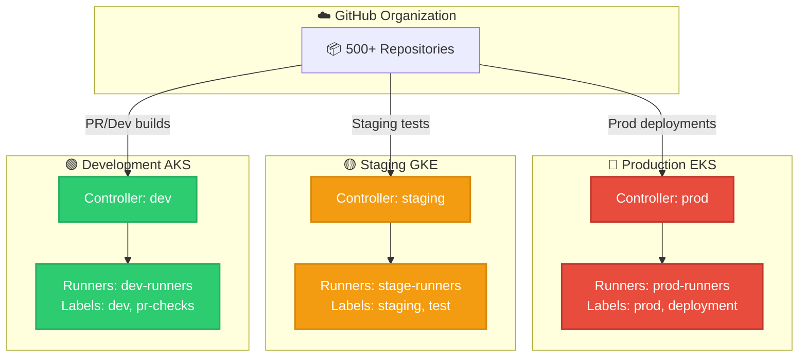
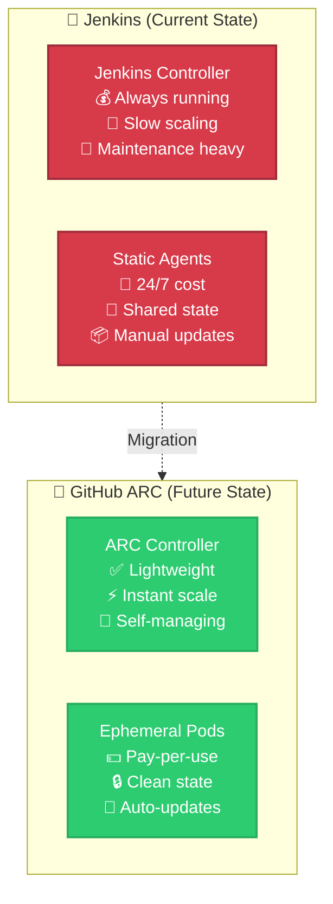

# GitHub Actions Runner Controller (ARC) - Interview Architecture

> **Interview-Ready Architecture Diagrams for AMD Technical Interview**

## Diagram 1: Simple High-Level Architecture



**Talk Track for Interview:**
> "GitHub ARC runs self-hosted runners on Kubernetes. When a workflow is triggered, GitHub sends the job to the ARC Controller via a GitHub App. The Controller communicates with the Runner Scale Set, which creates ephemeral runner pods to execute jobs. After completion, the pods are destroyed—ensuring clean, secure environments for every build."

---

## Diagram 2: Scaling Behavior

```mermaid
graph LR
    subgraph Before["⏸️ No Jobs Running"]
        IDLE_CONTROLLER["ARC Controller<br/>✓ Running"]
        IDLE_SCALESET["Scale Set<br/>Min: 0"]
        IDLE_PODS["Runner Pods<br/>Count: 0"]
    end

    subgraph During["⚡ Jobs Queued (5 jobs)"]
        ACTIVE_CONTROLLER["ARC Controller<br/>✓ Detecting jobs"]
        ACTIVE_SCALESET["Scale Set<br/>Scaling to 5"]
        ACTIVE_PODS["Runner Pods<br/>Count: 5<br/>(Creating...)"]
    end

    subgraph After["✅ Jobs Complete"]
        DONE_CONTROLLER["ARC Controller<br/>✓ Monitoring"]
        DONE_SCALESET["Scale Set<br/>Min: 0"]
        DONE_PODS["Runner Pods<br/>Count: 0<br/>(Terminated)"]
    end

    Before ==>|"GitHub workflow triggered"| During
    During ==>|"Jobs complete"| After

    classDef idle fill:#95a5a6,stroke:#7f8c8d,stroke-width:2px,color:#fff
    classDef active fill:#f39c12,stroke:#d68910,stroke-width:2px,color:#fff
    classDef done fill:#27ae60,stroke:#1e8449,stroke-width:2px,color:#fff
    
    class IDLE_CONTROLLER,IDLE_SCALESET,IDLE_PODS idle
    class ACTIVE_CONTROLLER,ACTIVE_SCALESET,ACTIVE_PODS active
    class DONE_CONTROLLER,DONE_SCALESET,DONE_PODS done
```



**Talk Track for Interview:**
> "ARC implements scale-to-zero architecture. At rest, only the controller runs—no runner pods consuming resources. When jobs arrive, it scales instantly from 0 to N runners. After jobs complete, runners terminate automatically. This saves costs compared to static Jenkins agents that run 24/7."

---

## Diagram 3: Multi-Environment Setup



**Talk Track for Interview:**
> "For AMD's scale, I'd recommend multiple ARC deployments across environments. Each cluster runs its own controller with labeled runner sets. Workflows select runners using `runs-on: [staging, test]` labels. This isolates production from development and allows per-environment security policies and resource quotas."

---

## Diagram 4: ARC vs Jenkins Comparison



**Talk Track for Interview:**
> "Moving from Jenkins to ARC solves AMD's key pain points:
> - **Cost**: Jenkins agents run 24/7. ARC scales to zero = 70% infrastructure savings.
> - **Security**: Shared Jenkins agents retain state. ARC pods are ephemeral = fresh environment every job.
> - **Maintenance**: Jenkins requires plugin updates, agent patching. ARC auto-updates via Helm.
> - **Speed**: Jenkins takes minutes to provision agents. ARC pods start in 10-20 seconds."

---

## Deployment Commands (For Interview Demo)

```bash
# Install ARC Controller via Helm
helm install arc-controller \
  oci://ghcr.io/actions/actions-runner-controller-charts/gha-runner-scale-set-controller \
  --namespace arc-systems \
  --create-namespace

# Deploy Runner Scale Set
helm install arc-runners \
  oci://ghcr.io/actions/actions-runner-controller-charts/gha-runner-scale-set \
  --namespace arc-runners \
  --set githubConfigUrl="https://github.com/AMD" \
  --set githubConfigSecret=github-app-secret \
  --set minRunners=0 \
  --set maxRunners=100
```

**Talk Track:**
> "ARC deploys via Helm in under 5 minutes. I'd use Terraform to manage this across AMD's EKS clusters, with environment-specific values for dev/staging/prod. The GitHub App secret authenticates the controller—no PATs needed."

---

## Key Interview Stats to Memorize

| Metric | Value |
|--------|-------|
| **Deployment Time** | &lt; 5 minutes (Helm) |
| **Scale Time** | 10-20 seconds (pod startup) |
| **Min Replicas** | 0 (scale to zero) |
| **Max Replicas** | 1000+ (horizontal scaling) |
| **Cost Savings** | 60-70% vs static agents |
| **Runner Lifecycle** | Ephemeral (1 job = 1 pod) |
| **Supported Platforms** | EKS, GKE, AKS, self-hosted K8s |
| **GitHub App Auth** | ✅ No PATs required |

---

## Sample Workflow Using ARC Runners

```yaml
name: Build on ARC
on: push

jobs:
  build:
    runs-on: [self-hosted, amd-production]  # Uses ARC runners
    steps:
      - uses: actions/checkout@v4
      - name: Build
        run: npm run build
      - name: Test
        run: npm test
```

**Talk Track:**
> "Workflows use `runs-on: [self-hosted, amd-production]` to target ARC runners. The controller sees the job, spins up a pod with the `amd-production` label, executes the workflow, and terminates the pod. Developers don't change their workflow code—just the `runs-on` label."

---

## Interview Opening Line (Use This!)

> **"I recommend deploying GitHub Actions Runner Controller on AMD's existing Kubernetes infrastructure. It reduces runner costs by 70% through scale-to-zero, improves security with ephemeral pods, and integrates seamlessly with GitHub Actions Importer to migrate 500 pipelines in under 6 months instead of 2 years."**
