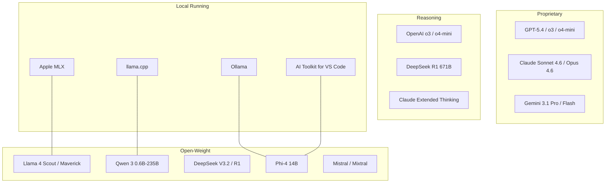
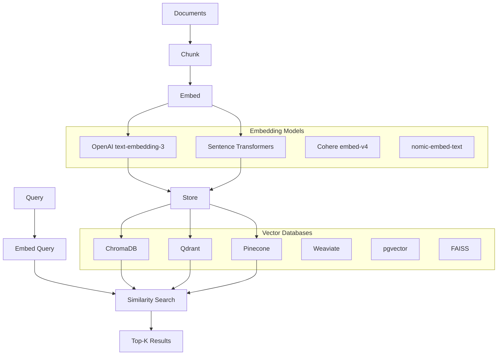
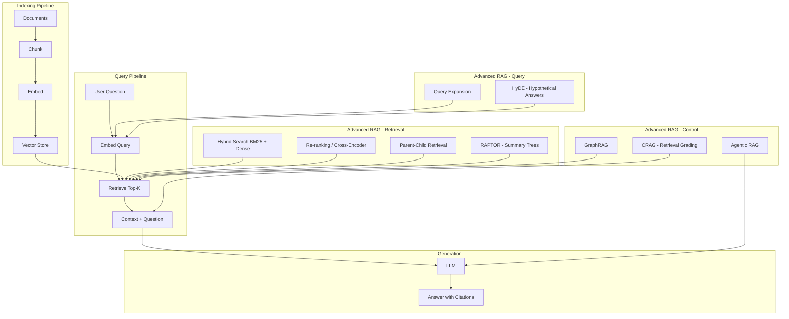
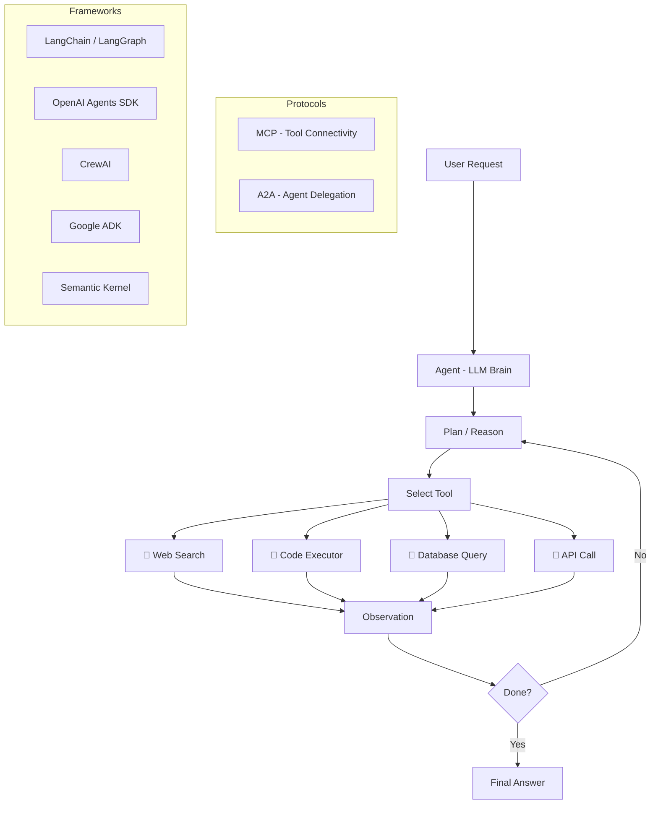
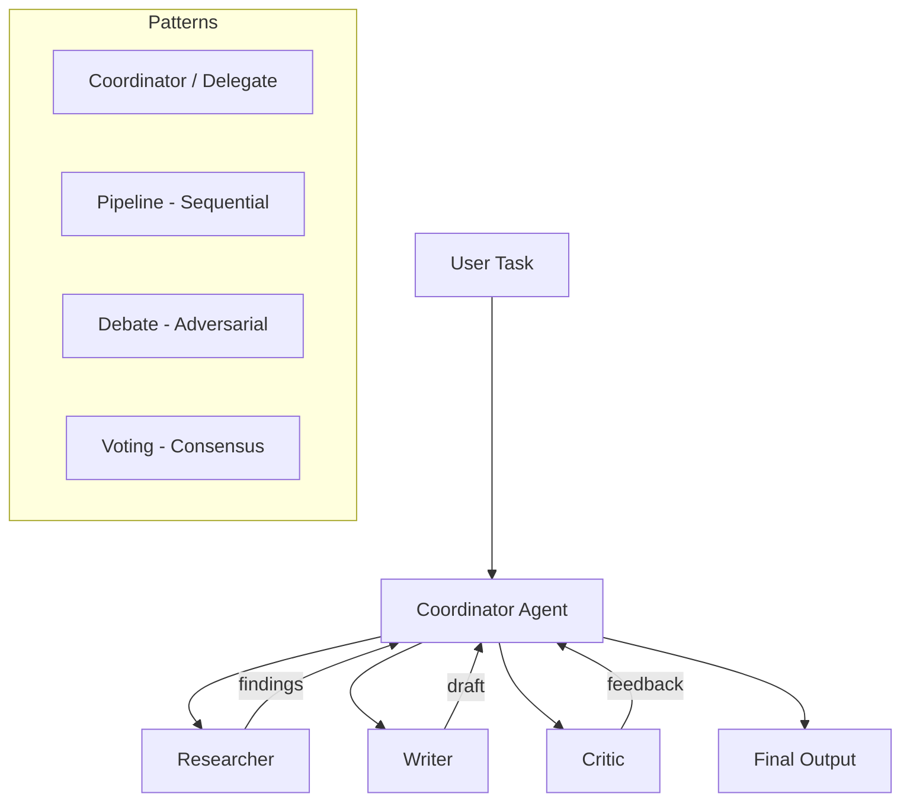
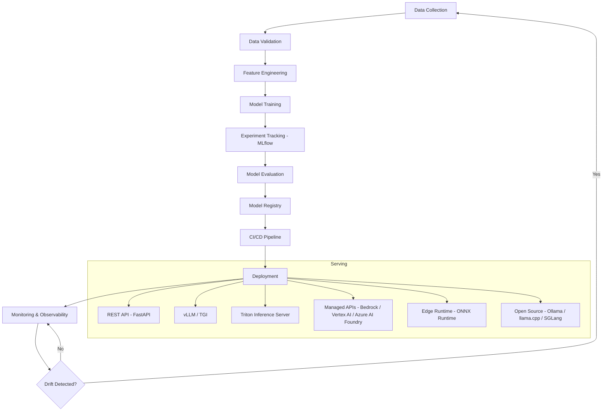

# Visual Roadmap - Part 2: Core Systems

> LLM landscape, embeddings, vector search, RAG, agents, multi-agent systems, and MLOps.

---

## 5. The LLM Model Landscape (2026)

---

## 6. Embeddings & Vector Search

---

## 7. RAG (Retrieval-Augmented Generation)

---

## 8. AI Agents Architecture

---

## 9. Multi-Agent Systems

---

## 10. MLOps Lifecycle

---

[← Previous: Overview](01_overview.md) | [Next: Advanced Topics →](03_advanced_topics.md)
